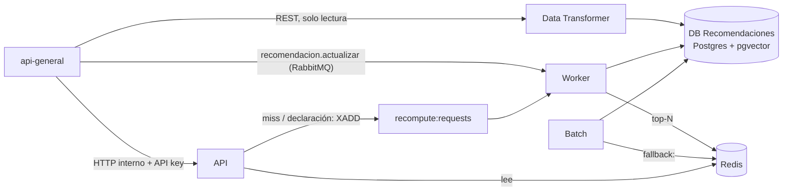

# Arquitectura — `recomendaciones`

Servicio de recomendaciones **precomputadas** para los módulos `peliculas` y `juegos`. La fuente
normativa es `specs/001-recomendaciones-precomputadas/` (`data-model.md` manda en la capa de datos); este
documento es el mapa para quien llega al código.

## Procesos

| Proceso | Entrypoint | Escribe | Lee |
|---|---|---|---|
| API | `reco-api` | `user_declared_tags` (única escritura, T053) y `recompute:requests` | Redis; Postgres solo ante miss de `filters:`/`retired:` |
| Worker | `reco-worker` | `user_signals` (evento), `user_exclusions`, `user_profiles`, `processed_events`, `reco:`/`reco:stale:` | cola `recomendacion.actualizar`, Stream `recompute:requests`, Postgres |
| Data Transformer | `reco-transformer` (una corrida) | proyección (`users`, `items`, `tags`, `item_tags`, `user_signals` de sync), `sync_runs`; luego vocabulario (`vocab_*`, `item_vectors`, `tag_modules`) | REST de `api-general` |
| Batch | `reco-batch popularity \| fallback \| warmup \| age-refresh \| purge-signals` | `item_popularity`, `item_promotions`, `fallback:`, `users` (ordinal etario), purga | Postgres |

Cada fila tiene **un único proceso escritor** (DI-13).

## Reglas que el código hace cumplir

- **INV-1 — cero cómputo en el request path.** `api/` no importa `engine/` ni `sqlalchemy`; lo verifica
  `tests/unit/test_architecture.py`. La API lee el top-N ya calculado y aplica **guardas** (edad,
  exclusión, vigencia), nunca ranking.
- **INV-2 — Redis nunca es fuente de verdad.** Todo lo de Redis se reconstruye desde Postgres
  (`reco-batch warmup`, ver el runbook). El top-N vive **solo** en Redis (FR-080b).
- **INV-3 — edad y exclusión sin bypass.** El post-proceso (`engine/postprocess.py`) tiene etapas tipadas
  en orden fijo: edad → exclusión → MMR con tope de cluster → cuota de novedades. No existe flag que las
  desactive; el loader rechaza configuraciones que lo intenten.
- **INV-4 — sin acceso a bases ajenas.** Todo dato de `api-general` entra por REST.
- **Redis primero** (FR-080c): toda invalidación ocurre antes de la escritura en Postgres que la causa.

## Motor (`engine/`, funciones puras)

`score = α·content + β·colaborativo + γ·cross-module` (α=0,5, β=0,3, γ=0,2 en `v1`), sobre un **único
espacio TF-IDF** para ambos módulos (`vocabulary.py`, `content.py`). El perfil (`profile.py`) se
**reconstruye** siempre desde la declaración de gustos y las señales vigentes: no hay actualización
incremental (FR-087). El colaborativo pondera por región sin excluir (`collaborative.py`, FR-081). El
desempate es fijo y determinista (`scoring.py`).

## Broker

El broker lo opera `notificaciones`. El worker declara al arrancar sus exchanges (`recomendacion.actualizar.v3`,
`usuario.eliminado`) y sus colas, con la convención de ese broker: **quorum**, la principal con
`x-message-ttl` = `RECO_EVENT_REDELIVERY_WINDOW_HOURS`, `x-delivery-limit` = `RECO_RETRY_MAX_ATTEMPTS` y
dead-letter a una DLQ propia sin TTL (`worker/topology.py`). Los reintentos con backoff van por una cola de
espera (`.retry`). La profundidad de la cola y de la DLQ se exportan como `reco_queue_depth` y
`reco_dead_letter_depth`.

## Datos

18 tablas (`storage/db/models.py`, migración `migrations/versions/0001_initial.py`) y 8 familias de claves
Redis (`storage/cache/keys.py`). La configuración del motor está versionada en
`config/engine_config/vN.yaml`; su identidad es el hash del contenido y viaja en cada clave `reco:` y
`fallback:`, de modo que cambiar de versión no exige invalidar en masa.

## Lectura (`GET /internal/v1/recommendations/{user_id}?module=…`)

1. Precondiciones: declaración en el módulo (`filters:{user}.declared_modules`), escala etaria comparable.
2. Resolución de clave: `reco:` vigente → versiones legibles anteriores → respaldo → obsoleto.
3. Guardas sobre la lista: edad, exclusión, retirados (`retired:{module}`).
4. `result_type` por la precedencia de FR-056 sobre la lista **posterior** a las guardas.
5. Un miss escribe `recompute:requests` (con `recompute:lock` para no duplicar) sin bloquear la respuesta.

Redis caído ⟹ `503` con `Retry-After`; nunca se calcula ni se lee el top-N de Postgres.

## Operación

Runbook: [`docs/runbook.md`](runbook.md). Alertas: `ops/alerts.yaml`. Métricas: `:9100/metrics` en cada
proceso; salud en `/health`, `/health/live`, `/health/ready` (API) y `:8081` (worker).
