# Modelo de Datos: Servicio de Recomendaciones Híbridas Precomputadas

**Feature**: 001-recomendaciones-precomputadas · **Fecha**: 2026-09-10 · **Estado**: refinamiento de [plan.md](./plan.md) §2

**Alcance**: formaliza la capa de datos que `plan.md` asume. **No modifica el alcance funcional
aprobado.** Toda entidad se remonta a un FR de [spec.md](./spec.md) o a un principio de la
[constitution v1.0.0](../../.specify/memory/constitution.md).

**Regla de lectura**: este documento especifica **qué datos existen y por qué**, no con qué ORM se
acceden. Los tipos son lógicos; su mapeo concreto es decisión de T003.

---

## 1. Separación de responsabilidades de almacenamiento

El principio que ordena todo el modelo: **ningún dato tiene dos fuentes de verdad**.

| Dato | Reside en | Justificación |
|---|---|---|
| Identidad del usuario, catálogo, actividad | **api-general** | Dato ajeno. Principio I: no se accede a su DB; se consume vía REST |
| Proyección local de usuario, ítem y señales | **DB Recomendaciones** | Materialización necesaria para que edad y exclusión se apliquen **íntegramente con datos locales**, sin llamada externa en el request path (FR-003) |
| Perfiles de tags, vectores de ítem | **DB Recomendaciones** | Estado derivado propio. Nadie más lo produce ni lo consume |
| Configuración del motor y su versión | **DB Recomendaciones** + repo | El archivo versionado vive en el repo (Q4); la tabla registra qué versiones existieron, para que un top-N viejo siga siendo interpretable |
| Exclusiones resueltas | **DB Recomendaciones** | Invariante de seguridad. No puede depender de un sistema que se puede caer (FR-050) |
| Idempotencia de eventos | **DB Recomendaciones** + Redis | Redis da velocidad; Postgres da durabilidad. Perder Redis no debe permitir reprocesar (INV-2) |
| Top-N precomputado, filtros calientes, respaldo | **Redis** | **Caché derivada y descartable.** Todo es recomputable desde Postgres |

> ⚠️ **Redis nunca es fuente de verdad.** Su pérdida total es un evento de rendimiento, no de
> integridad: `docs/runbook.md` + T022 describen la reconstrucción. Si algún dato dejara de ser
> recomputable desde Postgres, eso es un defecto de diseño, no una optimización.

**Frontera con `api-general`**: la proyección local es *solo lectura* y *desechable*. Se reconstruye
sincronizando. No se le agregan campos propios ni se edita: eso la convertiría en una segunda fuente
de verdad de un dato ajeno, violando el Principio I.

### 1.1 Zonas de datos y su regla de escritura

| Zona | Entidades | Escritor único | Reconstrucción |
|---|---|---|---|
| **Proyección local** (dato ajeno) | `users`, `items`, `tags`, `item_tags` | Data Transformer | Resincronizando desde `api-general` |
| **Derivados durables** (estado propio) | `item_vectors`, `user_profiles`, `user_exclusions` ⁽¹⁾, **`item_popularity`**, **`tag_modules`**, **`vocab_versions`**, **`vocab_version_tags`** | Procesos propios (vectorizador, resolutor, batch de popularidad, proceso de vocabulario) | Recomputando desde señales y proyección |

| **Registro de hechos** | `user_signals`, `user_exclusions` ⁽¹⁾, `sync_runs`, `processed_events` | Ingesta / jobs | **No reconstruible.** Es el historial |
| **Configuración** | `engine_config_versions` | Loader | Desde el repo |
| **Caché** | Redis (§3) | Worker / batches | Desde Postgres |

⁽¹⁾ **`user_exclusions` es de zona mixta (RD-29)**: sus filas con `origin ≠ 'consumo'`
son recomputables desde `user_signals`; sus filas con `origin = 'consumo'` **no lo son**
si la señal de `consumo` que las originó fue purgada por retención. Toda reconstrucción sobre esta
tabla debe ser **aditiva** (DI-20).

> **Regla de escritor único**: cada fila tiene **un solo** proceso con autoridad para escribirla. La
> zona determina cuál. Esto no es una convención de código —que se olvida— sino un criterio de
> ubicación: si dos procesos necesitan escribir la misma fila, la fila está en la zona equivocada.

**RD-12 corrigió una violación de esta regla**: `like_count_window` vivía en `items` (proyección
local) pero lo escribía el batch de popularidad, no el Data Transformer. Dos escritores sobre la
misma fila, y una proyección que ya no era reconstruible sincronizando —la resincronización no
reponía ese valor—. La afirmación de desechabilidad de arriba **era falsa** mientras ese atributo
estuvo ahí. Reubicarlo la restituye.

**RD-14 corrigió una violación idéntica, de mayor gravedad**: `is_shared` vivía en `tags`
(proyección local) pero era un agregado sobre `item_tags × items.module`, determinable solo con el
catálogo local completo. Mismos dos síntomas —doble escritor, desechabilidad falsa— y una
consecuencia peor: sostiene el término γ del score, no el conjunto de respaldo. Reubicado a
`tag_modules` (§2.12).

> Que el mismo defecto apareciera **dos veces de forma independiente** sugiere que no es un descuido
> puntual sino el modo de falla natural de este modelo: un derivado que *habla sobre* una entidad
> proyectada tiende a alojarse en ella. La regla de escritor único y DI-13 existen para detectarlo.


---

## 2. Entidades persistentes en DB Recomendaciones

### 2.1 `users` — usuario materializado

**Propósito**: permitir el filtro de edad sin llamar a `api-general` en el request path (FR-003, FR-030).

> 🔄 **Revisado 2026-09-10 (RD-1)**: `birth_date` pasa a **obligatoria y confiable por contrato**.
> Desaparece el escenario de edad indeterminable y con él `age_resolution`. Ver §11.

| Atributo | Tipo | Nulo | **Naturaleza** | Notas |
|---|---|---|---|---|
| `id` | UUID | No | **Identidad** | **PK**. Identificador externo de `api-general`; no se genera acá |
| `birth_date` | date | **No** | **Funcional** | **Único insumo admitido** para la restricción etaria. Garantizada por contrato (CR-1) |
| `max_age_ordinal` | smallint | **No** | **Funcional** | **Única representación del permiso etario.** Derivado de `birth_date` vía config activa. Es el valor que se compara |
| `age_config_version` | text | **No** | **Integridad** | FK → `engine_config_versions`. Escala bajo la que se derivó el ordinal. Sin él, el ordinal es un número sin unidad (RD-5) |
| `age_derived_at` | timestamptz | **No** | **Auditoría (forense)** | Cuándo se derivó el ordinal. **Ningún componente lo lee, ninguna consulta lo filtra, ninguna métrica lo agrega** (RD-6) |
| `region` | char(2) | **Sí** | **Anticipación** | **ISO 3166-1 alfa-2**, mayúsculas. Sin consumo en esta feature (RD-4). `CHECK (region ~ '^[A-Z]{2}$')` |
| `synced_at` | timestamptz | No | **Operativo** | Marca de última sincronización |

**Clasificación por naturaleza** — determina qué está permitido hacer con cada atributo:

| Naturaleza | Definición | Regla |
|---|---|---|
| **Funcional** | Participa del cálculo o del filtrado | Puede leerse, indexarse y sostener invariantes |
| **Integridad** | Hace interpretable o verificable a un atributo funcional | Puede leerse en consultas de verificación y mantenimiento. No participa del resultado |
| **Auditoría (forense)** | Solo reconstruye la historia de un registro | ⛔ **Prohibido construir lógica funcional, consultas de selección o alertas sobre él.** Se lee en investigación, nunca en ejecución |
| **Anticipación** | Proyectado sin consumo actual | ⛔ Mismas prohibiciones que auditoría, más: no se indexa |
| **Operativo** | Sostiene mantenimiento de la proyección | Puede indexarse si hay consulta declarada |

> La categoría **auditoría** existe para que la prohibición sea explícita y revisable. Un atributo
> forense sin esa etiqueta es una invitación a que alguien, dentro de un año, escriba
> `WHERE age_derived_at < ...` creyendo que detecta algo. RD-6 documenta por qué eso sería un error.


**Índices**:

| Índice | Consulta que sirve |
|---|---|
| PK (`id`) | Lectura por usuario en el request path |
| `idx_users_birth_date (birth_date)` | **Cruce de umbral** (§7.5): `WHERE birth_date IN (:fechas_umbral)` — igualdad exacta sobre el puñado de fechas que hoy hacen cumplir años a un usuario |
| `idx_users_age_config_version (age_config_version) WHERE age_config_version <> :activa` | **Derivados bajo config obsoleta** (§7.5): parcial, normalmente vacío; se puebla solo tras un cambio de catálogo |
| `idx_users_synced_at (synced_at)` | Detección de proyecciones rancias |

> **`region` no se indexa.** No existe consulta que lo justifique: ningún componente la lee. Un índice
> es costo de escritura permanente al servicio de una lectura hipotética. Se añadirá cuando exista un
> requisito de segmentación regional que defina la consulta concreta — no antes.


**Integridad**:
- `birth_date NOT NULL`: el esquema hace **irrepresentable** un usuario sin fecha de nacimiento.
  No hay default: un usuario sin ella no se inserta (§7.5, política de ingesta).
- `max_age_ordinal NOT NULL` **sin default**: no existe el estado «materializado pero sin derivar».
- `age_config_version` es FK real: un ordinal siempre es interpretable, aun si la config cambió.
- `region` **admite nulo y su ausencia no tiene consecuencia alguna**. Asimetría deliberada con
  `birth_date`: esta última es obligatoria porque de ella depende un invariante de seguridad; la
  región no sostiene ningún invariante. Un usuario sin región recibe exactamente las mismas
  recomendaciones que uno con región — porque **ningún componente la lee** (§4.3).

**Consumidores por atributo** — qué se rompe si el atributo no existe:

| Atributo | Consumidores | Qué se rompe ante su ausencia |
|---|---|---|
| `birth_date` | §7.5 causa A (`WHERE birth_date IN (...)`) · derivación del ordinal · DI-2, DI-2a' | **Todo.** Sin el insumo no hay permiso etario |
| `max_age_ordinal` | §4.2 filtro · §3.2 snapshot · `filters:` (§3.1) · DI-2b, DI-2c | **El filtro.** Es el valor comparado |
| `age_config_version` | §7.5 causa B (`WHERE age_config_version <> :activa`) · índice parcial · §2.1 resolución de etiqueta legible · `filters:` · DI-2a', DI-2e · FK a `engine_config_versions` | **La interpretabilidad y la detección selectiva.** Ver RD-5 |
| `age_derived_at` | **Ninguno.** Se escribe en §7.5 y se declara en DI-2 como `NOT NULL`; nada lo lee | **Nada funcional.** Se pierde la capacidad de reconstruir *cuándo* se derivó un ordinal durante una investigación (RD-6) |
| `region` | **Ninguno** (§4.3) | Nada (RD-4) |
| `synced_at` | `idx_users_synced_at` · detección de proyección rancia (T031) | La detección de proyecciones desactualizadas |

Que `age_derived_at` sea la única fila con «ninguno» en ambas columnas es lo que motivó la auditoría
RD-6. La escritura en §7.5 no lo convierte en consumidor: escribir un valor que nadie lee no es uso.

**Una sola representación del permiso.** No se almacena la clasificación etaria legible: sería el
mismo hecho codificado dos veces, derivado del mismo mapeo, y ningún componente la consultaría
—el filtro opera solo sobre el ordinal (§4.2)—. Su único efecto sería habilitar un estado
inconsistente que el esquema no puede impedir. Cuando se necesita la etiqueta legible para
diagnóstico o soporte, se resuelve el ordinal contra `age_config_version` del propio registro, que
es exactamente el mapeo con el que se derivó. La traducción es siempre correcta y nunca ocurre en
el request path.

**Por qué se materializa el ordinal**: el filtro debe ser una **comparación ordinal indexable**
(§4). Calcular la edad desde `birth_date` en cada evaluación implicaría aritmética de fechas sobre
cada candidato, lo que impide usar índice y reintroduce cómputo donde FR-003 lo prohíbe. El costo es
la caducidad por paso del tiempo, que se resuelve en §7.5.

**Ciclo de vida**: creado/actualizado por el Data Transformer (T029). El ordinal se recalcula al
sincronizar, al cruzar un umbral etario y al cambiar el catálogo (§7.5). Nunca se borra por lógica de
negocio; si desaparece del origen, se marca vía `synced_at` rancio. `region` se repuebla en cada
sincronización; nunca se edita ni se enriquece localmente.

#### Por qué se incorpora `region` y se sigue rechazando NC-1

Ambos son atributos sin requisito funcional. Incorporar uno y rechazar el otro exige un criterio
verificable, no una preferencia. El criterio es:

> **¿El atributo tiene un valor de verdad determinable sin decidir funcionalidad?**

| | «Módulo de interés» (NC-1) | `region` |
|---|---|---|
| ¿Existe en el origen? | **No.** Es un concepto de producto que habría que crear | **Sí.** Dato de registro que `api-general` ya posee |
| ¿Tiene semántica definida sin decidir su uso? | **No.** ¿Declarado o inferido? ¿Uno o varios? ¿Con qué vigencia? Cada respuesta es una decisión de producto | **Sí.** «País del usuario según ISO 3166-1». No hay grado de libertad |
| ¿Se puede poblar hoy correctamente? | **No.** Sin definir su semántica, cualquier valor es arbitrario | **Sí.** Se copia del origen y se valida contra un estándar externo |
| Sin consumo, ¿qué es? | **Nada.** Un módulo de interés que nadie lee no significa nada: su significado *es* alterar la selección | **Un hecho verdadero sobre el usuario**, verificable con independencia de que alguien lo use |

La distinción es esa última fila. NC-1 sin consumo es un campo sin significado, y definirlo obliga a
inventar producto —eso sí es alcance nuevo—. `region` sin consumo sigue siendo un dato correcto o
incorrecto, contrastable contra el origen. Proyectarlo no decide nada sobre el motor.

**Costo asumido, declarado sin atenuantes**: un atributo que nadie lee es un atributo que puede
pudrirse en silencio, porque ninguna funcionalidad falla si está mal. La única defensa es la métrica
de §7.6, y es una defensa débil. Ver RD-4 para la alternativa descartada.

> ⚠️ **needs-clarification (NC-1)** — El brief menciona «módulo de interés» del usuario. **La spec no
> define tal atributo** y ningún FR lo requiere: las recomendaciones se piden por módulo en el
> request (FR-006). No lo incluyo. Si existe un requisito de producto no capturado, debe entrar por
> `/speckit.clarify`, no asumirse acá.

> ✅ **NC-3 resuelto**: `api-general` expone `birth_date`. No hay campo `age` ni doble formato.

---

### 2.2 `items` — ítem del catálogo materializado

**Propósito**: candidatos a recomendar, con la clasificación etaria necesaria para filtrar localmente.

> 🔄 **Revisado 2026-09-14 (RD-7..RD-11)**: se incorpora ciclo de vida del ítem. El modelo anterior
> no podía expresar «retirado», lo que permitía servir contenido ya no disponible. Ver §12.

| Atributo | Tipo | Nulo | **Naturaleza** | Notas |
|---|---|---|---|---|
| `id` | UUID | No | **Identidad** | **PK**. Identificador externo |
| `module` | enum(`peliculas`,`juegos`) | No | **Funcional** | Dimensión obligatoria. Sostiene `tag_modules` y con ello la señal cruzada (ver abajo) |
| `status` | enum(`available`,`retired`) | **No** | **Funcional** | **Default `available`.** Retiro **lógico**, nunca físico (RD-7) |
| `retired_at` | timestamptz | Sí | **Auditoría (forense)** | Cuándo se retiró. ⛔ No sostiene lógica: el filtro usa `status` |
| `min_age_ordinal` | smallint | **No** | **Funcional** | **Edad mínima requerida, en escala ordinal**. Valor comparado. Default = máximo de la escala |
| `age_config_version` | text | **No** | **Integridad** | FK → `engine_config_versions`. Escala bajo la que se derivó el ordinal (RD-5) |
| `age_rating` | enum | **No** | **Integridad** | **Dato de origen**, no derivado. Default = valor más restrictivo (FR-051). Permite re-derivar el ordinal ante cambio de catálogo |
| `age_rating_source` | enum(`declared`,`unknown_defaulted`) | No | **Auditoría (accionable)** | Excepción a la regla forense: sostiene una métrica de cobertura (§7.7, RD-9) |
| `synced_at` | timestamptz | No | **Operativo** | Última sincronización |

> 🔄 **`like_count_window` reubicado a `item_popularity` (§2.11, RD-12).** No provenía del origen:
> lo produce un proceso propio desde señales locales. Su presencia acá rompía la desechabilidad de
> la proyección y ponía dos procesos a escribir la misma fila.


Clasificación por naturaleza y sus reglas: §2.1. `retired_at` lleva la **prohibición expresa** de
sostener lógica funcional; `age_rating_source` es la **única excepción** documentada a esa regla
(RD-9), y lo es porque habilita una métrica accionable que ningún otro atributo puede producir.

**Sobre `module` — justificación principal.** No es solo una dimensión de partición del catálogo.
Un tag es compartido (§2.12) **sí y solo si** aparece en ítems **vigentes** de **ambos** módulos,
determinación que exige conocer el módulo de cada ítem. Y eso es lo que habilita la propagación
cross-module de FR-010a, es decir el término γ del score (`γ·cross_module`, D4). **Sin `module` en
`items` no hay forma de saber qué tags son compartidos, y sin eso el tercer término del motor no
existe.** Esa es la justificación más fuerte del atributo, por encima del filtrado por módulo.

**Ningún atributo duplica información del origen.** `age_rating` es dato recibido y se conserva
porque permite re-derivar el ordinal ante un cambio de catálogo sin resincronizar (§4.1) — no es
descriptivo. `status` es estado propio de la proyección (RD-7). No se incorporan título, descripción,
género, duración ni fecha de publicación: son descriptivos, su autoridad es del origen, y ninguna
consulta declarada los requiere.

**Índices**:

| Índice | Consulta que sirve |
|---|---|
| PK (`id`) | Resolución de ítem |
| `idx_items_candidates (module, min_age_ordinal) WHERE status = 'available'` | **Selección de candidatos** del recálculo: prefiltrado ordinal ya restringido a vigentes. Parcial: los retirados no ocupan el índice. **También sirve al batch de respaldo** tras RD-12 |
| `idx_items_synced_at (synced_at)` | **Frescura del catálogo** (RD-11): `WHERE synced_at < :umbral` — detección económica de sincronización interrumpida, simétrica con `idx_users_synced_at` |

> El índice parcial **sobre `status = 'available'`** deja el predicado de vigencia en el índice, no
> en el código. Un desarrollador que olvide el `WHERE status` no obtiene un resultado silenciosamente
> incorrecto — obtiene un plan que no usa el índice, visible en review y en perfilado.


**Integridad**:
- `status` **NOT NULL con default `available`**. Asimetría deliberada con el fail-closed etario: el
  default permisivo es correcto acá porque el caso normal de alta es un ítem vigente, y el riesgo
  de un ítem retirado servido es de negocio, no de seguridad. El riesgo etario sí es de seguridad.
- `retired_at IS NOT NULL` ⟺ `status = 'retired'`. Verificable por `CHECK`.
- `min_age_ordinal` **NOT NULL con default = máximo ordinal**: un ítem sin derivar es representable
  pero inalcanzable para todo usuario. El fail-closed queda en el default del esquema.
- `age_rating` **NOT NULL con default no-apto**. Corrige P2 del prototipo a nivel de esquema.
- `age_rating` y `min_age_ordinal` derivan del mismo mapeo versionado; su consistencia se verifica
  por test (DI-2a'), no por constraint.
- `age_rating` restringido al catálogo de la configuración activa (FR-053).

**Consumidores de los atributos incorporados**:

| Atributo | Consumidores | Qué se rompe ante su ausencia |
|---|---|---|
| `status` | Selección de candidatos (T012) · batch de respaldo (T038) · guarda del request path (§4.4) · `retired:{module}` (§3.1) · DI-10 | **El defecto que motivó RD-7**: contenido retirado servible desde `fallback` y `reco:stale` |
| `retired_at` | **Ninguno.** Forense: reconstruir «¿desde cuándo dejó de estar disponible?» ante un reclamo | Nada funcional |
| `age_rating_source` | Métrica `catalog_unrated_ratio` (§7.7) | La única señal de cobertura degradada por fail-closed (RD-9) |

### 2.3 `tags` y `item_tags` — vocabulario y asignación

**Propósito**: sostener el espacio vectorial **único** de FR-010d.

**Zona**: **proyección local**. Escritor único: Data Transformer.

> 🔄 **Revisado 2026-09-14 (RD-14..RD-20)**: `is_shared` reubicado a `tag_modules` (§2.12); `id`
> serial eliminado en favor de clave natural; se agrega `vocab_versions` (§2.13). Ver §12.

**`tags`**

| Atributo | Tipo | Nulo | **Naturaleza** | Notas |
|---|---|---|---|---|
| `name` | text | No | **Identidad** | **PK**. Valor **tal cual llega del origen** (RD-16). `CHECK (name = btrim(name) AND length(name) > 0)` |
| `synced_at` | timestamptz | No | **Operativo** | Última sincronización |

**Clave natural, sin `id` serial (RD-16).** El nombre **es** la identidad del tag. Un identificador
autoincremental se renumeraría al truncar y resincronizar, y las dimensiones vectoriales dejarían de
corresponder a los mismos tags — corrupción silenciosa (RD-16).

**Índices**: PK (`name`). No hay otros: ninguna consulta declarada los requiere.

**`item_tags`**

| Atributo | Tipo | Nulo | **Naturaleza** | Notas |
|---|---|---|---|---|
| `item_id` | UUID | No | **Identidad** | **PK compuesta**, FK → `items.id` **ON DELETE CASCADE** |
| `tag_name` | text | No | **Identidad** | **PK compuesta**, FK → `tags.name` **ON DELETE RESTRICT** (RD-19) |
| `weight` | real | Sí | **Funcional** | Relevancia declarada **por el origen**. `CHECK (weight >= 0 AND weight <= 1)`. Ver NC-8 |

**Índices**:

| Índice | Consulta que sirve |
|---|---|
| PK `(item_id, tag_name)` | Tags de un ítem: vectorización (T007) y determinación de `tag_modules` |
| `idx_item_tags_tag (tag_name)` | Búsqueda inversa: ítems de un tag. Sostiene el recálculo de `tag_modules` (§2.12) ante un retiro |

**Políticas de integridad referencial — ambas deliberadas (RD-19)**:

| FK | Política | Fundamento |
|---|---|---|
| → `items.id` | **CASCADE** | La asignación es un hecho *sobre el ítem*. Sin ítem no significa nada, y es reconstruible resincronizando |
| → `tags.name` | **RESTRICT** | Un tag con asignaciones **no puede borrarse**. Permitir CASCADE haría que eliminar un tag del vocabulario vaciara asignaciones en silencio, cambiando los vectores sin señal. RESTRICT fuerza a que la retirada de un tag sea una operación **explícita** y ordenada (RD-18) |

La asimetría es del mismo tipo que la de `user_signals` (§2.6): ahí la ausencia de cascade protege
el historial; acá protege la integridad del espacio vectorial.

**Sobre `weight`**: se declara **dato del origen**, no producido localmente — los pesos TF-IDF viven
en `item_vectors` (§2.4), calculados por el vectorizador. Si el origen **no** lo provee, la columna
no tiene productor ni consumidor y debe eliminarse; ver **NC-8**. Valores fuera de `[0,1]` se
rechazan a nivel de esquema, coherente con el criterio ya aplicado a `region` (§7.6).


---

### 2.4 `item_vectors` — representación vectorial del ítem

**Propósito**: señal content-based (FR-009) sin recomputar TF-IDF en cada recálculo.

**Zona**: **datos derivados durables**. Escritor único: el vectorizador (T007/T030).

> 🔄 **Revisado 2026-09-14 (RD-21..RD-26)**: la clave incorpora `vocab_version`; la columna deja de
> declarar dimensionalidad fija. Ver §12.

| Atributo | Tipo | Nulo | **Naturaleza** | Notas |
|---|---|---|---|---|
| `item_id` | UUID | No | **Identidad** | **PK compuesta**. FK → `items.id` ON DELETE CASCADE |
| `vocab_version` | text | No | **Identidad + Integridad** | **PK compuesta.** FK → `vocab_versions.version` **ON DELETE RESTRICT** (RD-23). Es la **unidad de medida** del vector |
| `vector` | `vector` | No | **Funcional** | **Sin dimensionalidad declarada** (RD-21). La fija `vocab_versions.tag_count`. **L2-normalizado en escritura** (RD-26) |
| `computed_at` | timestamptz | **No** | **Operativo** | Detecta recálculo parcialmente fallido (RD-25) |

**Clave `(item_id, vocab_version)`** — permite que convivan la versión saliente y la entrante durante
la transición. Es idéntico al criterio de `item_popularity` (RD-13), y acá es **más necesario**: sin
convivencia, la transición de FR-010g —«recalcular todos los vectores antes de activar»— es
irrealizable, porque el recálculo pisaría los vectores vigentes mientras el sistema los usa (RD-22).

**Índices**:

| Índice | Consulta que sirve |
|---|---|
| PK `(item_id, vocab_version)` | Vector de un ítem bajo la versión activa |
| `idx_item_vectors_vocab (vocab_version)` | Progreso y purga de la transición (T030): cuántos vectores existen por versión |
| Índice vectorial (ivfflat/hnsw), **parcial sobre la versión activa** | Búsqueda por similitud. **Diferido a Fase 3.** Debe ser parcial: un índice vectorial exige dimensionalidad fija, que solo es constante dentro de una versión (RD-21) |

**Integridad**:
- `vocab_version` **NOT NULL** y **FK real**: un vector que declare una versión inexistente es
  irrepresentable. Es el mismo criterio que `users.age_config_version` (RD-5), que hasta esta
  auditoría no tenía correlato acá pese a que el ERD dibujaba la relación (RD-23).
- `ON DELETE RESTRICT` hacia `vocab_versions`: una versión con vectores no puede borrarse. La purga
  exige eliminar primero sus vectores — operación explícita, nunca un efecto colateral.
- **Dimensionalidad**: no la impone el tipo sino DI-17, verificable contra `vocab_versions.tag_count`.

**Ítems sin tags — no tienen fila (RD-24)**. Un ítem sin tags produce el vector nulo, que **no es
L2-normalizable**: la norma es cero y la división no está definida. Las opciones eran representarlo
igual (con un vector nulo que hace la similitud coseno indefinida o arbitrariamente cero), o no
representarlo. Se elige **no representarlo**: la cardinalidad es `1:0..1`, no `1:1`.

**Consecuencia sobre la selección de candidatos**: un ítem sin vector **no participa de la señal
content-based** (α) ni de la cross-module (γ), pero **sigue siendo candidato** por la señal
colaborativa (β) y por popularidad. No se lo excluye del catálogo: se lo excluye de dos de los tres
términos. La alternativa —excluirlo por completo— haría que un ítem recién ingresado y aún sin
etiquetar fuera invisible, lo que confunde «sin metadatos» con «no recomendable». Ver **NC-9**: la
métrica `catalog_unvectorized_ratio` observa cuánta cobertura se pierde por esta vía.

---

### 2.5 `user_profiles` — perfil de tags por módulo y general

**Propósito**: señal content-based por módulo y **señal cross-module** (FR-024).

**Zona**: **datos derivados durables**. Escritor único: el proceso de perfiles (T008).

| Atributo | Tipo | Nulo | **Naturaleza** | Notas |
|---|---|---|---|---|
| `user_id` | UUID | No | **Identidad** | **PK compuesta**, FK → `users.id` ON DELETE CASCADE |
| `scope` | enum(`peliculas`,`juegos`,`general`) | No | **Identidad** | **PK compuesta** |
| `vocab_version` | text | No | **Identidad + Integridad** | **PK compuesta.** FK → `vocab_versions.version` **ON DELETE RESTRICT** (RD-23) |
| `vector` | `vector` | No | **Funcional** | **Sin dimensionalidad declarada** (RD-21). **L2-normalizado** (FR-022c) |
| `signal_count` | integer | No | **Funcional** | Señales que lo formaron. Umbral de personalización (D6) |
| `computed_at` | timestamptz | **No** | **Operativo** | Detecta recálculo parcialmente fallido (RD-25) |

**Clave `(user_id, scope, vocab_version)`**: mismo fundamento que en `item_vectors`. Un perfil y un
vector de ítem solo se comparan si coinciden en `vocab_version`, y con la versión en ambas claves
esa condición se expresa como una **reunión natural**, no como una verificación que alguien puede
olvidar.

**Índices**:

| Índice | Consulta que sirve |
|---|---|
| PK `(user_id, scope, vocab_version)` | Perfil de un usuario bajo la versión activa |
| `idx_user_profiles_vocab (vocab_version)` | Progreso y purga de la transición (T030) |

**Integridad**: hasta tres filas por usuario **y por versión de vocabulario**. El perfil `general`
**no** es un cuarto vector independiente: agrega pesos por tag sobre ambos módulos y es lo que hace
posible el cold start cruzado (SC-010).

> **Decisión**: una sola tabla con `scope` discriminador, no tres tablas. El prototipo usa
> `UserMovieProfile` / `UserGameProfile` / `UserGeneralTagProfile` como clases distintas; a nivel de
> datos son la misma estructura y separarlas triplicaría las consultas del recálculo.

**Consumidores de los atributos auditados**:

| Atributo | Consumidores | Qué se rompe ante su ausencia |
|---|---|---|
| `vocab_version` (ambas tablas) | Reunión de comparación · transición de T030 · purga · DI-8, DI-17 | **La comparabilidad**, y con ella dos de los tres términos del score |
| `computed_at` (ambas tablas) | `vector_recompute_lag_seconds` (§7.9) · detección de recálculo parcial | La única señal de que un job reportó éxito habiendo omitido filas (RD-25) |


---

### 2.6 `user_signals` — registro de interacción

**Zona: Registro de hechos.** No reconstruible: es el historial. Ningún procedimiento de
reconstrucción puede truncarla (§1.1, RD-27).

**Propósito**: base de perfiles y exclusiones. Materializa DEP-1 y DEP-2.

| Atributo | Tipo | Nulo | Naturaleza | Notas |
|---|---|---|---|---|
| `id` | bigserial | No | Identidad | **PK subrogada** (RD-33) |
| `user_id` | UUID | No | Integridad | FK → `users.id` **ON DELETE CASCADE** (RD-30) |
| `item_id` | UUID | No | Integridad | FK → `items.id` **ON DELETE RESTRICT** (RD-31) |
| `signal_type` | enum(`like`,`dislike`,`consumo`) | **No** | Funcional | **Sin default.** FR-064 prohíbe inferirlo |
| `occurred_at` | timestamptz | **No** | Funcional | Momento de la interacción **en el origen** (CR-12). Resuelve señales contradictorias (FR-029d) |
| `received_at` | timestamptz | No | Operativo | `default now()`. Momento de ingreso a este repositorio. Consumidor declarado: `signal_ingest_lag_seconds` (RD-32) |
| `source` | enum(`sync`,`feedback_api`) | No | Operativo | Origen. Consumidor declarado: segmentación de `signal_ingest_lag_seconds` y de `signal_duplicate_rejections_total` (RD-32) |

**Unicidad**: `UNIQUE (user_id, item_id, signal_type, occurred_at)` — clave natural (RD-28).

**Índices**: PK · UNIQUE (user_id, item_id, signal_type, occurred_at) — sirve además la consulta
«gana la más reciente» de FR-029d, con prefijo `(user_id, item_id)` · **no hay más índices**
(RD-33).

**Integridad**: `signal_type` y `occurred_at` **NOT NULL sin default**. Un evento sin tipo de señal
no es representable: va a DLQ (T023). El esquema hace cumplir FR-064.

**Desempate determinista (FR-029d)**: la señal vigente para un par `(user_id, item_id)` se resuelve
por `ORDER BY occurred_at DESC, id DESC`. La unicidad impide el empate exacto dentro de un mismo
`signal_type`; el `id` desempata el caso residual de dos tipos distintos con idéntico `occurred_at`
(§7.10, RD-34).

**Regla de negocio (FR-022b, decisión Q3)**: `like` y `dislike` alimentan el perfil **y** excluyen;
`consumo` **solo excluye**, no altera el vector. Corrige P1 del prototipo, que le daba peso 0.3.

> ⚠️ **needs-clarification (NC-2)** — **Retención**. La spec no define cuánto se conservan las
> señales. Además del tamaño de tabla y de la ventana de FR-033a1, **compromete un invariante**:
> purgar una señal de `consumo` vuelve no reconstruible la exclusión permanente que originó
> (RD-29). Ver NC-2 ampliado en §12.

> ⚠️ **needs-clarification (NC-10)** — el `CASCADE` desde `users` destruye el historial completo de
> un usuario. Es coherente solo si responde a una obligación de supresión (RD-30).

---

### 2.7 `user_exclusions` — conjunto de exclusión resuelto

**Zona: mixta — la única del modelo.** Las filas con `origin ≠ 'consumo'` son **proyección local**
(recomputables desde `user_signals`). Las filas con `origin = 'consumo'` son **registro de hechos**:
su señal de origen puede haber sido purgada y entonces no son reconstruibles (RD-29, DI-20).

> La zona depende de un **valor de atributo**, no de la tabla. Es la consecuencia de RD-35: al
> eliminar `is_permanent`, el discriminante de zona pasa a ser `origin`, que es el único hecho
> registrado. La clasificación no se debilita — se apoya ahora en el dato que **no** es derivable.

**Propósito**: aplicar el filtro de exclusión en tiempo acotado, sin recorrer el histórico de señales.

**Escritor único**: el resolutor de exclusiones (T009). Ni el Data Transformer ni el worker la
escriben.

| Atributo | Tipo | Nulo | Naturaleza | Notas |
|---|---|---|---|---|
| `user_id` | UUID | No | Identidad | **PK compuesta**, FK → `users.id` **ON DELETE CASCADE** (NC-10) |
| `item_id` | UUID | No | Identidad | **PK compuesta**, FK → `items.id` **ON DELETE RESTRICT** (RD-35) |
| `origin` | enum(`like`,`dislike`,`consumo`) | No | Funcional | Señal que la produjo. **Determina la permanencia**: `consumo` ⟹ permanente; `like`/`dislike` ⟹ revertible |
| `resolved_at` | timestamptz | No | Operativo | Consumidor declarado: `exclusion_resolve_lag_seconds` (§7.11, RD-35) |

> **`is_permanent` eliminado (RD-35)**: era función de `origin`. Dos representaciones del mismo
> hecho habilitan un estado inconsistente que el esquema no puede impedir — el defecto que RD-2 ya
> corrigió en `users`.

**Permanencia — regla única y derivada**:

> `es_permanente(fila) ≡ (origin = 'consumo')`

**Índices**: PK compuesta — cubre la consulta de pertenencia, que es la única que el request path
necesita (FR-033d). La guarda pregunta **pertenencia**, no permanencia: `origin` viaja en la fila y
no necesita índice. **Sin índice adicional.**

**Integridad**: vista materializada de `user_signals` bajo «gana la más reciente». Su regeneración
es determinista y auditable: dadas las mismas señales, produce el mismo conjunto.

> ⚠️ **La regeneración es aditiva, no destructiva (DI-20, RD-29)**. Un procedimiento de
> reconstrucción **no puede truncar** esta tabla: las filas con `origin = 'consumo'` cuya señal de
> origen fue purgada no volverían a producirse, y un ítem ya consumido reaparecería como
> recomendable. Es el mismo fallo que se invocó en RD-7 para rechazar el borrado físico de ítems.

**Por qué es tabla y no cálculo al vuelo**: FR-050 exige rechazar la solicitud si el conjunto no está
disponible. Un conjunto que se calcula recorriendo señales sería cómputo en el request path (FR-003);
uno que solo vive en Redis violaría INV-2 al expirar. Debe ser durable y barato de leer.

---

### 2.8 `engine_config_versions` — configuración versionada del motor

**Zona: Configuración.** El contenido se versiona en git; esta tabla registra su historia de
activación. **Escritor único**: el loader de configuración (T004).

**Propósito**: que un top-N generado hace un mes siga siendo interpretable (Q4, FR-025).

| Atributo | Tipo | Nulo | Naturaleza | Notas |
|---|---|---|---|---|
| `config_version` | text | No | Identidad | **PK**. Hash del archivo. **Inmutable por construcción**: cambiar el contenido cambia el identificador |
| `payload` | jsonb | No | Funcional | Copia íntegra. **Inmutable, garantizado por trigger** (RD-37) |
| `activated_at` | timestamptz | No | Funcional | **Inmutable, garantizado por trigger** (RD-37) |
| `deactivated_at` | timestamptz | Sí | Funcional | `NULL` = versión activa. **Único atributo mutable**, y en un solo sentido: `NULL` → valor, nunca al revés (RD-37) |

**Integridad**:
- Índice parcial único sobre `deactivated_at IS NULL`: **a lo sumo una versión activa** (DI-7).
- **Trigger `BEFORE UPDATE`** que rechaza toda modificación de `config_version`, `payload` o
  `activated_at`, y toda transición de `deactivated_at` de valor a `NULL` (DI-24).
- **La tabla no es *append-only*.** La afirmación anterior era literalmente falsa: la desactivación
  es un `UPDATE`. Lo correcto es **inmutabilidad por atributo**, hecha cumplir por estructura y no
  por convención (RD-37).

**Relación con el repo**: la fuente de verdad del *contenido* es `engine_config/vN.yaml`, versionado
en git (Q4). Esta tabla registra qué versiones **estuvieron activas y cuándo** — información que el
archivo no tiene y que hace falta para interpretar un resultado viejo.

**Identificador**: hash criptográfico del archivo. Determinista: mismo contenido ⟹ mismo
identificador, en cualquier máquina.

**Trazabilidad (FR-025, Q4)**: toda recomendación persistida y servida referencia su
`config_version`. Está en el valor de Redis (§3.2), en la clave (§3.1) y en la respuesta de la API.
Sin esto, «¿por qué el sistema recomendó esto?» es incontestable.

**Cambio de versión activa**:

| Paso | Efecto |
|---|---|
| Se activa `vN+1` | `deactivated_at` de `vN` deja de ser nulo; nueva fila activa |
| Claves `reco:v{N}`, `reco:stale:v{N}`, `fallback:v{N}` | Siguen existiendo; **ya no se leen** (la clave incorpora la versión) |
| Lecturas nuevas | Miss bajo `vN+1` → precedencia FR-056: respaldo o pendiente |
| Expiración | Las claves de `vN` se purgan solas por TTL |

**No hay invalidación masiva**, y esa es la ventaja de tener la versión en la clave: el cambio de
configuración es un no-evento operativo.

---

### 2.9 `sync_runs` — metadatos del Data Transformer

**Zona: Registro de hechos** (bitácora). No reconstruible. **Escritor único**: el Data Transformer
(T029). **Sin FK, deliberadamente**: una bitácora que restringiera el borrado de entidades sería una
bitácora que gobierna el modelo.

**Propósito**: freshness observable (FR-040, T031).

| Atributo | Tipo | Nulo | Naturaleza | Notas |
|---|---|---|---|---|
| `id` | bigserial | No | Identidad | **PK** subrogada. Estable: tabla no reconstruible (mismo fundamento que RD-33) |
| `started_at` | timestamptz | No | Operativo | Duración de la corrida, en panel |
| `finished_at` | timestamptz | Sí | Operativo | Nulo ⟹ en curso o interrumpida. Consumidor: `catalog_sync_last_success_timestamp` |
| `status` | enum(`running`,`success`,`failed`) | No | Operativo | Consumidor: el índice parcial de liveness |
| `entity_counts` | jsonb | Sí | Operativo | Volumen por entidad. Consumidor declarado: `sync_volume_delta_ratio` (§7.11, RD-38) |
| `failure_reason` | text | Sí | Operativo | **Forense.** No sostiene lógica: ningún componente ramifica sobre su contenido (criterio RD-6) |

**Índices**: `idx_sync_runs_success (finished_at DESC) WHERE status='success'` — sirve **una sola
consulta**: «¿cuándo terminó la última corrida exitosa?», que es la métrica de freshness (T031). Es
el **último éxito**, no el último intento. **Sin índice adicional**: no hay consulta por `started_at`
ni por `status` en general.

---

### 2.10 `processed_events` — idempotencia

**Zona: Registro de hechos** (bitácora). **Escritor único**: el worker de eventos (T024). Sin FK,
por el mismo motivo que `sync_runs`.

**Propósito**: FR-011. Un evento reentregado no debe recomputar dos veces.

| Atributo | Tipo | Nulo | Naturaleza | Notas |
|---|---|---|---|---|
| `event_id` | UUID | No | Identidad | **PK**. Provisto por `api-general` (DEP-3) |
| `processed_at` | timestamptz | No | Operativo | **Forense**: reconstruir la secuencia de procesamiento en un incidente. No sostiene lógica (criterio RD-6) |
| `result` | enum(`recomputed`,`skipped_no_shared_tag`,`dlq`) | No | Operativo | Consumidor declarado: tasa de DLQ y de omisión por falta de tag compartido — auditoría **accionable** de FR-010c (criterio RD-9) |
| `expires_at` | timestamptz | No | Funcional | Retención configurable (FR-068). Lo consume la purga |

**Índices**: PK — la única consulta es pertenencia por `event_id` · `idx_processed_expires
(expires_at)` — sirve la consulta de purga `WHERE expires_at < now()`.

**Integridad**: PK sobre `event_id` hace la doble inserción **estructuralmente imposible**, no
dependiente de una comprobación previa que podría tener carrera.

**Relación con Redis**: `dedupe:event:{event_id}` es la copia caliente. Perder Redis degrada latencia,
no corrección: la PK sigue rechazando el duplicado (INV-2). Tras `expires_at`, un duplicado tardío
debe poder reprocesarse sin corromper estado (FR-069) — de ahí que el recálculo sea convergente.

---

### 2.11 `item_popularity` — popularidad derivada por ventana

**Zona**: **datos derivados durables**, no proyección local. Es estado propio, producido por un
proceso propio desde señales locales. Nadie más lo produce ni lo consume (RD-12).

**Propósito**: sostener el conjunto de respaldo de FR-033a1 sin contaminar la proyección de catálogo.

| Atributo | Tipo | Nulo | **Naturaleza** | Notas |
|---|---|---|---|---|
| `item_id` | UUID | No | **Identidad** | **PK compuesta** con `config_version`. FK → `items.id` |
| `config_version` | text | No | **Identidad + Integridad** | **PK compuesta.** FK → `engine_config_versions` **ON DELETE RESTRICT** (RD-43). Define `popularity_window_days` **y `popularity_confidence_z`**: **es la unidad de medida** del puntaje (RD-13) |
| `like_count` | integer | **No** | **Funcional** | **Usuarios distintos** cuya señal vigente sobre el ítem es `like`, en la ventana. Default 0. Es el **numerador** |
| `engaged_user_count` | integer | **No** | **Funcional** | **Usuarios distintos** con **alguna** señal sobre el ítem en la ventana (`like`, `dislike` o `consumo`). Default 0. Es el **denominador** (Q7, RD-45) |
| `popularity_score` | double precision | **No** | **Funcional** | Límite inferior del intervalo de Wilson. **Materializado**, no calculado al leer (RD-44) |
| `computed_at` | timestamptz | **No** | **Operativo** | Cuándo se calculó esta fila |

**Definición de popularidad (decisiones Q6 y Q7, cierran NC-7)** — límite inferior del intervalo de
confianza de Wilson sobre la **tasa de conversión a like entre quienes interactuaron**:

$$
\text{popularity\_score} = \frac{\hat{p} + \frac{z^2}{2n} - z\sqrt{\frac{\hat{p}(1-\hat{p})}{n} + \frac{z^2}{4n^2}}}{1 + \frac{z^2}{n}}
$$

donde $n = \texttt{engaged\_user\_count}$, $\hat{p} = \texttt{like\_count}\,/\,n$, y $z$ =
`popularity_confidence_z`, parámetro **nuevo** de la configuración del motor (§4).

**Lectura del puntaje**: *«de las personas que interactuaron con este ítem, qué proporción lo
likeó — descontando la incertidumbre de una muestra chica»*.

> ⚠️ **Por qué el denominador es un conteo de usuarios distintos y no `like + dislike + consumo`
> (RD-45).** Sumar los tres recuentos **cuenta dos veces a la misma persona**: quien likea un ítem
> casi siempre lo consumió antes, y ambas señales existen en `user_signals` —son de tipos distintos,
> así que la unicidad de RD-28 no las colapsa—. Un ítem con 100 likes de 100 personas que además lo
> consumieron daría $n = 200$ y $\hat{p} = 0{,}5$: un ítem **unánimemente likeado** puntuaría como si
> la mitad lo hubiera rechazado. El defecto es silencioso y sistemático, y afecta más a los ítems
> mejores. Contar usuarios distintos lo vuelve irrepresentable.

**Caso degenerado $n = 0$**: `popularity_score = 0`. La fórmula es indefinida, y cero es el valor
correcto —no hay evidencia alguna—, no una convención arbitraria. Se hace explícito porque es el
estado de **todo ítem recién ingresado**.

**Invariante estructural**: $0 \le \texttt{like\_count} \le \texttt{engaged\_user\_count}$, por
construcción — quien likeó está en el conjunto de quienes interactuaron. Lo verifica un `CHECK`, y
es lo que garantiza $\hat{p} \in [0,1]$ sin validación en código (DI-26).

**Por qué se persisten los dos recuentos y no solo el puntaje**: el puntaje **no es reconstruible**
desde sí mismo si cambia $z$. Con numerador y denominador en la fila, recalibrar es un barrido sobre
`item_popularity`; sin ellos exige recorrer `user_signals`, que es la tabla más grande del modelo.
Mismo criterio que RD-17: el derivado se guarda junto a los insumos que lo determinan.

> **`dislike_count` no se persiste**: es derivable como $n - \texttt{like\_count}$ menos los
> consumos sin preferencia, y **ninguna consulta lo necesita**. Incorporarlo sería un atributo sin
> consumo declarado — la regla que RD-11 y NC-7 ya aplicaron al rechazar recuentos por anticipación.

**Clave primaria `(item_id, config_version)`**: permite que convivan los recuentos de la ventana
saliente y la entrante durante una transición, sin que se pisen. Es lo que hace la transición
**aditiva**, igual que `config_version` en la clave de Redis (§4).

**Índices**:

| Índice | Consulta que sirve |
|---|---|
| PK `(item_id, config_version)` | Upsert del batch; reunión con `items` |
| `idx_popularity_ranking (config_version, popularity_score DESC)` | **Batch de respaldo** (T038): top por ventana activa, previo a la reunión con `items` para filtrar vigencia y módulo. **Ordena por el puntaje, no por `like_count`** (Q6) |

**Integridad**:
- `config_version` es FK real y **parte de la clave**: un puntaje sin ventana ni nivel de confianza
  declarados es irrepresentable. No hay «popularidad» a secas — hay «popularidad bajo estos
  parámetros».
- `ON DELETE RESTRICT` hacia `engine_config_versions` (RD-43): omisión equivalente a las que RD-19,
  RD-31 y RD-35 determinaron que eran olvidos. Purgar una versión de configuración con recuentos
  vivos dejaría el puntaje sin unidad de medida.
- `ON DELETE CASCADE` desde `items`: a diferencia de `user_signals`, esto **sí** es derivado
  descartable. Si el ítem desapareciera físicamente, su recuento no tiene sentido ni valor histórico.
- `CHECK (like_count >= 0 AND like_count <= engaged_user_count)` — **DI-26** y
  `CHECK (popularity_score BETWEEN 0 AND 1)`.

**Ciclo de vida**: lo escribe **exclusivamente** el batch de popularidad. El Data Transformer no lo
toca. Las filas de versiones de config inactivas se purgan tras confirmar la transición.

**Consumidores**:

| Atributo | Consumidores | Qué se rompe ante su ausencia |
|---|---|---|
| `popularity_score` | Batch de respaldo T038 → `fallback:v{cfg}:{module}` · ordenamiento del respaldo | El conjunto de respaldo de FR-033a1 |
| `like_count`, `engaged_user_count` | Cálculo del puntaje · **recálculo ante cambio de `z`** sin recorrer `user_signals` | La capacidad de recalibrar sin un barrido completo del historial |
| `config_version` | Selección de la ventana activa · aislamiento durante transición · DI-12 | **La comparabilidad.** Puntajes bajo parámetros distintos mezclados sin señal |
| `computed_at` | `catalog_popularity_last_success_timestamp` (§7.7) · detección de filas no recalculadas | La observabilidad de un batch parcialmente fallido (RD-13) |

**Efecto de la reubicación sobre el batch de respaldo**: pasa de un índice parcial de una sola
pasada a **reunión con `items`** para filtrar `status='available'` y agrupar por `module`. Es el
costo declarado de RD-12. Es aceptable porque el batch corre **fuera del request path**, sobre un
catálogo acotado y con periodicidad de horas. Se verifica en T050 (perfilado de performance), no se
asume.

> **No se denormaliza `module` en esta tabla.** Sería duplicar un dato cuya autoridad es del origen,
> exactamente lo que las restricciones prohíben, y reintroduciría un estado inconsistente posible.
> El precio es la reunión; el beneficio es que la frontera de zonas queda limpia.

---

### 2.12 `tag_modules` — pertenencia de tag a módulo

**Zona**: **datos derivados durables**. Escritor único: el proceso de vocabulario (T030).

**Propósito**: sostener la propagación cross-module de FR-010a — el término γ del score.

| Atributo | Tipo | Nulo | **Naturaleza** | Notas |
|---|---|---|---|---|
| `tag_name` | text | No | **Identidad** | **PK compuesta**. FK → `tags.name` ON DELETE CASCADE |
| `module` | enum(`peliculas`,`juegos`) | No | **Identidad** | **PK compuesta** |
| `computed_at` | timestamptz | **No** | **Operativo** | Cuándo se determinó esta pertenencia |

**Relación conjuntista, no escalar (RD-15).** Un tag puede pertenecer a uno o a varios módulos. Es
exactamente la razón por la que se rechazó modelar la disponibilidad regional de ítems como escalar
(§2.2, NC-6): un conjunto no se representa con un enumerado.

**`is_shared` es un caso particular, no un atributo**:

```sql
-- Un tag es compartido si y solo si pertenece a más de un módulo.
SELECT tag_name FROM tag_modules GROUP BY tag_name HAVING count(*) > 1
```

Por eso los hallazgos 1 y 2 se resuelven **juntos**: reubicar `is_shared` a su zona correcta produce
la pertenencia por módulo **sin costo adicional** —es la misma tabla—, y guardar además un booleano
sería duplicar un hecho derivable, el defecto que RD-2 ya corrigió en `users`.

**Índices**:

| Índice | Consulta que sirve |
|---|---|
| PK `(tag_name, module)` | Pertenencia puntual; `GROUP BY` de compartidos |
| `idx_tag_modules_module (module, tag_name)` | Vocabulario de un módulo: recálculo incremental ante retiro de ítems de ese módulo (§2.12 ciclo de vida) |

**Integridad**: `ON DELETE CASCADE` desde `tags` — es derivado descartable, recomputable desde
`item_tags × items`. No protege ningún historial.

**Ciclo de vida — y su interacción con el retiro (RD-20)**: se recalcula **solo sobre ítems
vigentes**:

```sql
-- Fuente de verdad de la pertenencia
SELECT DISTINCT it.tag_name, i.module
FROM item_tags it JOIN items i ON i.id = it.item_id
WHERE i.status = 'available'
```

Un tag cuyos únicos ítems en un módulo fueron retirados **deja de pertenecer a ese módulo** y, si
era compartido, deja de serlo. La consecuencia es real y deseada: la propagación cross-module dejaría
de sugerir juegos a partir de un tag cuyas películas ya no están disponibles — una recomendación
cruzada sostenida por contenido inexistente es exactamente lo que RD-7 buscó impedir.

**Momento del recálculo**: tras cada sincronización de catálogo, en el mismo job que vectoriza
(T030), **después** de aplicar retiros. No es incremental por retiro individual: la ventana de
desfasaje es la del sync, coherente con el resto de derivados.

---

### 2.13 `vocab_versions` y `vocab_version_tags` — composición del vocabulario

**Zona**: **datos derivados durables**. Escritor único: el proceso de vocabulario (T030).

**Propósito**: dar sustento verificable a FR-010f, que prohíbe comparar vectores de versiones
distintas pero hoy no permite saber **qué tags** integraban una versión (RD-17).

**`vocab_versions`**

| Atributo | Tipo | Nulo | **Naturaleza** | Notas |
|---|---|---|---|---|
| `version` | text | No | **Identidad** | **PK**. **Hash del conjunto ordenado de tags** que la compone. Determinista |
| `tag_count` | integer | **No** | **Integridad** | Dimensionalidad del espacio vectorial bajo esta versión |
| `created_at` | timestamptz | No | **Operativo** | |
| `activated_at` / `deactivated_at` | timestamptz | Sí | **Operativo** | Índice parcial único sobre `deactivated_at IS NULL`: a lo sumo una activa |

**`vocab_version_tags`**

| Atributo | Tipo | Nulo | **Naturaleza** | Notas |
|---|---|---|---|---|
| `version` | text | No | **Identidad** | **PK compuesta**. FK → `vocab_versions.version` |
| `tag_name` | text | No | **Identidad** | **PK compuesta**. **Sin FK a `tags`** (RD-18) |
| `dimension` | integer | **No** | **Funcional** | Posición en el vector. **UNIQUE por versión** |

**Composición de una versión = su contenido, no su nombre.** `version` es el hash del conjunto
ordenado de tags. Dos vocabularios con los mismos tags producen el mismo identificador; **cualquier**
alta, baja o reordenamiento produce uno distinto. Es el mismo mecanismo que `config_version` (§4), y
resuelve el hallazgo 3: una renumeración por reconstrucción **no puede pasar inadvertida**, porque
el identificador deja de coincidir y los vectores viejos se vuelven no comparables por construcción.

**`vocab_version_tags` no tiene FK a `tags` — deliberado (RD-18)**: es un **registro histórico
inmutable**. Debe seguir describiendo la composición de una versión aunque el tag haya desaparecido
del vocabulario vigente; con FK, borrar un tag corrompería la historia o quedaría bloqueado.

**Comportamiento ante desaparición o cambio de un tag**:

| Evento | Efecto |
|---|---|
| Un tag desaparece del origen | El vocabulario vigente cambia ⟹ **nueva versión**. Las anteriores conservan su composición. Los vectores viejos siguen siendo interpretables y **siguen sin ser comparables** con los nuevos (FR-010f) |
| Se agrega un tag | Ídem: nueva versión, nueva dimensionalidad |
| Se renombra un tag | Es una baja más un alta: el nombre **es** la identidad (RD-16) |
| Se intenta borrar un tag con asignaciones | **Bloqueado** por `ON DELETE RESTRICT` (RD-19). La retirada es explícita |

**Verificación de FR-010f / DI-8, hoy sin sustento**: con estas tablas el invariante pasa de
declarativo a verificable — `vocab_versions.tag_count` debe igualar la dimensionalidad de todo vector
que declare esa versión, y la comparación entre dos vectores exige igualdad de `version`. Antes no
había con qué contrastarlo.

**Ciclo de vida**: T030 calcula el vocabulario vigente, computa su hash, y **si difiere del activo**
crea la versión nueva, asigna dimensiones en orden determinista (lexicográfico por `name`) y
recalcula todos los vectores **antes** de activarla (FR-010g). Las versiones sin vectores asociados
se purgan.


> **Asimetría deliberada con `users`**: un usuario sin `birth_date` **se rechaza** (el dato lo
> garantiza el contrato); un ítem sin clasificación **se acepta como no-apto**. La diferencia es que
> el catálogo es un origen de datos heterogéneo sobre el que no tenemos garantía contractual
> equivalente, y descartar ítems silenciosamente degradaría la cobertura sin señal.

**Disponibilidad regional: fuera de alcance (RD-4).** No se incorpora atributo equivalente a
`users.region`. La simetría sería aparente:

- La región del usuario es un **escalar** copiable; la disponibilidad regional de un ítem es un
  **conjunto** (`{AR, UY, ...}`), con vigencia temporal y a veces con ventanas por región. Proyectar
  eso son una tabla y un ciclo de vida, no una columna.
- Es un dato de **licenciamiento**, con consecuencias legales. Su autoridad reside en el catálogo,
  fuera de este repositorio. Materializar una copia sin consumirla crea una segunda representación
  de una obligación contractual que nadie valida — el peor caso de dato podrido.
- El argumento que justifica `users.region` (evitar una modificación futura del contrato compartido)
  **no aplica**: el contrato de disponibilidad regional no lo define este repositorio.

Si aparece un requisito de segmentación regional, la disponibilidad de ítems entra por
`/speckit.clarify` con su propia modelización. Registrado como **NC-6**.


---

---

## 3. Modelo de datos en Redis

> **Redis es caché derivada y descartable.** Todo lo de esta sección es reconstruible desde §2.

### 3.1 Esquema de claves

Convención: `{dominio}:{versión-config}:{identidad}:{dimensión}` — namespacing por prefijo, todas las
claves de recomendación llevan **usuario y módulo**.

| Clave | Estructura | TTL | Reconstrucción |
|---|---|---|---|
| `reco:v{cfg}:{user_id}:{module}` | JSON (§3.2) | `TTL_FRESH` (24 h) | Recálculo del worker |
| `reco:stale:v{cfg}:{user_id}:{module}` | JSON (§3.2) | `TTL_STALE` (7 d) | Copia del último vigente |
| `filters:{user_id}` | JSON: `max_age_ordinal` + `age_config_version` + set de exclusiones | `TTL_FILTERS` (1 h) | Desde `users` + `user_exclusions` |
| `fallback:v{cfg}:{module}` | JSON (§3.2, sin `user_id`) | `TTL_FALLBACK` (6 h) | Batch T038 (RD-36) |
| `retired:{module}` | **Set** de `item_id` retirados **en los últimos 8 días** (RD-39) | `TTL_FILTERS` (1 h) | Desde `items WHERE status='retired' AND retired_at > now() - interval '8 days'` |
| `recompute:lock:{user_id}:{module}` | marca | `TTL_SUPPRESS` (5 min) | No requiere |
| `dedupe:event:{event_id}` | marca | `TTL_DEDUPE` (24 h) | Desde `processed_events` |

#### Criterio de dimensión de clave

> **Una dimensión entra en la clave cuando valores distintos producen contenidos distintos que
> deben poder coexistir sin colisionar. Entra en el valor cuando debe verificarse al leer.**

Auditoría completa de las siete claves contra ese criterio (RD-36):

| Clave | `user`/`module` | `config_version` | `vocab_version` | Fundamento |
|---|---|---|---|---|
| `reco:` | ✅ clave | ✅ clave | ❌ | El contenido depende de la config. La versión de vocabulario **no** produce contenidos que deban coexistir: un cambio de vocabulario obliga a recalcular, y las entradas viejas son obsoletas, no alternativas |
| `reco:stale:` | ✅ clave | ✅ clave | ❌ | Ídem |
| `fallback:` | ✅ `module` en clave | ✅ **clave (corregido)** | ❌ | El contenido **sí** depende de la config: `popularity_window_days` la fija, y RD-13 estableció que recuentos de ventanas distintas no son comparables |
| `filters:` | ✅ `user` en clave | ❌ **clave**, ✅ valor | ❌ | Ver §3.1.1: no admite coexistencia, y por eso se verifica al leer |
| `retired:` | ✅ `module` en clave | ❌ | ❌ | La vigencia de un ítem no depende de ninguna configuración |
| `recompute:lock:` | ✅ clave | ❌ | ❌ | Es un semáforo de concurrencia, no un resultado. Versionarlo permitiría dos recálculos simultáneos del mismo usuario |
| `dedupe:event:` | — | ❌ | ❌ | La identidad del evento es su `event_id`. Versionar permitiría reprocesarlo tras un cambio de config, violando FR-011 |

**`config_version` en la clave, no solo en el valor**: hace que resultados de versiones distintas
**coexistan sin colisionar**. Cambiar de configuración no requiere invalidación masiva — las claves
viejas expiran solas. Aplica a `reco:`, a `reco:stale:` **y a `fallback:`** (RD-36).

> ⚠️ **Corrección (RD-36)**: `fallback:` carecía de la dimensión de configuración. Tras activar una
> versión nueva, el respaldo servía durante `TTL_FALLBACK` (6 h) un ordenamiento calculado bajo la
> **ventana de popularidad anterior**. DI-12 prohíbe esa mezcla en Postgres y la caché la
> reintroducía. La corrección no es cosmética: era el único punto del modelo donde la unidad de
> medida de RD-13 se perdía.

**`TTL_FILTERS` es deliberadamente el más corto.** Corrige P4 del prototipo, donde `excl:` compartía
los 7 días de `reco:` (`cache_redis.py:33`): una exclusión vencida servía resultados sin filtrar.

#### 3.1.1 `filters:` — por qué no se versiona la clave, y qué hace la guarda

`filters:{user_id}` sostiene la guarda etaria del request path. Lleva `age_config_version` en el
**valor** y no en la clave. Es deliberado, y la asimetría con `reco:` tiene fundamento (RD-40):

| | `reco:` | `filters:` |
|---|---|---|
| ¿Dos versiones coexisten legítimamente? | **Sí.** Un resultado bajo `vN` sigue siendo un resultado válido e interpretable mientras expira | **No.** Un permiso etario derivado bajo una escala retirada **no es un permiso**: es un valor incomparable |
| ¿Qué hacer con la versión vieja? | Dejarla expirar. Nadie la lee | **Descartarla activamente.** Servir contra ella sería evaluar con una escala que ya no rige |

Versionar la clave de `filters:` produciría el efecto **contrario** al buscado: la entrada vieja
quedaría accesible bajo su propio espacio de nombres, y un lector que construyera la clave con una
versión desactualizada leería un permiso inválido sin advertirlo. La clave sin versión garantiza que
**hay una sola entrada por usuario** y que la comparación de versión es obligatoria al leerla.

**Comportamiento de la guarda ante desajuste de escala** — con el mismo grado de detalle que la
tabla del instantáneo etario (§3.2):

| Situación | Significado | Acción |
|---|---|---|
| `filters.age_config_version == activa` | El permiso es comparable | **Proceder.** Aplicar `item.min_age_ordinal <= max_age_ordinal` |
| `filters.age_config_version ≠ activa` | La entrada de caché se derivó bajo una escala retirada | **Descartar la entrada** y repoblar desde `users` (miss de caché, no de resultado). Costo: una lectura a Postgres |
| `users.age_config_version ≠ activa` tras repoblar | El **derivado durable** está desactualizado: el job de §7.5 no alcanzó a este usuario | **Fail-closed: no servir.** Responder `503` con `Retry-After` (FR-065) e incrementar `age_stale_config_users_total`. **Nunca servir con un ordinal incomparable** |

La asimetría con el instantáneo etario es intencional y se apoya en la misma lógica: allí el caso
`snapshot < usuario` era **seguro por construcción** y se servía; acá **ninguna** dirección del
desajuste es segura, porque un cambio de escala puede reordenar los ordinales en cualquier sentido.
No hay caso conservador que aprovechar, y por eso se cierra en vez de degradar.

> Esto **no introduce cómputo** en el request path: es una comparación de igualdad de cadenas sobre
> un valor ya leído, más —en el caso raro de desajuste— una lectura puntual por clave primaria. Es
> el mismo orden de costo que la lectura de `filters:` que ya ocurría. DI-23 lo verifica.

### 3.2 Estructura del valor

```jsonc
{
  "schema_version": 1,
  "user_id": "...",           // ausente en fallback:
  "module": "peliculas",
  "config_version": "sha256:ab12...",   // obligatorio
  "vocab_version": "v3",
  "max_age_ordinal": 3,       // snapshot: ordinal del usuario al momento del cálculo
  "computed_at": "2026-09-10T12:00:00Z",
  "items": [
    { "item_id": "...", "rank": 1, "score": 0.87 }
  ]
}
```

**Atributos obligatorios por elemento**: `item_id`, `score`, `rank`. **Obligatorio por entrada**:
`config_version` — es lo que se propaga a la respuesta y hace trazable con qué pesos se generó (Q4).

**`max_age_ordinal` (snapshot etario)**: registra bajo qué permiso se filtró el resultado.
`fallback:` no lo lleva (no es por usuario); se filtra en el momento de servirse.

| Comparación al leer | Significado | Acción |
|---|---|---|
| `snapshot == usuario` | El resultado se calculó con el permiso vigente | Servir |
| `snapshot > usuario` | El permiso **se restringió** (corrección de datos). El resultado puede contener ítems ahora vedados | **Descartar como miss** + emitir recálculo. Nunca servir |
| `snapshot < usuario` | El usuario **creció** (§7.5). El resultado es seguro pero conservador | Servir + emitir recálculo asíncrono. No degrada seguridad |

La asimetría es intencional: el caso inseguro se descarta, el caso seguro-pero-subóptimo se sirve.
Esto hace que la caducidad por cumpleaños **no** produzca latencia ni indisponibilidad.

`schema_version` permite evolucionar el formato sin ambigüedad: una entrada con versión desconocida
se descarta como miss, no se interpreta a medias.

**`vocab_version` en el valor — forense, sin lógica asociada (RD-41)**. No tiene consumidor
funcional y no debe tenerlo: ningún componente lo compara al leer. Su finalidad es **atribución en
incidente**: si una transición de vocabulario produce resultados degradados, es lo que permite
distinguir qué entradas se calcularon bajo la versión sospechosa. Aplica el precedente de RD-6, con
su prohibición: **ninguna rama condicional puede leerlo**.

> **Por qué no se trata como `max_age_ordinal`**: el desajuste de vocabulario produce un resultado
> **peor**, no **inseguro**. Descartar por ese motivo convertiría toda transición de vocabulario en
> una invalidación masiva de caché —exactamente lo que el diseño evita— a cambio de calidad marginal.
> El instantáneo etario se verifica porque su desajuste puede exponer contenido vedado; este no.

### 3.3 Reconstrucción total

Secuencia (T022), **nunca disparada por tráfico de lectura** (FR-066):

1. El servicio sigue respondiendo: `empty_pending` o `fallback` según precedencia (FR-056).
2. `fallback:v{cfg}:{module}` se rehidrata ejecutando el batch T038 — la **reunión**
   `item_popularity × items` filtrando `status='available'` y `config_version = :activa` (RD-12).
   **No existe una «tabla de respaldo»**: el respaldo es el resultado de esa reunión, no una entidad.
3. El job de warm-up publica señales de recálculo **con límite de tasa**, priorizando usuarios activos.
4. `filters:`, `retired:` y `dedupe:` se repueblan por demanda desde Postgres.

Que la reconstrucción sea un proceso dedicado y no un efecto colateral del tráfico es lo que evita la
avalancha auto-infligida: N lecturas en miss no deben producir N recálculos.

---

## 4. Versionado de configuración del motor

**Contenido** (`engine_config/vN.yaml`): `alpha`, `beta`, `gamma` (pesos de señal, suma 1.0) ·
`k` (vecinos) · `lambda_mmr` (diversificación) · `top_n_default`, `top_n_max` · `peso_like`,
`peso_dislike` · `age_rating_catalog` (mapeo de clasificación etaria) ·
`popularity_window_days` · **`popularity_confidence_z`** (nivel de confianza de Wilson, Q6) ·
`diversity_max_cluster_share` · TTLs · umbrales de reintento.

> **`signal_retention_days` NO pertenece a este archivo (Q8, RD-46).** Es configuración
> **operativa**, no del motor, y la distinción no es estética: todo parámetro de
> `engine_config_versions` forma parte de la **unidad de medida** de los derivados versionados
> (RD-13), y cambiarlo exige una `config_version` nueva y el recálculo del catálogo (RD-37, RD-44).
> Acortar la retención no cambia el significado de ningún puntaje ya calculado: cambia qué filas
> sobreviven. Incluirlo acá obligaría a versionar la configuración del motor por una decisión de
> almacenamiento, y haría que `item_popularity` quedara particionada por un atributo que **no
> participa de su cálculo**. Vive junto a los demás parámetros de FR-068.

> **`popularity_confidence_z` (Q6, RD-44)** — parámetro **real**, no una constante disfrazada como
> lo era `tiebreak_criteria` (RD-10). La diferencia es que este admite un rango continuo de valores
> con efectos observables distintos, y **no hay un valor objetivamente correcto**: es la posición de
> producto sobre cuánta evidencia exigir antes de destacar un ítem.
>
> | Valor | Efecto sobre el respaldo |
> |---|---|
> | `z = 0` | Degenera en la **proporción cruda** (opción C descartada): un ítem con 3 likes encabeza |
> | `z ≈ 1,28` (80 %) | Penalización leve de la muestra pequeña |
> | `z ≈ 1,96` (95 %) | **Convención habitual.** Un ítem necesita decenas de señales para competir con uno establecido |
> | `z ≈ 2,58` (99 %) | Conservador: el respaldo se vuelve casi estático, dominado por el catálogo antiguo |
>
> **Validación al cargar**: `popularity_confidence_z > 0`. El arranque falla si no. El valor `0` se
> rechaza explícitamente porque **anula el estimador** y reintroduce en silencio el modo de falla
> que la decisión Q6 descartó — sería una regresión indistinguible de un error de tipeo.
>
> **Cambiarlo obliga a recalcular `popularity_score` de todo el catálogo**, y por eso el parámetro
> vive en `engine_config_versions`: la `config_version` en la PK de `item_popularity` (RD-13) hace
> que esa transición sea aditiva y aislada, exactamente igual que un cambio de ventana. **No hace
> falta recorrer `user_signals`**: `like_count` y `engaged_user_count` ya están persistidos.

> ⚠️ **`tiebreak_criteria` eliminado de la configuración (RD-10).** Declaraba configurable un
> criterio para el cual el modelo ofrece **una sola alternativa**: el recuento de popularidad
> (`item_popularity.popularity_score`). Cualquier
> otro valor —antigüedad, novedad, fecha de publicación— referencia atributos que `items` no tiene
> y que son descriptivos del origen, cuya incorporación las restricciones prohíben. Un parámetro
> con un único valor posible no es configuración: es una constante disfrazada, que sugiere una
> flexibilidad inexistente y falla en runtime si alguien la usa.
>
> El desempate queda **fijo y documentado**: a igual score, mayor `item_popularity.popularity_score`; si persiste
> el empate, orden lexicográfico por `id` — arbitrario pero **determinista**, que es lo que el
> invariante de reproducibilidad necesita. Si aparece un requisito de desempate por novedad, entra
> por `/speckit.clarify` junto con el atributo que lo sostenga.

### 4.1 `age_rating_catalog` — única fuente del mapeo ordinal

Es **la única** definición de la escala etaria en todo el sistema. Ningún componente puede tener
una tabla propia, un literal ni una traducción en tiempo de ejecución.

```yaml
age_rating_catalog:
  - { rating: ATP,  ordinal: 0, min_age: 0  }
  - { rating: "13", ordinal: 1, min_age: 13 }
  - { rating: "16", ordinal: 2, min_age: 16 }
  - { rating: "18", ordinal: 3, min_age: 18 }
```

- **Ordinal totalmente ordenado**: `ordinal` es único, contiguo y creciente con `min_age`.
  Verificable al cargar la config (falla el arranque si no).
- **Un solo mapeo, dos usos**: `min_age` deriva `users.max_age_ordinal` (el ordinal más alto cuyo
  `min_age` ≤ edad del usuario); `rating` deriva `items.min_age_ordinal`. Ambos lados hablan la
  misma escala **por construcción**, no por convención.
- **Asimetría de representación**: `users` guarda **solo** el ordinal (RD-2); `items` conserva
  además `age_rating`, porque allí es **dato recibido del origen**, no derivado — descartarlo
  perdería información que no podemos reconstruir.
- **Cambiar el catálogo es cambiar la versión de config**, y obliga a **recalcular todos los
  derivados** (`users.max_age_ordinal`, `items.min_age_ordinal`) antes de activar `vN+1`. Una
  activación con derivados a medio migrar mezclaría escalas: es la única falla capaz de romper el
  filtro sin que ningún componente tenga un bug.
- Los derivados guardan `age_config_version`: un valor cuya versión no es la activa **no se compara**
  (se trata como no derivado ⟹ no apto).

### 4.2 Regla de filtrado etario

> **El filtro de edad es, y solo es:** `item.min_age_ordinal <= user.max_age_ordinal`.

Ningún componente lee `birth_date`, calcula edades ni traduce `age_rating` en tiempo de ejecución.
La aritmética de fechas ocurre **una vez**, en la derivación (§7.5), nunca por candidato.

**Dónde se aplica** — reconciliación con FR-036/FR-049/T037:

| Momento | Qué corre | Fundamento |
|---|---|---|
| Recálculo asíncrono | Pipeline completo: scoring → **edad** → exclusión → MMR | FR-003: todo cómputo fuera del request path |
| Request path | **Solo** la comparación ordinal sobre la lista ya ordenada y acotada (≤ `top_n_max`) | FR-036 + FR-049: un resultado obsoleto o de respaldo **debe** reevaluarse contra los filtros vigentes antes de servirse |

Esto **no** contradice «el filtro se aplica en el recálculo»: el pipeline de selección es asíncrono.
Lo que permanece en el request path es una guarda de seguridad de costo O(n) sobre n ≤ 50, sin
similitud, sin recomputación, sin reordenamiento y sin diversificación (FR-033d). Eliminarla haría
servible un `reco:stale:` o un `fallback:` calculado bajo un permiso que ya no rige — exactamente el
fallo que FR-036 existe para impedir. La comparación ordinal es lo que vuelve esa guarda barata.

### 4.3 Frontera de responsabilidad de `region`

| Afirmación | Alcance |
|---|---|
| **Dato ajeno proyectado** | La fuente de verdad es `api-general`. Este repositorio guarda una copia de solo lectura (§1) |
| **No se edita ni se enriquece localmente** | Nada de inferencia por IP, por idioma ni por ningún otro medio. Inferirla la convertiría en dato propio y violaría el Principio I |
| **Sin consumo en esta feature** | Ni el motor, ni el post-procesamiento (scoring → edad → exclusión → MMR), ni el request path la leen |
| **Verificable** | Test: ninguna consulta de esos componentes referencia la columna. Es una aserción sobre el código, no una convención |

**Impacto sobre invariantes existentes: ninguno.** `region` es nulable, no participa de ninguna
derivación, no entra en ninguna clave y no tiene índice. Los invariantes etarios (DI-1, DI-2,
DI-2a'..DI-2e) y de exclusión (DI-3) dependen de `birth_date`, de los ordinales y de
`user_exclusions`; ninguno los toca. No se agrega invariante nuevo: **no hay nada que preservar**
sobre un atributo que nadie lee. Ese vacío es exactamente el costo declarado en §2.1.

**Ausencia de dimensión en la clave de caché.** El criterio que incorporó `module` y `config_version`
a la clave (§3.1) es: *una dimensión se agrega cuando resultados de valores distintos deben coexistir
sin colisionar*. Hoy la región no participa del cálculo, así que dos usuarios idénticos en todo salvo
la región obtienen **el mismo resultado**. Incorporarla multiplicaría las entradas por la cantidad de
regiones para almacenar copias idénticas — costo de memoria puro, sin ganancia.

Si mañana existiera segmentación regional, el cambio sería **aditivo y sin invalidación masiva**: la
segmentación llegaría acompañada de un cambio de configuración del motor, y `config_version` ya está
en la clave. Las entradas viejas quedarían en un espacio de nombres que nadie lee y expirarían solas
(§4, «no hay invalidación masiva»). Que la clave ya versione la configuración es lo que vuelve barato
este cambio futuro — no hace falta anticiparlo en la clave.

### 4.4 Regla de vigencia del ítem

> **Un ítem `retired` no se recomienda: ni se selecciona, ni se rankea, ni se sirve.**

Se aplica en **tres puntos**, y los tres son necesarios porque cubren caminos distintos:

| Punto | Momento | Mecanismo |
|---|---|---|
| Selección de candidatos | Recálculo asíncrono | `WHERE status = 'available'` vía `idx_items_candidates` |
| Construcción del respaldo | Batch T038 | Reunión con `item_popularity`, `WHERE status = 'available'` (RD-12) |
| **Guarda del request path** | Al servir | Diferencia contra el set `retired:{module}` |

**Decisión sobre el request path: se verifica** (RD-8). Las tres opciones evaluadas:

| Opción | Evaluación |
|---|---|
| **Verificar al servir** ✅ | Set membership sobre ≤ `top_n_max` (50) ítems contra un set de Redis. **Mismo orden de costo que el filtro de exclusión que T037 ya ejecuta** en esa ruta, y sobre la misma estructura de datos. No hay similitud, recomputación ni reordenamiento: FR-033d lo admite |
| Invalidación proactiva | Retirar un ítem popular obligaría a invalidar los resultados de **todos** los usuarios que lo tengan. Sin índice invertido ítem→usuarios, es un barrido de todo el espacio de claves. Se descarta por costo, no por corrección |
| Aceptar exposición acotada | La ventana es `TTL_STALE` = **7 días** (§3.2) más el TTL del respaldo. Siete días sirviendo contenido retirado no es una exposición «acotada» en ningún sentido útil |

**Por qué es aceptable en el request path**: la lista ya está ordenada y su tamaño está acotado por
diseño; la verificación es una diferencia de conjuntos, no un cálculo. La prohibición de FR-003
apunta al cómputo de recomendaciones, no a las guardas de corrección — que es exactamente la misma
distinción que ya resolvió FR-036 para el filtro etario (§4.2).

**Efecto sobre el resultado**: los ítems retirados se **eliminan** de la lista servida. Esto puede
devolver menos de `top_n` elementos; no se rellena con sustitutos, porque rellenar exigiría rankear
—cómputo prohibido—. Si la lista queda vacía, aplica la precedencia de FR-056 (`empty_no_candidates`).

**`retired:{module}` es una caché, no fuente de verdad.** Su ausencia en Redis es un miss que se
repuebla desde Postgres, igual que `filters:`. `TTL_FILTERS` corto (1 h) acota el rezago entre el
retiro y su efecto en la guarda.

**Cota del conjunto (RD-39).** El set **no** contiene todo el histórico de retiros: contiene los
retirados en los **últimos 8 días**. La cota no es arbitraria ni una heurística de memoria — se
deduce de que la guarda no puede necesitar más:

| Paso | Razonamiento |
|---|---|
| ¿Qué puede servir un ítem retirado? | Solo una entrada de caché viva: `reco:` (24 h), `reco:stale:` (7 d) o `fallback:` (6 h) |
| ¿Cuándo se creó esa entrada? | Hace a lo sumo `TTL_STALE` = 7 días |
| ¿Qué contenía al crearse? | Solo ítems `available` **en ese momento**: los tres puntos de aplicación lo garantizan |
| ⟹ | Un ítem retirado hace **más** de 7 días **no puede estar** en ninguna entrada viva. Incluirlo en el set es costo sin efecto |

La cota es `TTL_STALE + 1 día` de margen, y **se deriva del TTL**: si `TTL_STALE` cambia, la ventana
del set debe cambiar con él. Se declara como dependencia explícita en la configuración, no como
constante suelta (DI-25 lo verifica).

**Verificación del costo declarado en RD-8**: la justificación original fue «mismo orden de costo
que el filtro de exclusión». Sin cota, el set crecía monótonamente con el histórico del catálogo y
esa afirmación **dejaba de ser cierta** —no por el costo de la consulta, que es `SISMEMBER` en O(1)
por ítem, sino por el de mantener y transferir el set completo en cada repoblado horario—. Con la
cota, el tamaño queda proporcional a la **tasa de retiro**, no al histórico, y la afirmación se
sostiene.

**Métrica**:

| Métrica | Umbral | Acción que dispara | Responsable |
|---|---|---|---|
| `retired_set_size{module}` | **> 10 000** | **Alerta.** A esa escala el repoblado horario deja de ser trivial, y una tasa de retiro tan alta sugiere que el origen está reportando listados incompletos (CR-9) más que retiros reales. Verificar `sync_volume_delta_ratio` antes de concluir | Guardia de plataforma |

> `catalog_retired_total` se mantiene **sin umbral**, en panel: mide el histórico y por construcción
> solo crece. Un umbral sobre ella sería el defecto de RD-6 otra vez. La métrica accionable es la del
> set acotado, no la del acumulado.

---

## 5. Diagrama entidad-relación

```mermaid
erDiagram
    users ||--o{ user_profiles   : "0..3 por version de vocabulario (RD-22)"
    users ||--o{ user_signals    : emite
    users ||--o{ user_exclusions : acumula
    items ||--o{ item_tags       : etiquetado
    items ||--o{ item_vectors    : "0..1 por version de vocabulario (RD-22, RD-24)"
    items ||--o{ user_signals    : recibe
    items ||--o{ user_exclusions : excluido
    tags  ||--o{ item_tags       : asignado
    tags  ||--o{ tag_modules     : "pertenece a (1..2)"
    vocab_versions ||--o{ vocab_version_tags : compone
    vocab_versions ||--o{ item_vectors : "FK RESTRICT, fija dimensionalidad"
    vocab_versions ||--o{ user_profiles : "FK RESTRICT, fija dimensionalidad"
    engine_config_versions ||--o{ users : "deriva ordinal etario"
    engine_config_versions ||--o{ items : "deriva ordinal etario"
    items ||--o{ item_popularity : "recuento por ventana"
    engine_config_versions ||--o{ item_popularity : "define la ventana"

    users {
        UUID id PK
        date birth_date "NOT NULL (CR-1), IDX cruce de umbral"
        smallint max_age_ordinal "NOT NULL, unica representacion del permiso"
        timestamptz age_derived_at "NOT NULL, observabilidad"
        text age_config_version FK
        char region "nullable, ISO 3166-1, sin consumo"
        timestamptz synced_at
    }
    items {
        UUID id PK
        enum module "peliculas|juegos"
        enum status "available|retired, default available"
        timestamptz retired_at "nullable, forense"
        enum age_rating "dato de origen, NOT NULL"
        smallint min_age_ordinal "NOT NULL, default max (no-apto)"
        text age_config_version FK
        enum age_rating_source
        timestamptz synced_at
    }
    item_popularity {
        UUID item_id PK "FK, CASCADE"
        text config_version PK "FK RESTRICT, unidad de medida (RD-43)"
        int like_count "NOT NULL default 0"
        int engaged_user_count "usuarios distintos, denominador (Q7)"
        float popularity_score "Wilson, materializado (RD-44)"
        timestamptz computed_at "NOT NULL"
    }
    tags {
        text name PK "clave natural, sin normalizar"
        timestamptz synced_at
    }
    item_tags {
        UUID item_id PK,FK "CASCADE"
        text tag_name PK,FK "RESTRICT"
        real weight "nullable, CHECK 0..1"
    }
    tag_modules {
        text tag_name PK,FK "CASCADE"
        enum module PK "peliculas|juegos"
        timestamptz computed_at
    }
    vocab_versions {
        text version PK "hash del conjunto de tags"
        int tag_count "dimensionalidad"
        timestamptz activated_at
        timestamptz deactivated_at
    }
    vocab_version_tags {
        text version PK,FK
        text tag_name PK "sin FK: registro historico"
        int dimension "UNIQUE por version"
    }
    item_vectors {
        UUID item_id PK,FK "CASCADE"
        text vocab_version PK,FK "RESTRICT, unidad de medida"
        vector vector "sin dim declarada, L2-normalizado"
        timestamptz computed_at "NOT NULL"
    }
    user_profiles {
        UUID user_id PK,FK "CASCADE"
        enum scope PK "peliculas|juegos|general"
        text vocab_version PK,FK "RESTRICT"
        vector vector "sin dim declarada, L2-normalizado"
        int signal_count
        timestamptz computed_at "NOT NULL"
    }
    user_signals {
        bigint id PK "subrogada estable: tabla no reconstruible (RD-33)"
        UUID user_id FK "CASCADE - privacidad (RD-30)"
        UUID item_id FK "RESTRICT - protege historial (RD-31)"
        enum signal_type "NOT NULL, sin default - UK"
        timestamptz occurred_at "NOT NULL, del origen (CR-12) - UK"
        timestamptz received_at "local - metrica de lag (RD-32)"
        enum source "solo observabilidad (RD-32)"
    }
    user_exclusions {
        UUID user_id PK,FK "CASCADE - privacidad (NC-10)"
        UUID item_id PK,FK "RESTRICT - protege el historial (RD-35)"
        enum origin "determina la permanencia (RD-35)"
        timestamptz resolved_at "NOT NULL, metrica de lag"
    }
    engine_config_versions {
        text config_version PK "hash, inmutable por construccion"
        jsonb payload "inmutable por trigger (RD-37)"
        timestamptz activated_at "inmutable por trigger (RD-37)"
        timestamptz deactivated_at "NULL = activa. Unico mutable"
    }
    sync_runs {
        bigint id PK "sin FK: bitacora"
        timestamptz started_at
        timestamptz finished_at
        enum status
        jsonb entity_counts "metrica de volumen (RD-38)"
        text failure_reason "forense"
    }
    processed_events {
        UUID event_id PK "sin FK: bitacora"
        timestamptz processed_at "forense"
        enum result "auditoria accionable de FR-010c"
        timestamptz expires_at "lo consume la purga"
    }
```



**Fronteras** — **reconciliadas con §1.1, que es la tabla normativa** (RD-27):

| Zona | Entidades | Naturaleza |
|---|---|---|
| **Ajena** (`api-general`) | identidad, catálogo, actividad | Consumida vía REST. Nunca duplicada como verdad |
| **Proyección local** | `users`, `items`, `tags`, `item_tags` | Materialización desechable de datos ajenos |
| **Derivada durable** | `item_vectors`, `user_profiles`, `user_exclusions` ⁽¹⁾, `item_popularity`, `tag_modules`, `vocab_versions`, `vocab_version_tags` | Propia. Recomputable, pero persistida por costo |
| **Registro de hechos** | `user_signals`, `user_exclusions` ⁽¹⁾, `sync_runs`, `processed_events` | Propia. **No recomputable** — es memoria de hechos |
| **Configuración** | `engine_config_versions` | Versionada en el repo, registrada acá |
| **Caché** | Todo Redis | Descartable |

> ⚠️ **Corrección (RD-27)**: esta tabla ubicaba `user_signals` en proyección local, contradiciendo a
> §1.1. La correcta es **registro de hechos**: las señales no se materializan desde `api-general`
> —el endpoint propio de feedback también las produce (`source = 'feedback_api'`)— y **no son
> reconstruibles resincronizando**. Tratarlas como proyección desechable habría autorizado a
> truncarlas en una reconstrucción, destruyendo el historial que DI-11 protege. La contradicción era
> peligrosa, no cosmética.

> `sync_runs` y `processed_events` no tienen FK: son bitácoras, no participan del grafo relacional.

---

## 6. Invariantes de datos

| ID | Invariante | Verificación | Origen |
|---|---|---|---|
| **DI-1** | Ningún ítem se persiste ni se sirve sin clasificación etaria resuelta | `items.age_rating NOT NULL` + default no-apto. Test: insertar sin rating → default restrictivo, nunca permisivo | FR-051 |
| **DI-2** | Todo usuario materializado tiene `birth_date` y ordinal etario completo y vigente | `birth_date`, `max_age_ordinal`, `age_derived_at`, `age_config_version` todos `NOT NULL` sin default. Test: insertar sin `birth_date` → rechazo de la base | RD-1, CR-1 |
| ~~DI-2a~~ | ~~Consistencia `max_age_rating` ↔ `max_age_ordinal`~~ | **ELIMINADO (RD-2)**: verificaba la coherencia entre dos representaciones del mismo hecho. Al quedar una sola, el estado inconsistente es irrepresentable y el invariante queda sin objeto | — |
| **DI-2a'** | El ordinal de todo usuario corresponde a su `birth_date` bajo `age_config_version` | Test de propiedad: para toda fila, `max_age_ordinal` es el que el mapeo registrado asigna a esa fecha. Sustituye a DI-2a con un objeto real: la derivación, no la duplicación | §4.1 |
| **DI-2b** | Ningún resultado almacenado ni servido contiene un ítem con `min_age_ordinal > max_age_ordinal` del usuario | Test de invariante: recorrer `reco:*` y `reco:stale:*` y cruzar contra `users`. Intersección de violaciones = ∅ | §4.2 |
| **DI-2c** | Todo cambio de `max_age_ordinal` invalida los resultados precomputados de ese usuario | Test: alterar el ordinal → la lectura siguiente no sirve el resultado previo (descarte o recálculo según §3.2) | §3.2, §7.5 |
| **DI-2d** | No existe forma de desactivar, saltear ni relajar el filtro por configuración | Revisión + test: no hay flag, no hay rama condicional, no hay valor de config que lo evite. `age_rating_catalog` no admite un ordinal «comodín» | Principio de seguridad |
| **DI-2e** | Ningún usuario con `age_config_version` distinta de la activa se evalúa | Test: ordinal derivado bajo otro mapeo no es comparable. Consulta de §7.5 causa B como chequeo permanente | §4.1, §7.5 |
| **DI-3** | Ningún elemento del conjunto de exclusión aparece en un top-N almacenado | Test de invariante (T017): para todo `reco:*`, intersección con `user_exclusions` = ∅ | FR-050 |
| **DI-4** | Todo top-N almacenado referencia una `config_version` existente | Test de integridad: cada `config_version` de Redis existe en `engine_config_versions` | Q4, FR-025 |
| **DI-5** | La clave de recomendación distingue siempre el módulo | Test unitario del constructor de claves: no existe forma de generar una sin `module` | §3.1 |
| **DI-6** | El mismo `event_id` no se procesa dos veces | PK sobre `processed_events.event_id`. Test: 10 inserciones → 1 fila, 1 recálculo | FR-011 |
| **DI-7** | A lo sumo una configuración activa | Índice parcial único sobre `deactivated_at IS NULL` | FR-025 |
| **DI-8** | Ningún vector se compara con otro de distinta `vocab_version` | `vocab_version NOT NULL` + error explícito al comparar. **Verificable desde RD-17**: `vocab_versions.tag_count` debe igualar la dimensionalidad de todo vector que declare esa versión | FR-010f |
| **DI-9** | Edad y exclusión se resuelven **solo con datos locales** | Test: el request path no emite ninguna llamada a `api-general` | FR-003, INV-1 |
| **DI-10** | Ningún ítem `retired` se selecciona, rankea ni sirve | Test de invariante (T017): retirar un ítem presente en `reco:*` y en `fallback:*` → la lectura siguiente no lo contiene. Cubre los tres puntos de §4.4 | RD-7, FR nuevo |
| **DI-11** | El retiro de un ítem **no destruye** señales históricas | Test: retirar un ítem con señales → `user_signals` conserva las filas y los perfiles no cambian. El retiro es lógico | RD-7 |
| **DI-12** | El respaldo **nunca mezcla** recuentos de ventanas distintas | Test: poblar `item_popularity` con dos `config_version` → el batch usa solo la activa. La PK compuesta hace la mezcla detectable, y el `WHERE config_version = :activa` la hace imposible | RD-13 |
| **DI-13** | Cada fila tiene un **único proceso escritor**, determinado por su zona (§1.1) | Revisión + test: el Data Transformer no escribe `item_popularity`, `tag_modules` ni `vocab_*`; los procesos derivados no escriben `items` ni `tags`. Verificable por los módulos que importa cada repositorio | RD-12, RD-14 |
| **DI-14** | `vocab_version` es **función del contenido** del vocabulario | Test: reconstruir la proyección desde cero con los mismos tags → mismo identificador. Alterar un tag → identificador distinto. Es lo que impide la corrupción silenciosa por renumeración (RD-16, RD-17) | FR-010f |
| **DI-15** | `tag_modules` refleja **solo ítems vigentes** | Test: retirar el último ítem de un módulo para un tag → el tag deja de pertenecer a ese módulo tras el recálculo, y deja de propagar cross-module | RD-20 |
| **DI-16** | Un tag con asignaciones **no puede borrarse** | `ON DELETE RESTRICT`. Test: intentar borrar → la base rechaza. Impide vaciar asignaciones y alterar vectores en silencio | RD-19 |
| **DI-17** | La dimensionalidad de todo vector **iguala** el `tag_count` de la versión que declara | Test de propiedad sobre ambas tablas vectoriales. Es lo que hace verificable a DI-8: sin él, la dimensionalidad no estaba garantizada por nada tras eliminar `vector(N)` | RD-21 |
| **DI-18** | Todo vector referencia una versión de vocabulario **existente** | FK real con RESTRICT. Test: insertar con versión inexistente → la base rechaza. Antes era representable (RD-23) | FR-010f |
| **DI-19** | Todo vector persistido está **L2-normalizado** | Test de propiedad: norma euclídea = 1 ± ε, en ambas tablas. Sin esto, la similitud coseno exigiría normalizar al comparar (RD-26) | FR-022c |
| **DI-20** | Una exclusión permanente **nunca desaparece** por purga de señales ni por reconstrucción | Test: crear exclusión por `consumo` → purgar la señal → reconstruir derivados → la fila con `origin='consumo'` sigue presente. La reconstrucción es aditiva (RD-29, RD-35) | FR-029c |
| **DI-21** | Una señal idéntica reentregada **no produce una segunda fila** | UNIQUE `(user_id, item_id, signal_type, occurred_at)`. Test: insertar 10 veces la misma señal → 1 fila, y `item_popularity` no varía (RD-28) | FR-011 |
| **DI-22** | La resolución de la señal vigente es **determinista** ante empate temporal | Test: dos señales de tipos distintos con idéntico `occurred_at` → la resolución elige siempre la misma, en 100 ejecuciones. `ORDER BY occurred_at DESC, id DESC` (RD-34) | FR-029d |
| **DI-23** | Ningún resultado se sirve comparando ordinales de **escalas distintas** | Test: alterar `age_config_version` del usuario a una no activa → la lectura responde `503`, **nunca `200`**. Cierra el hueco de §3.1.1: DI-2e lo exigía en el recálculo, este lo exige **al servir** (RD-40) | §4.1, FR-065 |
| **DI-24** | Una versión de configuración ya registrada **no se altera**, y una desactivada **no se reactiva** | Trigger `BEFORE UPDATE`. Test: intentar modificar `payload` → rechazo; intentar poner `deactivated_at = NULL` → rechazo. Antes dependía de disciplina (RD-37) | FR-025 |
| **DI-25** | La ventana del set de retirados **cubre** la obsolescencia máxima servible | Test de propiedad: `ventana_retired ≥ TTL_STALE`. Si alguien sube `TTL_STALE` sin subir la ventana, un retirado servible queda fuera del set y la guarda lo deja pasar (RD-39) | RD-8, FR-036 |
| **DI-26** | El numerador de la popularidad **nunca excede** al denominador | `CHECK (like_count <= engaged_user_count)`. Test: intentar insertar 10 likes con 5 usuarios comprometidos → la base rechaza. Garantiza $\hat{p} \in [0,1]$ **sin validación en código**, y hace irrepresentable el doble conteo que RD-45 describe | RD-45, FR-033a3 |


**DI-1, DI-2 y DI-7 se cumplen en el esquema**, no en el código. Es la diferencia entre un invariante
que se puede violar por olvido y uno que la base rechaza.

DI-2 y DI-2a'..DI-2e son los invariantes etarios exigidos por RD-1, con la corrección de RD-2.
Nótese que **DI-2b es el único que no puede garantizarse en el esquema**: cruza Redis con Postgres.
Por eso es un test de invariante transversal (T017) y no una constraint — y por eso la guarda del
request path (§4.2) existe.

**Verificabilidad tras la auditoría RD-5/RD-6**: ningún atributo se eliminó, de modo que **ningún
invariante pierde su método de verificación**. DI-2 sigue exigiendo `age_derived_at NOT NULL`: es
una constraint de integridad sobre el registro de auditoría —si existe la fila, existe la marca—,
no una lógica funcional sobre su valor. Esa distinción es la que RD-6 preserva.

### 6.1 Revisión de conjunto (tras cinco auditorías)

**Numeración.** Vigentes: DI-1..DI-25, con DI-2a'..DI-2e como sufijos de la familia etaria.
**Eliminado: DI-2a** (RD-2), señalado como tal en la tabla y **no reutilizado**. No hay huecos ni
identificadores reasignados.

**Invariantes cuyo método de verificación cambió**:

| ID | Qué cambió | Estado |
|---|---|---|
| **DI-20** | Dependía de `is_permanent`, que RD-35 elimina | ✅ **Reformulado** sobre `origin = 'consumo'`. No se debilita: se apoya ahora en el dato **no derivable**, que es más fuerte |
| **DI-8** | Era declarativo hasta RD-17 | ✅ Verificable vía DI-17 |
| **DI-12** | Mencionaba `WHERE config_version = :activa` solo en Postgres | ✅ RD-36 extiende su alcance a la clave de `fallback:`; el test debe cubrir ambos |
| **DI-7** | Se apoyaba en un índice parcial, correcto pero incompleto | ✅ DI-24 cubre lo que faltaba: el índice impide *dos activas*, no impide *reactivar una desactivada* |

**Ninguno quedó sin método de verificación.** Los cambios de esquema de esta auditoría son
eliminaciones de atributos redundantes (RD-35) y agregados de restricción (RD-37, RD-39); ninguno
retira un atributo del que dependiera un invariante sin sustituirlo.

**Solapamientos evaluados** — se revisaron los que verifican hechos próximos:

| Par | ¿Solapan? | Resolución |
|---|---|---|
| DI-2b / DI-23 | **No.** DI-2b verifica el **contenido** de lo almacenado; DI-23 verifica la **comparabilidad de la escala** al servir | Ambos se conservan. Eran los dos lados del mismo riesgo, y solo uno estaba cubierto |
| DI-2e / DI-23 | **No.** DI-2e prohíbe **evaluar** un usuario con config no activa (recálculo); DI-23 prohíbe **servir** en esa condición (request path) | Ambos. El hueco de §3.1.1 era precisamente que DI-2e no alcanzaba al camino de lectura |
| DI-3 / DI-10 | **No.** Exclusión por usuario vs. vigencia global del ítem | Ambos |
| DI-6 / DI-21 | **No.** Idempotencia de **evento** vs. de **señal** — §7.10 declara que son mecanismos distintos y que ninguno sustituye al otro | Ambos. Que parecieran redundantes es exactamente lo que ocultó el hallazgo de RD-28 |
| DI-13 / zonas de §1.1 | **Parcial**, y deliberado: DI-13 es la forma **verificable** de una regla que §1.1 enuncia | Se conserva |

**Huecos del grupo 1 con invariante asociado**:

| Hueco | Invariante |
|---|---|
| Comparabilidad de escala en el camino de la petición | **DI-23** (nuevo) |
| Inmutabilidad de la configuración | **DI-24** (nuevo) |
| Cota del set de retirados ligada al TTL | **DI-25** (nuevo) |
| Mezcla de ventanas de popularidad en caché | **DI-12**, con alcance extendido por RD-36 |
| Permanencia derivable de la exclusión | **DI-20**, reformulado |

**DI-1, DI-2, DI-7 y DI-24 se cumplen en el esquema**, no en el código. Es la diferencia entre un
invariante que se puede violar por olvido y uno que la base rechaza. DI-24 es la incorporación de
esta auditoría a esa lista: la inmutabilidad de la configuración estaba **declarada pero no
garantizada**.

---

## 7. Ciclo de vida y consistencia

### 7.1 Escritura

```
api-general ──REST──> Data Transformer ──> users, items, tags, item_tags, user_signals
                                             │
                                             ├──> item_vectors    (TF-IDF, vocab compartido)
                                             ├──> user_profiles   (3 scopes)
                                             └──> user_exclusions (resolución de señales)

evento ──> Worker ──> processed_events (idempotencia)
                 └──> engine + post-proceso ──> reco:v{cfg}:{user}:{module}
                                                reco:stale:v{cfg}:...
```

### 7.2 Lectura y ausencia de resultado precomputado

Precedencia **estricta** de FR-056 — el orden importa y es lo que hace el comportamiento determinista:

| # | Condición | `result_type` |
|---|---|---|
| 1 | Recálculo en curso o sin datos suficientes | `empty_pending` |
| 2 | Candidatos agotados tras filtrar | `empty_no_candidates` |
| 3 | Sin top-N personalizado, hay respaldo | `fallback` |
| 4 | Vigente vencido, obsoleto disponible | `personalized_stale` |
| 5 | Top-N vigente | `personalized` |

**Momento de evaluación (RD-42)**: la precedencia se evalúa **sobre la lista posterior a las
guardas** —etaria (§4.2), de exclusión y de vigencia (§4.4)—, no sobre la entrada de caché cruda.
Sin esta precisión, un resultado que las guardas vacían por completo caería en el caso 4 o 5 y se
serviría una lista vacía rotulada `personalized`.

**Exhaustividad y exclusión mutua tras incorporar las guardas**:

| Situación | Estado | Por qué |
|---|---|---|
| No hay entrada de caché y hay recálculo encolado | `empty_pending` | Sin cambio |
| Hay entrada, las guardas la vacían **por completo** | **`empty_no_candidates`** | Los candidatos se agotaron *al filtrar* — que es literalmente el enunciado del caso 2. Que el filtrado ocurra al servir y no al precomputar no cambia el hecho observable |
| Hay entrada, las guardas la reducen **sin vaciarla** | `personalized` o `personalized_stale` según frescura | FR-075: se sirve la lista reducida, sin relleno. El estado lo determina la frescura, no el tamaño |
| El respaldo queda vacío tras las guardas | `empty_no_candidates` | Mismo caso 2. **No** se degrada a `empty_pending`: no hay nada pendiente que esperar |
| `users.age_config_version` no es la activa | **`503`**, no un `result_type` | DI-23. Es indisponibilidad, no un resultado vacío. Precede a toda la tabla |

> **El `503` de DI-23 no es un sexto caso de la precedencia**: la precedencia clasifica *resultados*,
> y acá no hay resultado que clasificar. Mantenerlo fuera de la tabla es lo que conserva la exclusión
> mutua — meterlo dentro la rompería, porque podría coincidir con cualquiera de los cinco.

**Nunca se devuelve vacío silencioso** — corrige la deuda del prototipo. Cada estado es distinguible
y accionable por el consumidor. **Redis caído ≠ miss**: es `503` con `Retry-After` (FR-065), nunca
un `200` engañoso.

### 7.3 Consistencia eventual

El sistema es **eventualmente consistente por diseño** (Principio III): el top-N refleja el estado
del perfil al momento del último recálculo.

| Ventana | Valor | Origen |
|---|---|---|
| Señal → top-N actualizado | segundos a minutos | Latencia del worker |
| Frescura aceptable | `TTL_FRESH` = 24 h | D5 |
| Obsolescencia máxima servible | `TTL_STALE` = 7 d | D5, Q1 |
| Antigüedad de la proyección | `sync_runs` + alerta | T031, T042 |

**Excepción sin ventana de tolerancia**: los invariantes de seguridad. Una exclusión registrada es
efectiva en la **siguiente lectura** —el filtro se aplica al servir, no solo al precomputar (FR-036)—
y por eso `TTL_FILTERS` es corto. Un top-N puede estar desactualizado; **nunca puede estar mal
filtrado**.

### 7.4 Migraciones

Regla: **expand → migrate → contract**. Nunca destructivo en un solo despliegue.

1. Agregar estructura nueva, nullable o con default seguro
2. Backfill idempotente y reanudable
3. Endurecer constraints
4. Eliminar lo viejo, en despliegue posterior

Toda migración tiene `downgrade` probado (T003). Un cambio de dimensionalidad del vector implica
`vocab_version` nueva, y **la convivencia de versiones es la condición que vuelve realizable la
transición** (RD-22): los vectores de la versión entrante se escriben **junto a** los vigentes —la
clave primaria los distingue—, y la activación es un único `UPDATE` sobre `vocab_versions`, atómico.

> ⚠️ **Corrección**: el texto anterior decía que los vectores «se recalculan antes de activar, nunca
> conviven mezclados». La primera mitad es correcta; la segunda contradecía a RD-22. **Conviven, y
> deben hacerlo** — lo que no ocurre es que se *mezclen* en una comparación, cosa que DI-8 impide.
> Sin convivencia, el recálculo *era* la activación y un fallo parcial dejaba el catálogo con
> vectores de dos versiones indistinguibles entre sí.

### 7.5 Ingesta de usuarios y caducidad de los derivados etarios

**Política de ingesta (Data Transformer, T029)** — un usuario sin `birth_date` **no se inserta ni se
actualiza en modo degradado**:

| Paso | Acción |
|---|---|
| 1 | Se **rechaza** el registro. No hay inserción parcial ni fila con derivados por default |
| 2 | Se registra como **violación de contrato** (`WARN`), con `user_id` y `sync_run_id`, no como error de datos del usuario |
| 3 | El usuario queda **fuera del universo recomendable**: sin fila, no hay a quién recomendar. La ausencia es el fail-closed |
| 4 | Se incrementa `contract_violations_total{field="birth_date"}`, cuyo **valor esperado es 0**. Cualquier valor > 0 alerta: indica que `api-general` incumple CR-1 |
| 5 | `sync_runs.status = 'failed'` con `failure_reason`; la corrida no se marca exitosa en silencio |

Que la métrica tenga valor esperado cero es lo que la vuelve útil: no mide un fenómeno normal con
umbral arbitrario, mide un incumplimiento binario.

**Caducidad del ordinal.** Es el costo de materializarlo: `max_age_ordinal` es correcto *al momento
de derivarlo* y deja de serlo por **dos causas distintas**, que exigen consultas y respuestas
distintas.

#### Causa A — Cruce de umbral etario (paso del tiempo)

El usuario cumple la edad de un umbral del catálogo (13, 16, 18). Afecta a un conjunto **pequeño y
exactamente identificable** de usuarios por día.

**Criterio de selección** — no es un recorrido por antigüedad de derivación:

```sql
-- Para cada umbral U del catálogo activo, la fecha de nacimiento de quien
-- cumple exactamente U años hoy. Son tantas fechas como umbrales (3 o 4).
WHERE birth_date IN (:hoy - U1 años, :hoy - U2 años, ...)
```

Es **igualdad exacta** sobre un puñado de valores, resuelta por `idx_users_birth_date`. Buscar
«derivados antiguos» sería incorrecto además de caro: la antigüedad de la derivación no predice el
cruce de umbral —un usuario derivado hace un año puede seguir teniendo el ordinal correcto, y uno
derivado ayer puede cumplir años hoy—.

Acción: actualizar `max_age_ordinal` y `age_derived_at`; emitir evento de recálculo por usuario
(mismo camino que cualquier otra invalidación, con la idempotencia de `processed_events`).

| Parámetro | Valor | Fundamento |
|---|---|---|
| Frecuencia | **Diaria**, fuera de pico | Los umbrales son de granularidad diaria |
| Ventana máxima de caducidad aceptable | **24 h** | Cota superior del desfasaje |
| Dirección del desfasaje | **Siempre conservadora** | El ordinal viejo es *menor* que el correcto: el usuario ve **menos** contenido del que le corresponde. Nunca más |
| Métrica | `age_refresh_last_success_timestamp` | Ver §7.5.1 |

**La ventana de 24 h no es una ventana de riesgo de seguridad.** El paso del tiempo solo puede
volver a un usuario *más* permitido, jamás menos.

#### Causa B — Derivado bajo una versión de configuración distinta de la activa

Un cambio de `age_rating_catalog` reasigna la escala: los ordinales derivados con el mapeo anterior
**no son comparables** con los de ítems derivados con el nuevo. Es un caso categóricamente distinto
del anterior: afecta potencialmente a **toda** la tabla y no lo produce el paso del tiempo.

**Criterio de selección**: `WHERE age_config_version <> :version_activa`, resuelto por el índice
parcial `idx_users_age_config_version`. Normalmente el conjunto es **vacío**; se puebla solo tras
activar un catálogo nuevo.

Acción: recálculo masivo de `max_age_ordinal` (y de `items.min_age_ordinal`), **antes** de activar
`vN+1` (§4.1). Un usuario cuya `age_config_version` no es la activa tiene un ordinal no comparable:
no se lo evalúa contra ítems de la escala nueva.

> Esta consulta es también la **verificación** de que la migración de §4.1 terminó. Que sea barata y
> normalmente vacía la vuelve apta para ejecutarse como chequeo permanente, no solo durante el
> despliegue.

**`age_derived_at` no participa de ninguna de las dos consultas.** Causa A selecciona por igualdad
sobre `birth_date`; causa B por desigualdad sobre `age_config_version`. Es un atributo **forense**
(RD-6): se escribe, no se lee. Indexarlo habría sido optimizar una consulta que el proceso no
ejecuta (RD-3).

#### 7.5.1 Métricas de caducidad etaria

| Métrica | Umbral | Acción que dispara | Responsable |
|---|---|---|---|
| `age_refresh_last_success_timestamp` | **> 26 h** sin corrida exitosa | **Alerta.** Ejecutar el job manualmente; investigar la causa. Mientras no corra, los usuarios que cumplen años quedan sub-permitidos (degradación conservadora, no incidente de seguridad) | Guardia de plataforma |
| `age_stale_config_users_total` (filas con `age_config_version <> :activa`) | **> 0 fuera de una migración en curso** | **Alerta.** Ordinales no comparables en circulación. Completar el recálculo de §4.1 antes de que se evalúen | Guardia de plataforma |
| `age_threshold_crossings_total` | Sin umbral | **Ninguna.** Solo panel: dimensiona el trabajo diario del job | — |

Las dos primeras son accionables y **diferenciadas por causa**: la primera dice «el proceso no
corre», la segunda «la escala está mezclada». Son fallas distintas con remediaciones distintas, y
pueden ocurrir por separado.

> ⚠️ **Métrica eliminada: `age_ordinal_staleness_seconds`.** No era solo no accionable: **era
> incorrecta**. Se definía como el máximo de `now() - age_derived_at`, suponiendo que un valor alto
> indicaba atraso del job. No lo indica. `age_derived_at` solo se actualiza cuando el usuario cruza
> un umbral, de modo que un adulto de 40 años que nunca volverá a cruzar ninguno conserva la marca
> de su alta —años de antigüedad— aun con el job corriendo perfectamente. La métrica habría estado
> en rojo permanente desde el primer mes, por diseño.
>
> La sustituye `age_refresh_last_success_timestamp`, que mide lo que realmente importaba: **si el
> proceso corre**. Es telemetría del job, no un agregado sobre una columna de usuarios — y por eso
> no requiere leer `age_derived_at`.

**El caso inseguro no llega por ninguna de estas dos vías.** Que un permiso se **restrinja** —por
corrección de una fecha de nacimiento errónea— llega por sincronización (CR-4) y se propaga de
inmediato: la actualización de `users` invalida los resultados y, hasta que el recálculo ocurra, la
guarda del request path (§4.2) descarta el snapshot con ordinal mayor (§3.2).

### 7.6 Ingesta de `region`

Contrasta con la política de `birth_date` (§7.5) en todo salvo en la observabilidad:

| Situación | Comportamiento |
|---|---|
| Región presente y válida (ISO 3166-1 alfa-2) | Se persiste tal cual, en mayúsculas |
| **Región ausente** | Se persiste `NULL`. **El usuario se materializa normalmente** y es plenamente elegible para recibir recomendaciones |
| **Región fuera del dominio admitido** | Se persiste `NULL` (no el valor inválido: guardar basura validada es peor que no guardar). Se registra el valor rechazado en el log, no en la columna. El usuario se materializa normalmente |

**Ninguna de estas situaciones impide materializar al usuario ni afecta sus recomendaciones.** No
podría: nada las lee. Un `NULL` en `region` es indistinguible, para el motor, de cualquier valor.

**Observabilidad** — métrica deliberadamente **distinta** de la de campos obligatorios:

| Métrica | Valor esperado | Severidad | Significado |
|---|---|---|---|
| `contract_violations_total{field="birth_date"}` | **Exactamente 0** | Alerta | Incumplimiento de CR-1. Rompe el contrato y deja usuarios fuera del servicio |
| `projection_field_anomalies_total{field="region", reason="missing"\|"invalid"}` | **Bajo, no necesariamente 0** | Solo panel, sin alerta | Calidad de un dato sin consumo. No degrada nada hoy |

Confundirlas sería el error: alertar por región ausente entrenaría al equipo a ignorar alertas de una
familia que incluye violaciones reales de contrato. La métrica de región existe para que, **el día
que la región se consuma**, se sepa de antemano en qué estado está el dato — que es la única defensa
contra la degradación silenciosa que RD-4 declara como costo.

### 7.7 Ingesta y frescura del catálogo

**Retiro de ítems.** El origen comunica el retiro por CR-7. Cuando un ítem **desaparece del origen
sin señal explícita** (CR-8), la sincronización lo marca `status = 'retired'` — **nunca lo borra**:

- El borrado físico **fallaría** por la FK de `user_signals.item_id`, declarada **`ON DELETE
  RESTRICT`** (§2.6, RD-31). Esa política no es un efecto del comportamiento por defecto: es una
  decisión explícita, y es lo que protege el historial.
- Forzar el borrado en cascada **destruiría las señales** del usuario, degradando sus perfiles y
  vaciando su conjunto de exclusión — un ítem consumido volvería a ser recomendable si reingresara.

La desaparición silenciosa se trata como retiro porque es la interpretación **conservadora**: dejar
de recomendar algo que quizá siga disponible cuesta cobertura; seguir recomendando algo retirado
cuesta credibilidad y puede tener consecuencias contractuales del lado del catálogo.

**Métricas del catálogo**:

| Métrica | Umbral | Acción que dispara | Responsable |
|---|---|---|---|
| `catalog_sync_last_success_timestamp` | **> 26 h** | **Alerta.** Catálogo congelado: altas y retiros no se reflejan. Ejecutar sync, investigar | Guardia de plataforma |
| `catalog_popularity_last_success_timestamp` | **> 26 h** | **Alerta.** El respaldo sirve un ranking congelado (RD-11). Degradación silenciosa de la calidad del `fallback` | Guardia de plataforma |
| `catalog_unrated_ratio` = `age_rating_source='unknown_defaulted'` / total vigentes | **> 5 %** | **Alerta.** Esa fracción del catálogo es **inalcanzable para todo usuario** por el fail-closed etario. Escalar al proveedor del catálogo para que declare las clasificaciones faltantes (RD-9) | Dueño de producto |
| `catalog_retired_total` | Sin umbral | **Ninguna.** Panel: dimensiona el catálogo vigente vs. histórico | — |
| `projection_field_anomalies_total{field="tag_name", reason="collision"\|"empty"\|"weight_out_of_range"}` | **> 0** | **Alerta.** El origen emite tags que colisionan o valores fuera de dominio. Escalar al proveedor (RD-16) | Guardia de plataforma |


**`catalog_unrated_ratio` es la única métrica de auditoría accionable del modelo**, y por eso
`age_rating_source` es la única excepción a la prohibición forense. La diferencia con
`age_derived_at` (RD-6) es concreta: allí el atributo no permitía construir ninguna pregunta
operativa; acá permite formular «¿qué porcentaje de mi catálogo nadie puede ver?», cuya respuesta
tiene un dueño y una acción. La degradación que mide es **silenciosa por naturaleza**: un ítem sin
clasificar no produce error, simplemente nunca aparece.

### 7.8 Ingesta de tags

**No se normaliza (RD-16).** El nombre se persiste **tal cual llega del origen**. Normalizar sería
una transformación local sobre dato ajeno, prohibida por §1, y genera un modo de falla concreto:
dos valores distintos en origen que colapsen al mismo valor local producen una violación de unicidad
durante el sync. La única validación es **estructural**, no semántica: `btrim` no vacío, verificado
por `CHECK`. Rechazar un valor mal formado no es editarlo.

**Política ante colisión de unicidad**:

| Situación | Comportamiento |
|---|---|
| Dos tags del origen con el mismo `name` | **Se unifican** en una sola fila. No es una colisión real: el origen emitió el mismo nombre dos veces, y el nombre es la identidad (RD-16) |
| Tag con nombre vacío o solo espacios | **Se descarta la asignación**, se registra en `projection_field_anomalies_total{reason="empty"}`. **No aborta el sync**: un tag inválido degrada la vectorización de un ítem, no compromete un invariante |
| `weight` fuera de `[0,1]` | **Se persiste la asignación con `weight = NULL`**, se registra `reason="weight_out_of_range"`. El vectorizador trata `NULL` como ausencia de ponderación declarada |

**Por qué no aborta**: contrasta deliberadamente con CR-9 (§7.7), donde un listado incompleto **sí**
aborta el sync. La diferencia es la consecuencia: allí una respuesta parcial retiraría masivamente
ítems vigentes —daño amplio e irreversible en el ciclo—; acá un tag inválido degrada la calidad
vectorial de un ítem. Abortar el sync completo por un tag mal formado sería desproporcionado.

**Métrica**: `projection_field_anomalies_total{field="tag_name"}` — misma familia que la de `region`
(§7.6), **no** `contract_violations_total`. Coherente con la distinción ya establecida: son anomalías
de calidad de proyección, no incumplimientos que dejen usuarios fuera del servicio. Umbral > 0 con
alerta, porque a diferencia de `region` acá sí hay consumo: los tags alimentan el espacio vectorial.

### 7.9 Vectores: retiro, transición y observabilidad

**Un ítem retirado conserva su vector (RD-25).** No se borra:

- **Reingreso barato**: si el ítem vuelve al catálogo, su vector ya está — sin recálculo, y con la
  misma versión de vocabulario si esta no cambió.
- El costo es almacenamiento de vectores que no se consultan. Los ítems retirados no se seleccionan
  como candidatos (§4.4), así que su vector simplemente no participa.
- **`ON DELETE CASCADE` hacia `items` conserva efecto**: el retiro lógico eliminó el borrado *por
  lógica de negocio*, no el borrado físico en general. Truncar y resincronizar la proyección
  —operación que §1 declara segura— sigue disparando el cascade, y es correcto que lo haga: los
  vectores son derivados recomputables.

**Los ítems retirados NO participan del cálculo de la ponderación global (RD-25).** La ponderación
inversa de frecuencia documental es **propiedad del corpus**: incluir o excluir a los retirados
produce ponderaciones distintas **para los ítems vigentes**. Se calcula solo sobre vigentes, por
coherencia con RD-20 —que ya excluyó a los retirados de `tag_modules`— y porque el corpus relevante
es el recomendable.

> **Consecuencia declarada**: retirar un ítem cambia la ponderación y por tanto **los vectores de
> todos los demás**. No se recalcula por cada retiro: se recalcula en la ventana de vocabulario
> (T030), junto con `tag_modules`. Entre un retiro y el siguiente recálculo, los vectores vigentes
> reflejan un corpus levemente desactualizado. Es degradación de calidad, no de seguridad, y la
> ventana es la del sync — el mismo criterio que RD-20.

**Métricas**:

| Métrica | Umbral | Acción que dispara | Responsable |
|---|---|---|---|
| `vector_recompute_lag_seconds` = `now() − min(computed_at)` **sobre la versión activa** | **> 26 h** | **Alerta.** Hay vectores de la versión activa sin recalcular: el job reportó éxito habiendo omitido filas. Re-ejecutar e investigar | Guardia de plataforma |
| `vocab_transition_progress` = vectores en versión entrante / total esperado | **Estancado > 2 h** | **Alerta.** Transición de vocabulario detenida a mitad de camino (RD-22) | Guardia de plataforma |
| `catalog_unvectorized_ratio` = ítems vigentes sin vector / vigentes | **> 10 %** | **Alerta.** Esa fracción no participa de las señales α ni γ (RD-24). Escalar al proveedor: son ítems sin tags | Dueño de producto |

**Sobre `vector_recompute_lag_seconds`** — es la métrica que justifica conservar `computed_at`, y su
definición evita el error que RD-6 encontró en la métrica etaria: se calcula **solo sobre la versión
activa**, no sobre toda la tabla. Los vectores de versiones anteriores tienen `computed_at` antiguo
por definición y no indican falla alguna; incluirlos la dejaría en rojo permanente. Es exactamente el
defecto que ya corregí una vez, y acá está explícitamente evitado.

### 7.10 Señales: ingesta, desempate y purga

**Ingesta idempotente en dos niveles**. Son mecanismos distintos y ninguno sustituye al otro:

| Nivel | Mecanismo | Qué protege | Qué **no** protege |
|---|---|---|---|
| Evento | PK de `processed_events` | Que un evento reentregado no **recompute** dos veces | Que la señal no se **inserte** dos veces si llega por otro camino |
| Señal | UNIQUE `(user_id, item_id, signal_type, occurred_at)` | Que la señal no se duplique, venga de donde venga | Duplicados con `occurred_at` distinto (ver CR-13) |

La inserción usa `ON CONFLICT DO NOTHING` e incrementa
`signal_duplicate_rejections_total{source}` cuando hay conflicto. Un rechazo **no es un error**: es
la reentrega funcionando.

**Por qué la clave natural admite la repetición legítima**: un usuario puede consumir el mismo ítem
dos veces, y esas son dos señales reales. La clave las distingue por `occurred_at`. Lo que hace
irrepresentable es la **misma** señal registrada dos veces, que es el caso que contaminaba
`item_popularity`.

**Desempate (FR-029d)**: `ORDER BY occurred_at DESC, id DESC`. El `id` es estable porque esta tabla
**no se reconstruye** (§1.1) — por eso el fundamento de RD-16, que rechazó la clave subrogada en
`tags` por inestabilidad ante resincronización, **no aplica acá** (RD-33).

**Purga por retención (Q8, RD-46)** — procedimiento obligado por DI-20. **Ya no es condicional**:
Q8 adoptó la purga por antigüedad, de modo que estos pasos describen el régimen normal, no una
contingencia.

1. Antes de purgar, verificar que toda señal de `consumo` a purgar **ya tenga** su fila en
   `user_exclusions` con `origin = 'consumo'`. Una señal cuya exclusión no esté materializada
   **no se purga** (FR-068c) — se registra y se deja para el ciclo siguiente, porque purgarla
   convertiría un ítem ya consumido en recomendable.
2. Purgar las señales con antigüedad mayor a `signal_retention_days`.
3. **Nunca** truncar `user_exclusions`. La reconstrucción de derivados es aditiva sobre ella.

> **La purga es irreversible y el horizonte solo se puede acortar (RD-46).** No existe operación
> inversa: una vez borrada la señal, ni el filtrado colaborativo ni la auditoría de exclusiones la
> recuperan. Por eso el valor inicial es conservador y todo cambio que lo **reduzca** debería
> tratarse como una migración con aprobación, no como un ajuste de configuración.

**Métricas**:

| Métrica | Umbral | Acción que dispara | Responsable |
|---|---|---|---|
| `signal_ingest_lag_seconds{source}` = `received_at − occurred_at`, p95 | **> 1 h** en `feedback_api` | **Alerta.** El endpoint propio no tiene sync de por medio: un desfasaje alto es reloj del origen desviado o cola acumulada. Segmentar por `source` es lo que permite distinguir uno de otro | Guardia de plataforma |
| `signal_duplicate_rejections_total{source}` | Salto sostenido | **Panel, sin alerta.** Los rechazos son normales; un salto brusco indica reentrega masiva o bucle del productor | Guardia de plataforma |
| `exclusions_orphaned_permanent_total` = exclusiones permanentes sin señal de origen viva | — | **Panel.** No es falla: es la medida de cuánto de `user_exclusions` ya **no** es reconstruible. Si crece, DI-20 pasó de precaución a dependencia real. **Con Q8 crecerá por diseño**, de forma monótona: el panel deja de ser una advertencia y pasa a ser la contabilidad del costo aceptado (FR-068d) | Guardia de plataforma |
| `signals_purge_deferred_total` = señales de `consumo` **no** purgadas por faltarles la exclusión materializada | **> 0 sostenido** | **Alerta.** Un valor persistente significa que la materialización de exclusiones tiene una fuga: hay consumos sin exclusión. La purga se protege sola (FR-068c), pero el defecto está aguas arriba y no se arregla solo | Guardia de plataforma |

> `signal_ingest_lag_seconds` se define sobre la **ventana reciente de ingesta**, no sobre toda la
> tabla, por el mismo motivo que RD-6 y RD-25: una métrica calculada sobre el histórico completo
> estaría en rojo por construcción.

### 7.11 Exclusiones y sincronización: consumidores declarados

Esta subsección existe para que ningún atributo de §2.7 y §2.9 quede sin consumidor — la regla que
las auditorías previas aplicaron a `computed_at`, `source` y `age_derived_at`.

**`user_exclusions.resolved_at`** — mismo caso que RD-13: el resolutor puede reportar éxito habiendo
procesado solo una parte de los usuarios, y la telemetría del job no lo detecta porque reportó éxito.

| Métrica | Umbral | Acción que dispara | Responsable |
|---|---|---|---|
| `exclusion_resolve_lag_seconds` = `now() − min(resolved_at)` sobre usuarios **con señales posteriores a su última resolución** | **> 1 h** | **Alerta.** Hay señales registradas que no llegaron al conjunto de exclusión. Es degradación de un invariante de seguridad (DI-3), no de calidad: un ítem ya rechazado puede volver a recomendarse | Guardia de plataforma |

> La restricción del denominador —solo usuarios con señales pendientes— evita el defecto de RD-6.
> Calculada sobre toda la tabla, un usuario inactivo desde hace meses la dejaría en rojo permanente
> sin que nada estuviera mal.

**`sync_runs.entity_counts`** — su consumidor es la detección del listado incompleto que CR-9
describe y que FR-074 exige tratar. Es la **única evidencia disponible** de que el origen respondió
parcialmente: si la respuesta es sintácticamente válida pero trae la mitad de los ítems, ningún otro
mecanismo lo advierte, y el resultado sería un retiro masivo de ítems vigentes.

| Métrica | Umbral | Acción que dispara | Responsable |
|---|---|---|---|
| `sync_volume_delta_ratio{entity}` = conteo de esta corrida / conteo de la última exitosa | **< 0,9** | **Alerta, y la corrida aborta sin marcar retiros** (CR-9, FR-074). Una caída del 10 % en el volumen del catálogo es, casi siempre, una respuesta parcial del origen — no un retiro masivo real | Guardia de plataforma |

> **Es una guarda, no solo una métrica.** El umbral no dispara únicamente un aviso: condiciona el
> comportamiento del sync. Por eso `entity_counts` es atributo funcional-operativo con consumo real,
> y no cae bajo la regla forense de RD-6.

> ⚠️ **El umbral concreto (0,9) es provisional.** Depende de la volatilidad real del catálogo, que
> hoy se desconoce. Queda como NC-12: un umbral mal calibrado aborta sincronizaciones legítimas o
> deja pasar respuestas parciales, y ninguna de las dos es aceptable por omisión.

---

## 8. Correspondencia con el prototipo

| Prototipo | Entidad definitiva | Divergencia | Acción | Tarea |
|---|---|---|---|---|
| `Item` (`domain.py:18`) | `items` + `item_tags` | `tag_vector` embebido en el objeto | Separar a `item_vectors` con `vocab_version` | T003, T007 |
| `Movie` / `Game` | `items.module` | Subclases por módulo | Discriminador, no herencia: el módulo es dato | T003 |
| `User` (`domain.py:55`) | `users` | `.age` calculada al vuelo, por candidato | Materializar `max_age_ordinal`; la aritmética de fechas ocurre una vez (§7.5) | T003, T029 |
| `Feedback.WEIGHTS` (`domain.py:76`) | `user_signals` + config | **`consumo` pesa 0.3 sobre el perfil** | Solo excluye, no altera el vector (Q3) | T008 |
| `UserMovieProfile` / `UserGameProfile` / `UserGeneralTagProfile` | `user_profiles.scope` | Tres clases distintas | Una tabla, discriminador `scope` | T003 |
| `TfIdfVectorizer` (`vectorizer.py:44`) | `item_vectors` | **Vocabulario independiente por módulo** | Espacio único compartido (FR-010d) | T007, T030 |
| `AGE_RATING_MIN` (`orchestration.py:19`) | `age_rating_catalog` en config | **Constante en código; `.get(rating, 0)` fail-open** | Externalizar a config con ordinal; desconocido ⟹ ordinal máximo (no apto) | T004, T013 |
| `ExclusionSet` (`orchestration.py:102`) | `user_exclusions` | Estado interno accedido desde el batch | Tabla + interfaz pública de pertenencia | T014 |
| `RedisCache` (`cache_redis.py:67`) | §3 | **`DEFAULT_TTL` 7 d compartido; sin `config_version`** | TTLs diferenciados; versión en clave y valor | T018, T019 |
| `reco:{user}:{module}` (`cache_redis.py:103`) | `reco:v{cfg}:{user}:{module}` | **El módulo ya está**; falta `config_version` | Agregar versión al namespace | T018 |
| `excl:{user}:{module}` (`cache_redis.py:107`) | `filters:{user_id}` | Mismo TTL que `reco:` | `TTL_FILTERS` estrictamente menor | T018 |
| — | `sync_runs` | **Entidad ausente** | Crear: freshness observable | T003, T031 |
| — | `processed_events` | **Entidad ausente** | Crear: idempotencia durable | T003, T024 |
| — | `engine_config_versions` | **Entidad ausente** | Crear: trazabilidad de Q4 | T003, T004 |
| — | `item_popularity` | **Entidad ausente.** El prototipo no persiste popularidad: el respaldo no existía | Crear con `config_version` en la PK como unidad de medida (RD-12, RD-13) | T003, T038 |
| — | `tag_modules` | **Entidad ausente.** El prototipo resolvía la pertenencia por módulo con un booleano en el tag | Crear: la pertenencia es una relación, no un escalar (RD-14, RD-15) | T003, T030 |
| — | `vocab_versions` | **Entidad ausente.** El vocabulario del prototipo es implícito y se reconstruye en cada corrida | Crear: el identificador es función del contenido, y es lo que hace comparables dos vectores (RD-17) | T003, T030 |
| — | `vocab_version_tags` | **Entidad ausente** | Crear: registro histórico inmutable de la composición, sin FK (RD-18) | T003, T030 |
| `Feedback` como lista en memoria | `user_exclusions` con `origin` | Sin distinción entre exclusión revertible y permanente | `origin` la determina; sin booleano redundante (RD-35) | T003, T009 |

> **Las cinco entidades ausentes no son omisiones del prototipo**: cuatro de ellas
> (`item_popularity`, `tag_modules`, `vocab_versions`, `vocab_version_tags`) existen porque el
> prototipo recalcula todo en cada corrida y **no necesita versionar nada**. Persistir resultados
> obliga a declarar bajo qué supuestos se calcularon. Es el costo estructural de dejar de ser un
> prototipo.

> **Corrección al brief**: se pedía resolver «ausencia de la dimensión de módulo en la clave». El
> prototipo **sí** la incluye (`cache_redis.py:103`). La ausencia real es la de `config_version`.
> No se documenta una divergencia inexistente.

---

## 9. Impactos sobre `spec.md`, `plan.md`, `tasks.md` e issues

### 9.1 `spec.md`

| FR | Acción | Detalle |
|---|---|---|
| **FR-030** | ✏️ Reescribir | El filtro se resuelve por comparación ordinal local, no por «edad del usuario» genérica |
| **FR-052** | ⚠️ **Obsoleto en su forma actual** | «Si la edad no puede determinarse ⟹ restricción máxima» pierde referente: el caso es **irrepresentable** (DI-2). Reemplazar por: *un usuario sin `birth_date` MUST ser rechazado en ingesta y MUST NOT existir en el universo recomendable* |
| **FR-051** | ✅ Se mantiene | Aplica a **ítems**, donde el fail-closed por default sigue siendo necesario |
| **FR-036 / FR-049 / FR-033d** | ✅ Sin cambio | La guarda ordinal del request path los satisface (§4.2). **No se debilitan** |
| **FR-053** | ✏️ Precisar | El catálogo etario debe definir ordinal único, contiguo y monótono (§4.1) |
| **DEP-5** | ⚠️ Endurecer | De «edad o fecha de nacimiento» a **`birth_date` obligatoria, no nula y confiable**. Pasa de dependencia informativa a **requisito contractual duro** (CR-1) |
| **Nuevo FR** | ➕ Crear | Caducidad de derivados etarios: ventana máxima 24 h, proceso periódico, dirección conservadora (§7.5) |
| **`region`** | ⭕ **Sin impacto** | No corresponde FR alguno: no habilita comportamiento observable. Un FR describiría un requisito inexistente. Solo se refleja en DEP/contratos como CR-5/CR-6 |

**⚠️ Impacto funcional de RD-7 — requiere FR nuevos.** A diferencia de todo lo anterior en este
documento, el ciclo de vida del ítem **cambia el comportamiento observable del sistema** y no puede
resolverse solo en el modelo de datos:

| FR | Acción | Enunciado propuesto |
|---|---|---|
| **FR-072** | ➕ **Crear** | Un ítem retirado del catálogo **MUST NOT** ser recomendado: ni seleccionado como candidato, ni incluido en el conjunto de respaldo, ni servido desde un resultado precomputado o degradado |
| **FR-073** | ➕ **Crear** | El retiro **MUST** ser lógico. Las señales históricas del usuario sobre un ítem retirado **MUST** conservarse y seguir alimentando su perfil y su conjunto de exclusión |
| **FR-074** | ➕ **Crear** | Un ítem que desaparece del origen sin señal explícita **MUST** tratarse como retirado. La sincronización **MUST** abortar sin marcar retiros si no puede confirmar que el listado recibido es completo (CR-9) |
| **FR-075** | ➕ **Crear** | Si tras excluir ítems retirados el resultado queda por debajo de `top_n`, **MUST** servirse la lista reducida. **MUST NOT** rellenarse con sustitutos, por requerir cómputo prohibido (FR-003) |
| **FR-033a1** | ⚠️ **Modificar** | El respaldo por popularidad **MUST** construirse solo sobre ítems vigentes |
| **FR-036** | ✏️ Precisar | La reevaluación de un resultado obsoleto **MUST** incluir la vigencia del ítem, además de la edad |
| **FR-025** | ✏️ Precisar | `tiebreak_criteria` deja de ser parámetro configurable (RD-10). El desempate es fijo y determinista |
| **DEP** | ➕ Crear | **DEP-7**: estado de disponibilidad del ítem y garantía de completitud del listado (CR-7, CR-8, CR-9) |

> **Estos FR deben entrar por `/speckit.specify` o `/speckit.clarify`**, no darse por aprobados
> porque estén escritos acá. El modelo de datos los anticipa; no los autoriza. FR-074 en particular
> tiene una consecuencia de producto —qué hacer ante un origen que responde parcialmente— que
> excede lo técnico.

### 9.2 `plan.md`

§2 ya delega en este documento. Agregar a la lista de componentes el job `age_threshold_refresh`
(Fase 1: sin él, DI-2c se degrada con el tiempo). Cerrar la referencia a resolución de edad en D-items.

### 9.3 `tasks.md`

| Tarea | Acción | Detalle |
|---|---|---|
| **T003** | ⚠️ Modificar | `users`: `birth_date NOT NULL`, `max_age_ordinal`, `age_derived_at`, `age_config_version`. **Sin `max_age_rating`** (RD-2) ni `age_resolution`. Índices `idx_users_birth_date` e `idx_users_age_config_version` (parcial) — **no** `idx_users_age_staleness` (RD-3). `items`: `min_age_ordinal`; conserva `age_rating`. Índices de `items` definidos por RD-7 (ver abajo) |
| **T004** | ⚠️ Modificar | Validar `age_rating_catalog` al cargar: ordinal único, contiguo, monótono con `min_age`. Falla el arranque si no |
| **T013** | ⚠️ Modificar | El filtro es **solo** `min_age_ordinal <= max_age_ordinal`. TDD: el test rojo debe incluir el caso fail-open del prototipo |
| **T017** | ⚠️ Modificar | Cubrir DI-2, DI-2a', DI-2b, DI-2c, DI-2d, **DI-2e**. **No** implementar DI-2a (eliminado por RD-2) |
| **T029** | ⚠️ Modificar | Política de rechazo + `contract_violations_total` con valor esperado 0. Deriva solo el ordinal |
| **T031** | ✏️ Precisar | Exponer `age_refresh_last_success_timestamp`, `age_stale_config_users_total` y `age_threshold_crossings_total` (§7.5.1). **No** exponer `age_ordinal_staleness_seconds`: eliminada por incorrecta (RD-6) |
| **T037** | ✏️ Precisar | La guarda del request path es comparación ordinal. **No se elimina** |
| **T042** | ⚠️ **Modificar** | Alertas: `contract_violations_total > 0`; **`age_refresh_last_success_timestamp > 26 h`**; `age_stale_config_users_total > 0` fuera de migración. Cada una con su acción y responsable (§7.5.1). La alerta sobre `age_ordinal_staleness_seconds` **no debe implementarse** — habría quedado en rojo permanente |
| **T047** | ⚠️ Modificar | Documentar CR-1..CR-4 en `docs/contracts/required-fields.md` |
| **T051** | ➕ **Crear** | Job `age_threshold_refresh`, con **dos criterios de selección separados** (§7.5 causa A por igualdad sobre fechas de umbral; causa B por config no activa). Emite `age_refresh_last_success_timestamp`. Fase 1. Depende de T003, T004 |

**Impacto de la auditoría RD-5/RD-6 sobre el backlog.** Ningún atributo se elimina ⟹ T003 no cambia
por este motivo. El impacto real está en **observabilidad**:

| Tarea | Acción | Detalle |
|---|---|---|
| **T031** | ⚠️ Modificar | Sustituir la métrica incorrecta por las tres de §7.5.1 |
| **T042** | ⚠️ Modificar | Reemplazar la alerta de `age_ordinal_staleness_seconds` por la de liveness del job. **Es la corrección más importante de esta auditoría**: la alerta original habría disparado permanentemente, y una alerta que siempre suena es peor que ninguna — enseña a ignorar la familia entera, que incluye violaciones de contrato |
| **T051** | ✏️ Precisar | Emitir la métrica de liveness al completar cada corrida |
| **T003** | ⭕ Sin cambio adicional | La clasificación por naturaleza (§2.1) es documental; no altera el DDL |

**Issues**: **#31, #42, #51** a modificar — los tres ya figuraban en la lista previa. **Ningún issue
nuevo, ninguno se cierra.**

**Impacto de la auditoría de catálogo (RD-7..RD-11).** Es el de mayor alcance del documento: es el
único que **agrega funcionalidad**.

| Tarea | Acción | Detalle |
|---|---|---|
| **T003** | ⚠️ Modificar | `items`: `status`, `retired_at`, `CHECK` de coherencia. Índice parcial `idx_items_candidates` (reemplaza a los totales) + `idx_items_synced_at` |
| **T004** | ⚠️ Modificar | **Eliminar `tiebreak_criteria`** del esquema de configuración (RD-10). El loader debe rechazar el parámetro si aparece |
| **T012** | ⚠️ Modificar | Selección de candidatos restringida a `status='available'` |
| **T017** | ⚠️ Modificar | Añadir DI-10 y DI-11 |
| **T018** | ⚠️ Modificar | Clave `retired:{module}` con `TTL_FILTERS` |
| **T029** | ⚠️ Modificar | Retiro por CR-7; desaparición → retiro (CR-8); **abortar sin marcar retiros si no hay confirmación de completitud (CR-9)**. Emitir `catalog_sync_last_success_timestamp` |
| **T031** | ⚠️ Modificar | Añadir `catalog_unrated_ratio`, `catalog_retired_total`, las dos de liveness |
| **T037** | ⚠️ **Modificar** | **Guarda de vigencia** en el request path (§4.4), además de la etaria. Lista reducida sin relleno (FR-075) |
| **T038** | ⚠️ Modificar | Respaldo solo sobre vigentes. Emitir `catalog_popularity_last_success_timestamp` |
| **T042** | ⚠️ Modificar | Alertas de §7.7 con umbral, acción y responsable |
| **T047** | ⚠️ Modificar | Documentar CR-7, CR-8, **CR-9** |
| **T052** | ➕ **Crear** | Tests de ciclo de vida del ítem: retiro lógico preserva señales (DI-11), retirado no servible por ninguno de los tres caminos (DI-10), sync parcial no retira (CR-9). Fase 1 |

**Sobre `plan.md`**: §2 delega en este documento, pero la lista de componentes debe incorporar la
guarda de vigencia en el request path. D-items sin cambio.

**Issues**: **#3, #4, #12, #17, #18, #29, #31, #37, #38, #42, #47** a modificar; **dos issues nuevos**
(T051 → #61, T052 → #62). **Ninguno se cierra por obsolescencia** — ni siquiera el de
`tiebreak_criteria`, porque T004 existe por el loader completo, no por ese parámetro.

> ⚠️ **Estos cambios no deben aplicarse al backlog hasta que los FR-072..FR-075 se aprueben.**
> Modificar T037 para filtrar por vigencia es implementar un requisito que todavía no existe en
> `spec.md`. La secuencia correcta es: aprobar los FR, después propagar.

**Impacto de la auditoría de popularidad (RD-12, RD-13, NC-7).**

| Tarea | Acción | Detalle |
|---|---|---|
| **T003** | ⚠️ Modificar | **Tabla `item_popularity`** con PK compuesta `(item_id, config_version)`, FK con CASCADE desde `items`, `idx_popularity_ranking`. Quitar `like_count_window` de `items`. Pasa a **12 tablas** (cifra intermedia; el total final tras el vocabulario es **15**) |
| **T038** | ⚠️ **Modificar** | Batch con **reunión** `item_popularity × items`, filtrando `status='available'` y `config_version = :activa`. **Desbloqueado por Q6**: ordena por `popularity_score` |
| **T017** | ⚠️ Modificar | Añadir DI-12 y DI-13 |
| **T029** | ✏️ Precisar | El Data Transformer **no escribe** `item_popularity` (DI-13) |
| **T050** | ⚠️ Modificar | Perfilar la reunión del batch: es el costo declarado de RD-12 y no debe asumirse resuelto |
| **T031** | ✏️ Precisar | `catalog_popularity_last_success_timestamp` desde el batch; `computed_at` permite detectar fallo **parcial** |

**Sobre `spec.md`**: ✅ resuelto por Q6 → FR-033a3/a4/a5. El texto siguiente describe el estado previo: decía
«por popularidad» sin definirla, lo que la vuelve no verificable. No corresponde FR nuevo por la
reubicación: es estructura interna, sin comportamiento observable.

**Sobre `plan.md`**: §2 lista las tablas; pasa a 12. La zona de datos de §1.1 debería reflejarse en
la descripción de componentes.

**Issues**: **#3, #17, #29, #31, #38, #50** a modificar. **Ninguno nuevo, ninguno se cierra.**

---

### Verificación de coherencia de esta auditoría

| Criterio previo | ¿Se respeta? | Cómo |
|---|---|---|
| RD-5: conservar la versión de config como unidad de medida | ✅ | RD-13 aplica el mismo argumento al mismo tipo de defecto. Difiere solo en que acá va **en la clave**, porque se requiere convivencia durante la transición |
| RD-11: descartar la marca temporal por fila | ⚠️ **Revisado** | El argumento (replicar un valor idéntico en millones de filas) valía para `items`; no vale para `item_popularity`, cuya existencia entera **es** el resultado del batch. Documentado en RD-11 |
| «Nada sin consumo entra al modelo» | ✅ | Se **rechaza** incorporar `dislike_count` y `consumo_count` por anticipación, y se explicita por qué la excepción de RD-4 no aplica: no hay costo de contrato compartido. **Vigente**: Q7 incorporó `engaged_user_count` recién cuando tuvo consumidor, y con otra forma (RD-45) |
| No duplicar datos del origen | ✅ | No se denormaliza `module` en `item_popularity`, aun al precio de la reunión |
| Clasificación por zonas verdadera para toda entidad | ✅ | §1.1 revisada entidad por entidad. `item_popularity` era la única mal ubicada |
| Sin cómputo en el request path | ✅ | La reunión ocurre en el batch (T038) |
| Desempate determinista | ✅ | RD-10 intacto, con la referencia actualizada |

---

### Impacto de la auditoría de vocabulario (RD-14..RD-20, NC-8)

| Tarea | Acción | Detalle |
|---|---|---|
| **T003** | ⚠️ **Modificar** | `tags` con PK natural (`name`), sin `id` ni `is_shared`. `item_tags` con `tag_name` y **ambas políticas de FK declaradas**. **Tres tablas nuevas**: `tag_modules`, `vocab_versions`, `vocab_version_tags`. Pasa a **15 tablas** |
| **T007** | ⚠️ Modificar | Asignación determinista de dimensiones (orden lexicográfico); `weight` nulable (NC-8) |
| **T030** | ⚠️ **Modificar** | El job de vocabulario pasa a: calcular `tag_modules` **solo sobre vigentes** (RD-20), computar el hash del vocabulario, crear versión si difiere, recalcular vectores **antes** de activar |
| **T012** | ⚠️ Modificar | La propagación cross-module consulta `tag_modules`, no `tags.is_shared` |
| **T017** | ⚠️ Modificar | Añadir DI-14, DI-15, DI-16; DI-8 pasa a ser **verificable** |
| **T029** | ⚠️ Modificar | Tags sin normalizar; política de anomalías (§7.8); no escribe `tag_modules` ni `vocab_*` (DI-13) |
| **T031** | ✏️ Precisar | `projection_field_anomalies_total{field="tag_name"}` |
| **T042** | ✏️ Precisar | Alerta sobre esa métrica, umbral > 0 |
| **T047** | ⚠️ Modificar | Documentar CR-10 y CR-11 |
| **T022** | ⚠️ **Modificar** | El runbook de reconstrucción debe reflejar que truncar y resincronizar `tags` **cambia el `vocab_version`** y obliga a recalcular vectores. Antes el procedimiento era silenciosamente incorrecto |

**Sobre `spec.md`**:

| FR | Acción | Detalle |
|---|---|---|
| **FR-010a** | ⚠️ **Modificar** | La propagación cross-module opera sobre tags compartidos **entre ítems vigentes**. Es cambio de comportamiento observable (RD-20) |
| **FR-010f** | ✏️ Precisar | `vocab_version` es función del contenido del vocabulario (DI-14) |
| **FR-010g** | ✏️ Precisar | Los vectores se recalculan antes de activar una versión nueva; el disparador es el cambio de hash |
| **DEP** | ➕ Crear | **DEP-8**: estabilidad y unicidad de nombres de tag (CR-10, CR-11) |

> **FR-010a requiere aprobación**: que un tag deje de propagar cuando sus ítems se retiran es una
> decisión de producto defendible pero no obvia. Mismo tratamiento que FR-072..FR-075.

**Sobre `plan.md`**: la tabla `shared_tags` de §2 queda definitivamente resuelta — **no** como
`tags.is_shared` (consolidación que RD-14 revierte) sino como `tag_modules`, que es la forma correcta
de aquella intuición original. §2 pasa a 15 tablas.

**Issues**: **#3, #7, #12, #17, #22, #29, #30, #31, #42, #47** a modificar. Ninguno nuevo; ninguno se
cierra.

---

### Verificación de coherencia de la auditoría de vocabulario

| Criterio | ¿Se respeta? | Cómo |
|---|---|---|
| RD-12 (reubicación de derivado) | ✅ Sin divergencia | RD-14 aplica idéntico diagnóstico, criterio y razonamiento |
| «Nada sin consumo» | ✅ | RD-15 no agrega atributo: la tabla existe por RD-14, y la pertenencia por módulo sale **sin costo adicional**. Se aplica la cláusula de excepción prevista |
| Rechazo de modelización escalar de un conjunto (NC-6) | ✅ | `tag_modules` es relación, no enumerado |
| RD-5/RD-13 (versión como unidad de medida) | ✅ | RD-17 aplica el mismo argumento a `vocab_version` |
| RD-2 (no duplicar hechos derivables) | ✅ | No se conserva `is_shared` junto a `tag_modules` |
| Zonas verdaderas para toda entidad | ✅ | §1.1 revisada; las tres tablas nuevas son derivados durables |
| Sin cómputo en el request path | ✅ | Todo ocurre en T030, batch de vocabulario |
| Ningún índice sin consulta declarada | ✅ | Los dos de `tag_modules` y el de `item_tags` declaran la suya. `tags` **no** tiene índices más allá de la PK |
| No debilitar invariantes | ✅ | DI-8 se **fortalece**: pasa de declarativo a verificable |


**Impacto de `region` (RD-4) sobre el backlog: mínimo y sin funcionalidad.**

| Tarea | Acción | Detalle |
|---|---|---|
| **T003** | ✏️ Precisar | Columna `region char(2) NULL` con `CHECK (region ~ '^[A-Z]{2}$')`. **Sin índice** |
| **T029** | ✏️ Precisar | Mapear `region` desde el origen; `NULL` ante ausencia o valor fuera de dominio; `projection_field_anomalies_total` (§7.6) |
| **T031** | ✏️ Precisar | Exponer la métrica **en panel, sin alerta** — distinta de `contract_violations_total` |
| **T047** | ✏️ Precisar | Documentar CR-5 y CR-6 |

**Ninguna tarea nueva, ningún issue nuevo, ninguna estimación cambia.** `region` no habilita
funcionalidad: no hay lógica que implementar, ni test de comportamiento que escribir más allá de la
validación de dominio en T029 y la aserción de §4.3 (que ningún componente la lee). No genera épica
ni criterio de aceptación funcional. Es una columna, un mapeo y una métrica.

**Ninguna tarea se cierra por obsolescencia.** Todas se refinan.

### 9.4 Issues de GitHub

| Issue | Acción |
|---|---|
| #3, #4, #13, #17, #29, #47 | ⚠️ **Modificar** cuerpo (criterios de aceptación afectados) |
| #31, #37, #42 | ✏️ **Precisar** (agregar criterio) |
| **#61** | ➕ **Crear** issue de T051, milestone Fase 1, épica de datos. La numeración arranca en 61 porque #51–#60 ya son épicas |
| — | ✅ **Ninguno se cierra** |

> Los issues afectados por `region` (#3, #29, #31, #47) ya figuran arriba por las correcciones
> etarias. **`region` no agrega ningún issue a la lista**: se absorbe en cambios ya necesarios.

> ⚠️ La numeración issue↔tarea (`TXXX`→`#XXX`) se rompe con T051, porque #51–#60 ya son épicas. El
> issue nuevo tomará #61. Conviene anotarlo en `tasks.md` para no reintroducir la suposición.

### 9.5 Impactos de la auditoría de entidades vectoriales (RD-21..RD-27)

**`spec.md`** — dos precisiones y un comportamiento nuevo:

| FR | Acción | Detalle |
|---|---|---|
| **FR-010f** | ✏️ Precisar | Debe decir que los vectores de una versión **conviven** con los de la anterior hasta la activación, y que la activación es un `UPDATE` atómico sobre `vocab_versions`. Hoy la redacción es compatible con recálculo destructivo |
| **FR-010g** | ✏️ Precisar | «Recalcular todos antes de activar» era irrealizable bajo el esquema anterior (RD-21, RD-22). Con la convivencia pasa a ser verificable: agregar el criterio de que la versión entrante debe estar **completa** antes de activarse |
| **FR-076** (nuevo) | ➕ Crear | Un ítem sin tags **no tiene vector** y por lo tanto no participa de las dimensiones de contenido ni cruzada, pero **permanece como candidato** por señal colaborativa y popularidad. Es comportamiento observable —cambia qué se recomienda— y hoy no está especificado. Sujeto a NC-9 |

> FR-076 requiere aprobación por `/speckit.clarify` junto con las FR de ciclo de vida ya propuestas.
> No lo incorporo por decisión propia.

**`plan.md`** — D-nuevo: la dimensionalidad no se declara en el esquema; el índice vectorial de Fase
3 es **parcial sobre la versión activa** y se recrea en cada transición. Es una restricción de diseño
con costo operativo, no un detalle de implementación.

**`tasks.md`**:

| Tarea | Acción | Detalle |
|---|---|---|
| **T003** | ✏️ Precisar | PK compuestas; `vector` sin dimensionalidad; FK `RESTRICT` hacia `vocab_versions` en ambas tablas |
| **T007** | ✏️ Precisar | Normalizar L2 al escribir; **omitir** ítems sin tags (no escribir fila nula); excluir retirados de la ponderación del corpus |
| **T008** | ✏️ Precisar | Normalizar L2; escribir con la versión de vocabulario en la clave |
| **T017** | ✏️ Precisar | Cubrir DI-17, DI-18 y DI-19 |
| **T030** | ✏️ Precisar | Transición con convivencia: escribir versión entrante completa → activar → purgar saliente en ese orden |
| **T031** | ✏️ Precisar | Exponer `vector_recompute_lag_seconds` (**solo versión activa**), `vocab_transition_progress` y `catalog_unvectorized_ratio` |
| **T039** | ✏️ Precisar | Índice vectorial **parcial** sobre la versión activa; procedimiento de recreación en transición |
| **T042** | ✏️ Precisar | Alertas y umbrales de las tres métricas (§7.9) |
| **T022** | ✏️ Precisar | Runbook: recuperación de transición fallida a mitad |

**Ninguna tarea nueva por el modelo de datos.** Si FR-076 se aprueba, sí habrá test de comportamiento
nuevo asociado a T007.

**Issues**: modificar **#3, #7, #8, #17, #30, #39** (criterios de aceptación afectados); precisar
**#22, #31, #42**. Ninguno se cierra.

---

### 9.6 Verificación de coherencia solicitada

| Verificación | Resultado |
|---|---|
| ¿La clave es coherente con RD-13 (popularidad)? | **Ahora sí.** Antes divergía sin justificación. Criterio unificado en RD-22 |
| ¿La integridad referencial es coherente con RD-5? | **Sí.** Mismo defecto (referencia huérfana), misma solución. RD-23 |
| ¿La decisión sobre `computed_at` es coherente con los criterios de atributos sin consumo? | **Sí**, y se explicita el contraste con RD-6 y RD-11 en la tabla de RD-25. El precedente aplicable es RD-13 |
| ¿La clasificación por zonas es verdadera para todas las entidades? | **Sí**, tras RD-27. Se revisaron las 15 tablas; se corrigió `user_signals` y se eliminó una relación espuria del ERD |
| ¿Se introdujo cómputo en el camino de la solicitud? | **No.** Todo lo agregado ocurre en escritura (normalización) o en batch (recálculo, transición) |
| ¿Se declaró algún índice sin consulta que lo justifique? | **No.** El único índice discutido —el vectorial de Fase 3— ya tenía consulta declarada; lo que cambió es que debe ser parcial |

---

### 9.7 Impactos de la auditoría de `user_signals` (RD-28..RD-34)

**`spec.md`**:

| FR | Acción | Detalle |
|---|---|---|
| **FR-011** | ✏️ Precisar | Distinguir los **dos** niveles de idempotencia (evento y señal). Hoy la redacción cubre solo el primero, y eso ocultaba el hallazgo 1 |
| **FR-029d** | ✏️ Precisar | Declarar el criterio de desempate ante `occurred_at` idéntico |
| **FR-029c** | ✏️ Precisar | La permanencia de una exclusión de `consumo` es **independiente de la retención de la señal** |
| **FR-068** | ⚠️ Modificar | La purga debe verificar exclusiones permanentes materializadas antes de borrar señales (§7.10) |
| **FR-077** (nuevo) | ➕ Crear | Una reconstrucción de derivados **no puede truncar** `user_exclusions`. Es comportamiento observable y hoy no está especificado |

> FR-077 y la modificación de FR-068 requieren aprobación por `/speckit.clarify`. No las incorporo
> por decisión propia.

**`plan.md`** — actualizar la tabla de zonas de §2 con la zona mixta de `user_exclusions` y la
propiedad de reconstrucción aditiva. La afirmación actual de que los derivados durables son
recomputables **es falsa** tal como está escrita.

**`tasks.md`**:

| Tarea | Acción | Detalle |
|---|---|---|
| **T003** | ⚠️ Modificar | UNIQUE `(user_id, item_id, signal_type, occurred_at)`; `received_at`; FK `RESTRICT` a `items` y `CASCADE` a `users` explícitos; **eliminar** `idx_signals_user_type` |
| **T024** | ⚠️ Modificar | Inserción con `ON CONFLICT DO NOTHING` + contador de rechazos por `source` |
| **T029** | ✏️ Precisar | Mapear `occurred_at` **del origen**; rechazar a DLQ si no viene (CR-12) |
| **T009** | ⚠️ Modificar | Resolutor de exclusiones: escritura **aditiva**, nunca `TRUNCATE`; desempate `occurred_at DESC, id DESC` |
| **T017** | ✏️ Precisar | Cubrir DI-20, DI-21 y DI-22 |
| **T031** | ✏️ Precisar | Exponer `signal_ingest_lag_seconds{source}`, `signal_duplicate_rejections_total{source}`, `exclusions_orphaned_permanent_total` |
| **T042** | ✏️ Precisar | Umbral y alerta de `signal_ingest_lag_seconds` |
| **T022** | ⚠️ Modificar | Runbook: el procedimiento de reconstrucción debe **prohibir explícitamente** truncar `user_exclusions`. Es el punto donde el fallo de RD-29 se materializaría |
| **T047** | ✏️ Precisar | Documentar CR-12, CR-13 y CR-14 |
| **DEP** | ➕ Crear | **DEP-9**: procedencia y estabilidad de `occurred_at` |

**Ninguna tarea nueva.** Todas las resoluciones son restricciones de esquema, cambios en el modo de
escritura de tareas existentes, o métricas sobre tareas de observabilidad ya previstas.

**Issues**: modificar **#3, #9, #22, #24, #68-equivalente**; precisar **#17, #29, #31, #42, #47**.
Ninguno se cierra.

### 9.8 Verificación de coherencia — auditoría de señales

| Verificación | Resultado |
|---|---|
| ¿Coherente con el criterio de atributos sin consumo? | **Sí.** `source` se conserva por RD-9 (métrica accionable, segmentación por origen), no por RD-6. `received_at` **entra con su consumidor**, no por anticipación. Y hereda de RD-6 la prohibición de sostener lógica |
| ¿Coherente con las políticas de integridad ya auditadas? | **Sí.** RD-31 aplica literalmente el tratamiento de RD-19: una omisión equivalente ya se había determinado que era olvido, no decisión tácita. La asimetría `RESTRICT`/`CASCADE` es deliberada y está fundada en la distinta naturaleza de cada referencia |
| ¿La clasificación por zonas y su reconstruibilidad siguen siendo verdaderas? | **Ahora sí.** Antes eran **falsas**: §1.1 afirmaba que los derivados durables son recomputables desde señales, y eso no vale para las exclusiones permanentes bajo retención. Corregido con zona mixta y DI-20 |
| ¿Se introdujo cómputo en el camino de la petición? | **No.** La unicidad actúa en escritura; las métricas son agregados de observabilidad; el filtro de exclusión sigue siendo una consulta de pertenencia sobre la PK compuesta. **Se descartó explícitamente** la alternativa de tabla separada por exigir una segunda consulta ahí (RD-29) |
| ¿Algún índice sin consulta declarada? | **No**, y se **eliminó uno** que la tenía ausente (`idx_signals_user_type`, RD-33). El índice restante es la propia restricción UNIQUE, que sirve «gana la más reciente» por prefijo `(user_id, item_id)` |
| ¿Se debilitó DI-11? | **No.** DI-11 protege el historial frente al **retiro de ítems**; RD-31 lo refuerza haciendo explícito el `RESTRICT` del que dependía sin declararlo |

---

### 9.9 Impactos de la auditoría de secciones pendientes (RD-35..RD-42)

**`spec.md`**:

| FR | Acción | Detalle |
|---|---|---|
| **FR-056** | ⚠️ **Modificar** | Declarar que la precedencia se evalúa **sobre la lista posterior a las guardas**, y que un resultado vaciado por ellas es `empty_no_candidates` (RD-42) |
| **FR-036** | ✏️ Precisar | La reevaluación incluye la **comparabilidad de escala**, no solo la comparación ordinal (RD-40) |
| **FR-065** | ✏️ Precisar | Agregar la causa de `503`: derivado etario bajo escala no activa (DI-23) |
| **FR-025** | ✏️ Precisar | La inmutabilidad de una versión registrada es **garantizada**, no convencional. Una versión desactivada no se reactiva (DI-24) |
| **FR-033a1** | ✏️ Precisar | El respaldo se sirve **bajo la configuración activa**; no se sirve un respaldo calculado con otra ventana (RD-36) |
| **FR-078** (nuevo) | ➕ Crear | Una sincronización cuyo volumen caiga por debajo del umbral **MUST** abortar sin marcar retiros. Es la forma verificable de CR-9, hoy sin mecanismo (RD-38). Sujeto a NC-12 |

> **Sin colisión de identificadores.** Reasignados en esta auditoría: el «ítem sin tags» pasa de
> FR-072 a **FR-076**, y la «reconstrucción aditiva» de FR-073 a **FR-077**. FR-072..FR-075 quedan
> reservados a la familia de ciclo de vida del ítem, que fue la primera en usarlos. El nuevo es
> FR-078. Ningún identificador designa más de un requisito.

**`plan.md`**:

- §2: la tabla de entidades pasa a **15 tablas** — cifra final y única. La mención de «12 tablas» en
  §9.3 es una cifra **intermedia** de la auditoría de popularidad, y quedó anotada como tal.
- Incorporar a la descripción de componentes: el trigger de inmutabilidad (RD-37) y la ventana
  acotada del set de retirados (RD-39), que es un acoplamiento con `TTL_STALE` y no una constante.

**`tasks.md`**:

| Tarea | Acción | Detalle |
|---|---|---|
| **T003** | ⚠️ Modificar | `user_exclusions` **sin `is_permanent`**, con FK `RESTRICT` a `items`. `engine_config_versions` con **trigger de inmutabilidad**. Sin índices nuevos |
| **T004** | ✏️ Precisar | El loader no puede reactivar una versión desactivada (DI-24) |
| **T009** | ⚠️ Modificar | El resolutor no escribe `is_permanent`; emite `resolved_at`. Escritura **aditiva** |
| **T018** | ⚠️ **Modificar** | Clave `fallback:v{cfg}:{module}` (RD-36). Set `retired:` **acotado a la ventana** (RD-39). Comportamiento de `filters:` ante desajuste de versión (RD-40) |
| **T037** | ⚠️ **Modificar** | Guarda de comparabilidad de escala con `503` (DI-23). Precedencia evaluada post-guardas (RD-42) |
| **T038** | ✏️ Precisar | El batch escribe bajo la clave versionada; puede **precalcular** el respaldo de la versión entrante antes de activarla |
| **T029** | ⚠️ Modificar | Guarda de volumen `sync_volume_delta_ratio`; abortar sin marcar retiros bajo el umbral (bloqueado por **NC-12**) |
| **T017** | ⚠️ Modificar | Cubrir DI-23, DI-24, DI-25. **DI-20 reformulado** sobre `origin`. **DI-12 extendido** a la clave de caché |
| **T022** | ✏️ Precisar | La rehidratación del respaldo ejecuta el batch T038; **no existe «tabla de respaldo»** |
| **T031** | ✏️ Precisar | Exponer `exclusion_resolve_lag_seconds`, `sync_volume_delta_ratio{entity}`, `retired_set_size{module}` |
| **T042** | ✏️ Precisar | Umbrales y acciones de las tres, según §7.11 y §4.4 |

**Ninguna tarea nueva, ningún issue nuevo.** Todo se absorbe en tareas existentes: son restricciones
de esquema, dimensiones de clave y guardas sobre rutas ya previstas.

**Issues**: modificar **#3, #9, #18, #29, #37**; precisar **#4, #17, #22, #31, #38, #42**. Ninguno
se cierra.

### 9.10 Verificación de coherencia — auditoría de secciones pendientes

| Verificación | Resultado |
|---|---|
| ¿Se introdujo cómputo en el camino de la petición? | **No.** RD-40 agrega una comparación de igualdad de cadenas sobre un valor ya leído; RD-42 no agrega operaciones, solo declara sobre qué lista se clasifica. RD-39 **reduce** el trabajo del repoblado |
| ¿Algún atributo o índice sin consumo declarado? | **No**, y se cerraron tres huecos: `resolved_at`, `entity_counts` y `vocab_version` del valor de caché. Se **eliminó** un atributo redundante (`is_permanent`). Ningún índice nuevo |
| ¿Se debilitó algún invariante de seguridad? | **No.** DI-20 se reformula sobre un dato **no derivable**, que es más fuerte. DI-12 amplía alcance. Se agregan DI-23, DI-24 y DI-25 |
| ¿Coherencia con «unidad de medida por versión» (RD-5, RD-13, RD-17)? | **Sí.** RD-36 aplica el mismo criterio al único punto donde se perdía. RD-40 explica por qué `filters:` es la excepción, en vez de tratarla como olvido |
| ¿Coherencia con el criterio de atributos redundantes (RD-2)? | **Sí.** RD-35 es el mismo diagnóstico y el mismo razonamiento |
| ¿Coherencia con el criterio de métricas accionables (RD-6, RD-9)? | **Sí.** Cada métrica nueva declara umbral, acción y responsable, y cada una acota su denominador para no quedar en rojo por construcción. `catalog_retired_total` se mantiene deliberadamente **sin** umbral |
| ¿Zonas y escritor único verdaderos para toda entidad? | **Sí.** Las cuatro pendientes declaran zona y escritor. `user_exclusions` es la única mixta, y su discriminante pasa a ser `origin` |
| ¿Decisiones de producto o privacidad resueltas por cuenta propia? | **No.** NC-10 (supresión), NC-12 (umbral de volumen) quedan abiertas. FR-078 y la modificación de FR-056 requieren aprobación |


---


### 9.11 Impactos de la sesión de clarificación 2026-09-14 (Q6 → RD-44, Q7 → RD-45)

Q6 definió **qué es popularidad** (límite inferior de Wilson) y Q7 definió **sobre qué población se
mide** (usuarios distintos que interactuaron). Las dos juntas convierten `item_popularity` de una
tabla de recuento en una tabla de **estimación**, y ese cambio de naturaleza es el que se propaga.

#### `spec.md` — ya aplicado

| Requisito | Estado | Contenido |
|---|---|---|
| FR-033a | **Reformulado** | «volumen de likes» → «señales registradas en el propio sistema». La redacción anterior prejuzgaba la opción A, descartada en Q6 |
| FR-033a3 | **Nuevo** | Popularidad = límite inferior de Wilson sobre la tasa de conversión a like entre quienes interactuaron |
| FR-033a3a | **Nuevo** | El denominador cuenta **usuarios distintos**, no la suma de recuentos por tipo. El numerador nunca excede al denominador |
| FR-033a3b | **Nuevo** | `consumo` entra **solo** al denominador. No contradice FR-022b |
| FR-033a4 | **Nuevo** | El puntaje se **materializa**; no se calcula al servir ni al ordenar |
| FR-033a5 | **Nuevo** | Se persisten numerador y denominador, no solo el puntaje |

> **Los seis requieren aprobación** antes de propagarse al backlog, junto al bloque FR-072..FR-078
> ya pendiente. Se listan acá para que la aprobación sea de un solo lote.

#### `plan.md`

| Sección | Cambio |
|---|---|
| §Configuración del motor (D4) | Agregar `popularity_confidence_z` al inventario de parámetros. Hoy el inventario está **incompleto**, y un parámetro no listado es un parámetro que nadie valida |
| §Decisiones | D-nueva o nota en D4: la popularidad es un **estimador con parámetro**, no un recuento. Es la diferencia entre «ordenar por una columna» y «calibrar un modelo», y determina quién es dueño del valor |

#### `tasks.md`

| Tarea | Cambio | Motivo |
|---|---|---|
| **T003** (esquema) | `item_popularity`: `engaged_user_count` en lugar de `dislike_count`; `popularity_score double precision`; `CHECK (like_count >= 0 AND like_count <= engaged_user_count)`; `CHECK (popularity_score BETWEEN 0 AND 1)`; FK a `engine_config_versions` **RESTRICT** (RD-43); índice `idx_popularity_ranking` sobre `popularity_score DESC` | El índice **cambia de columna**: ordenar por `like_count` ya no es el orden servido |
| **T004** (carga de config) | Validar `popularity_confidence_z > 0` **estricto**. Rechazar `0` explícitamente | `z = 0` degenera el estimador en la proporción cruda —opción C, descartada— y lo hace en silencio |
| **T038** (batch de popularidad) | **Desbloqueada** (NC-7 cerrado). Denominador con `COUNT(DISTINCT user_id)`; numerador con la señal **vigente** por usuario; escribir `popularity_score` calculado | El «vigente» importa: quien dio like y después dislike aporta al denominador, no al numerador |
| **T017** (tests de invariantes) | Agregar **DI-26**, incluyendo el caso `n = 0 → score = 0` | `n = 0` es el estado de **todo ítem recién ingerido**, no un borde exótico |
| **T050** (perfilado) | Perfilar la agregación con `DISTINCT` junto a la reunión de RD-12 | Costo declarado, no descubierto en producción |
| **T031** (métricas) | `fallback_new_item_share`, **condicional a NC-13** | Sin la métrica, NC-13 no es decidible: no hay evidencia de si el sesgo contra ítems nuevos duele |

#### Issues de GitHub

| Issue | Acción |
|---|---|
| #3 (T003) | Actualizar el esquema de `item_popularity` y el índice |
| #4 (T004) | Agregar la validación de `popularity_confidence_z` |
| #17 (T017) | Agregar DI-26 al criterio de aceptación |
| #38 (T038) | Quitar la etiqueta de bloqueo por NC-7; precisar la agregación |
| #50 (T050) | Agregar el perfilado de la agregación distinta |

> **No se editan todavía.** Dependen de FR aún no aprobados, y un issue que describe un requisito no
> aprobado es peor que un issue desactualizado: parece autoridad.

#### Pendientes abiertos que esta sesión dejó

| Id | Bloquea | Nota |
|---|---|---|
| **NC-14** | **T004** | Valor de `popularity_confidence_z`. Es posición de producto: cuánta evidencia exigir antes de recomendar. Bloquea igual que NC-4 |
| **NC-13** | Nada | Protección de ítems nuevos. Revisable cuando `fallback_new_item_share` sea observable |

### 9.12 Verificación de coherencia — sesión de clarificación

| Criterio previo | ¿Se respeta? | Cómo |
|---|---|---|
| Q3 / FR-022b: `consumo` no expresa preferencia | **Sí.** Y se explicita por qué no hay contradicción: el consumo no entra al **perfil** (qué le gusta a esta persona) sino a la **población** de una medición sobre el ítem. Son dos preguntas distintas sobre el mismo evento |
| RD-11: «nada sin consumo entra al modelo» | **Sí.** `engaged_user_count` entró **cuando** tuvo consumidor —el denominador de Q7—, no por anticipación. El párrafo de NC-7 que lo rechazaba queda marcado como superado, y su razonamiento **confirmado**: la forma que anticipaba (`dislike_count + consumo_count`) era la incorrecta |
| RD-13: la `config_version` en la clave como unidad de medida | **Sí.** `popularity_confidence_z` vive en `engine_config_versions`, y por eso recalibrar es aditivo y aislado, igual que un cambio de ventana |
| RD-10: desempate determinista | **Sí**, con la referencia actualizada a `popularity_score` |
| Sin cómputo en el camino de la petición | **Sí.** FR-033a4 materializa el puntaje. La raíz cuadrada por ítem ocurre en T038 |
| Sin índice sin consulta declarada | **Sí.** `idx_popularity_ranking` cambia de columna **porque** cambió la consulta que sirve, no para cubrir un caso hipotético |
| No resolver por cuenta propia lo que es decisión de producto | **Sí.** El valor de `z` queda en NC-14 y la protección de ítems nuevos en NC-13. Ninguno se completó con un valor «razonable» |

> **Observación sobre el método.** Q7 se formuló como «¿participa `consumo`?», una pregunta de
> sí/no. La respuesta C obligó a decidir algo que la pregunta no contenía: **sobre qué se cuenta**.
> La formulación ingenua —sumar `consumo_count` al denominador— habría penalizado sistemáticamente
> a los ítems mejores, que son justamente aquellos donde más gente que consumió además likeó. El
> defecto no estaba en la respuesta del usuario sino en la pregunta, que presuponía que el
> denominador era una suma de señales.

---


### 9.13 Impactos de la decisión de retención (Q8 → RD-46)

Q8 no agrega entidades ni atributos: **el modelo ya estaba preparado**. RD-29 había declarado la
zona mixta, DI-20 el invariante, §7.10 el procedimiento y la métrica de huérfanas el instrumento.
Lo que faltaba era la decisión que los volviera vigentes. El impacto es por eso mayormente de
**activación**, no de diseño — lo cual es la confirmación de que RD-29 anticipó bien.

#### `spec.md` — ya aplicado

| Requisito | Estado | Contenido |
|---|---|---|
| FR-029b1 | **Nuevo** | La permanencia de la exclusión es independiente de la retención de la señal. Reconstrucción aditiva; prohibido vaciar el conjunto para reconstruirlo |
| FR-068a | **Nuevo** | Retención finita y parametrizada. No existe modo sin política de supresión |
| FR-068b | **Nuevo** | Horizonte estrictamente mayor que toda ventana operativa, **validado al arranque** |
| FR-068c | **Nuevo** | Verificación de exclusión materializada antes de purgar un `consumo` |
| FR-068d | **Nuevo** | Medida de exclusiones permanentes sin señal de origen |

#### `plan.md`

| Sección | Cambio |
|---|---|
| §Configuración | Distinguir **dos** conjuntos de parámetros: los del motor (versionados, en `engine_config_versions`) y los **operativos** (FR-068, no versionados). `signal_retention_days` pertenece al segundo (RD-46). Hoy `plan.md` los trata como uno solo, y esa confusión llevaría a versionar la config del motor por una decisión de almacenamiento |
| §Operación | Declarar el batch de purga como proceso periódico con su propio modo de falla: **se detiene, no fuerza** |

#### `tasks.md`

| Tarea | Cambio | Motivo |
|---|---|---|
| **T004** (carga de config) | Validar que `signal_retention_days` supere estrictamente `popularity_window_days` y la retención de idempotencia. Fallar el arranque | El modo de falla peor es silencioso: una popularidad sobre ventana parcialmente vaciada devuelve números plausibles |
| **Tarea nueva** (batch de purga) | No existe en `tasks.md`. Implementa §7.10: verificar → purgar → nunca truncar exclusiones | Es trabajo real que hoy no está en el backlog |
| **T017** (invariantes) | Test de DI-20 **con purga real**, no simulada: crear exclusión por consumo → purgar → reconstruir → la fila sigue | El test actual ya lo describe; ahora es escenario de régimen, no hipotético |
| **T022** (runbook) | Documentar la asimetría: el horizonte se acorta pero no se alarga. Un cambio a la baja es migración con aprobación | Sin esto, alguien baja el valor «para liberar espacio» y destruye evidencia irrecuperable |
| **T031** (métricas) | `exclusions_orphaned_permanent_total` (FR-068d) y `signals_purge_deferred_total` | La primera contabiliza el costo aceptado; la segunda detecta una fuga aguas arriba |
| **T050** (perfilado) | Incluir el costo de la purga y su efecto sobre índices | Una purga masiva sobre la tabla más grande del modelo no es gratis |

#### Issues de GitHub

| Issue | Acción |
|---|---|
| #4 (T004) | Agregar la validación del horizonte |
| #17, #22, #31, #50 | Según la tabla anterior |
| **Nuevo** | Batch de purga por retención |

> **No se editan todavía**, por la misma razón que en §9.11: dependen de FR no aprobados.

### 9.14 Verificación de coherencia — decisión de retención

| Criterio previo | ¿Se respeta? | Cómo |
|---|---|---|
| DI-20: la exclusión permanente nunca desaparece | **Sí**, y ahora se lo somete a prueba real. Se corrige de paso una afirmación errónea del planteo de opciones: la purga **no** rompe DI-20, porque las filas ya están materializadas (RD-35). Lo que se pierde es verificabilidad |
| RD-29: zona mixta de `user_exclusions` | **Sí.** RD-29 existía precisamente previendo esta decisión. Q8 la confirma: la previsión no fue defensiva de más |
| RD-13: la `config_version` como unidad de medida | **Sí**, y el criterio se aplica **en sentido inverso**: así como faltaba versionar lo que depende de la ventana, sobra versionar lo que no participa del cálculo. `signal_retention_days` queda fuera |
| RD-37: inmutabilidad por atributo de la config del motor | **Sí.** Un parámetro cuyo cambio no invalida ningún derivado no pertenece a esa configuración |
| RD-6, RD-25: métricas accionables, denominador acotado | **Parcial y declarado.** `exclusions_orphaned_permanent_total` crece de forma monótona por diseño y **por eso no lleva umbral**: sería roja por construcción. Se declara panel, no alerta — mismo tratamiento que `catalog_retired_total` (RD-39). `signals_purge_deferred_total` sí lleva umbral porque su valor normal es cero |
| Sin cómputo en el camino de la petición | **Sí.** La purga es batch |
| No resolver por cuenta propia lo que es decisión de producto | **Sí.** El valor queda en NC-15 y la supresión por usuario en NC-10. Ninguno se completó con un número «razonable» |

> **Observación sobre el método.** Al presentar las opciones sobreestimé el costo de esta: afirmé
> que rompía DI-20 y exigía materializar exclusiones que **ya estaban materializadas** desde RD-35.
> El error fue razonar sobre el invariante por su nombre en vez de contra el modelo. Vale
> registrarlo porque tuvo consecuencia: presentó como cara una opción que no lo era, y el criterio
> de este documento es que las alternativas se descarten por su costo real, no por uno mal medido.

---


## 10. Contrato requerido a `api-general`

Este repositorio tiene **prioridad de definición** sobre el modelo de datos; `api-general` se acopla.

| ID | Requisito | Consecuencia del incumplimiento |
|---|---|---|
| **CR-1** | El usuario expone **`birth_date`** (`date`, ISO 8601), **obligatoria y no nula** | El usuario se rechaza en ingesta y no recibe recomendaciones |
| **CR-2** | `birth_date` es **confiable**: validada en origen, no derivada ni estimada | Un dato erróneo produce un permiso etario erróneo. Es la fuente única |
| **CR-3** | No se expone campo `age` ni escalar equivalente | Un segundo formato reintroduce la resolución ambigua que RD-1 elimina |
| **CR-4** | Toda corrección de `birth_date` genera evento de sincronización | Sin él, un permiso restringido tarda hasta el próximo sync completo |
| **CR-5** | El usuario expone **`region`** como código **ISO 3166-1 alfa-2** en mayúsculas. **Best-effort**: puede venir ausente o nula | **NO se rechaza al usuario.** Se persiste `NULL` y se materializa igual (§7.6). Solo se contabiliza en `projection_field_anomalies_total` |
| **CR-6** | Toda corrección de `region` se refleja en la siguiente sincronización | Ninguna. No requiere evento dedicado ni invalidación de caché: nada consume el valor (§4.3). Se corrige solo por el sync periódico |
| **CR-7** | El catálogo expone el **estado de disponibilidad** del ítem, y comunica el retiro de forma explícita | Sin él, el retiro solo se detecta por desaparición (CR-8), con el rezago del sync completo |
| **CR-8** | Un ítem que **desaparece** del catálogo se interpreta como retirado | Si la desaparición fuera un defecto de paginación o un error transitorio del origen, se retirarían ítems vigentes. Mitigación: CR-9 |
| **CR-9** | La respuesta del catálogo permite distinguir un **listado completo** de uno parcial o fallido | **Crítico.** Sin esto, una respuesta truncada retiraría masivamente ítems vigentes. La sincronización **MUST** abortar sin marcar retiros si no puede confirmar completitud |
| **CR-10** | Los nombres de tag son **estables e idénticos entre sincronizaciones**: un mismo concepto conserva su nombre exacto | El nombre **es** la identidad (RD-16). Un cambio de nombre es una baja más un alta ⟹ nueva versión de vocabulario ⟹ recálculo completo de vectores. No es un error, pero es caro |
| **CR-11** | El origen **no** emite tags que difieran solo en espacios, mayúsculas o acentos cuando designan el mismo concepto | Se persisten como tags **distintos**: no se normaliza (RD-16). El espacio vectorial se fragmenta y la señal content-based se degrada silenciosamente |
| **CR-12** | Cada señal de actividad incluye `occurred_at`, **provisto por el origen**, no asignado en la recepción | Si se asignara localmente, una reentrega recibiría marca nueva y la clave natural **no detectaría el duplicado** (RD-28). La popularidad se inflaría en silencio |
| **CR-13** | `occurred_at` es **estable ante reentrega**: la misma interacción reentregada trae la misma marca | Sin esto, CR-12 no alcanza: la unicidad se vuelve inefectiva y DI-21 no se sostiene. Es el requisito del que depende toda la resolución del hallazgo 1 |
| **CR-14** | El origen **no** emite dos señales de tipo distinto para el mismo `(usuario, ítem)` con `occurred_at` idéntico | Es físicamente imposible que un usuario dé like y dislike en el mismo instante. Si ocurre, el origen está fabricando la marca. El modelo lo tolera con desempate determinista (DI-22), pero el resultado **no tiene significado** |

> **CR-12 y CR-13 son la resolución real del hallazgo 1.** La restricción de unicidad es
> condición necesaria pero no suficiente: sin una marca de ocurrencia provista y estable, una
> reentrega genera una fila nueva que la clave natural considera legítima. Si el origen **no** puede
> garantizarlas, la alternativa es exigir un identificador propio de la interacción y usarlo como
> clave natural. Ver NC-11.


**Sobre el nivel de garantía de CR-5**: es el único requisito de la serie que **no** es exigible. Se
pide el estándar de codificación, no la presencia del dato. Exigir presencia sería incoherente:
no podemos convertir en bloqueante un campo que no usamos. Si `api-general` no puede emitir ISO
3166-1, es preferible que **no emita nada** a que emita texto libre — un `NULL` es honesto, un
`"Buenos Aires"` en un campo declarado ISO es una mentira que alguien creerá más adelante.

A documentar en `docs/contracts/required-fields.md` (T047) y a reflejar en la constitution de
`api-general` como cambio de contrato que requiere aprobación.

---

## 11. Registro de decisión

### RD-1 — `birth_date` obligatoria; filtro etario por comparación ordinal

**Contexto**: el modelo original admitía `birth_date` nula, un campo `age` alternativo y un atributo
de auditoría `age_resolution` con fail-closed sobre `undetermined` (FR-052).

**Decisión**: `birth_date` obligatoria y no nula como único insumo. Derivar `max_age_ordinal` y
comparar ordinales. Eliminar `age_resolution`.

**Fundamento**:
1. `age_resolution` audita un estado que ya no puede ocurrir. Un atributo cuyo dominio útil es vacío
   es ruido, y peor: **sugiere que el caso es manejable**, invitando a código que lo maneje.
2. La comparación ordinal es indexable; la comparación por enum requiere traducir en tiempo de
   ejecución, que es exactamente donde vivía el bug fail-open del prototipo (`.get(rating, 0)`).
3. Con un solo insumo obligatorio, el fail-closed se mueve del código al esquema: no hay rama que
   olvidar.

### Alternativa descartada — `birth_date` opcional + `age_resolution` + fail-closed

**En qué consistía**: aceptar usuarios sin fecha de nacimiento, registrar la procedencia de la
resolución, y aplicar la restricción máxima cuando fuera indeterminable.

**Por qué se descarta**: dado que `api-general` se acopla a este modelo, aceptar el dato ausente
sería tolerar voluntariamente una degradación evitable. Introduce un estado (`undetermined`) que
debe manejarse en cada punto de decisión, y un usuario permanentemente limitado al contenido más
restrictivo sin señal accionable — un fallo silencioso disfrazado de comportamiento seguro.

**Ventaja real que se resigna**: robustez ante un origen de datos incompleto. La alternativa degrada;
esta decisión rechaza. Rechazar es más visible, pero deja usuarios sin servicio.

**Condición bajo la cual debe reconsiderarse** — cualquiera de estas la reactiva:

1. `api-general` deja de poder garantizar CR-1 (p. ej. registro social sin fecha de nacimiento, o
   requisito legal de que el campo sea opcional).
2. Aparece un **segundo consumidor** del contrato con garantías distintas, de modo que este
   repositorio pierde la prioridad de definición.
3. `contract_violations_total{field="birth_date"}` deja de ser cero de forma sostenida y el origen
   no puede corregirse: la realidad contradice al contrato, y el modelo debe seguir a la realidad.

En cualquiera de los tres casos, la reversión es aditiva: relajar `NOT NULL`, reintroducir el
atributo de procedencia y hacer que `max_age_ordinal` tome el máximo del catálogo ante ausencia.
La escala ordinal **no** cambia — solo el modo de poblarla.

---

### RD-2 — Ordinal como única representación del permiso etario del usuario

**Contexto**: RD-1 introdujo `max_age_ordinal` **junto a** `max_age_rating`. Ambos codificaban el
mismo hecho, derivaban del mismo mapeo y ninguna consulta leía el enumerado: §4.2 establece que el
filtro opera solo sobre el ordinal y que ningún componente traduce clasificaciones en runtime.

**Decisión**: eliminar `max_age_rating` de `users`. Conservar solo `max_age_ordinal`.

**Fundamento**: el propio documento admitía que la consistencia entre ambos «se verifica por test,
no por constraint — la base no conoce el mapeo». Esa admisión es el argumento: la duplicación
**crea** un estado inconsistente posible que sin ella no existiría, y traslada al test la carga de
detectarlo. Un invariante que solo hace falta porque duplicamos un dato es un costo autoinfligido.

**Qué se pierde**: legibilidad directa en inspección de la tabla. Se recupera resolviendo el ordinal
contra `age_config_version` del propio registro — traducción siempre correcta, porque usa el mapeo
con el que se derivó, y nunca en el request path.

**No aplica a `items`**: ahí `age_rating` es dato recibido del origen, no derivado. Eliminarlo
perdería información irreconstruible y borraría la trazabilidad de `age_rating_source`.

**Invariante eliminado**: DI-2a queda sin objeto. Se sustituye por DI-2a', que verifica lo que sí
importa —que el ordinal corresponda a la fecha de nacimiento bajo el mapeo registrado—.

**Reconsiderar si**: apareciera un consumidor que requiera la etiqueta legible en caliente y con
volumen tal que la resolución contra la config resulte costosa. Sería entonces una **caché** de
presentación explícita, no un atributo del modelo.

---

### RD-3 — Índice orientado a la consulta de cruce de umbral

**Contexto**: RD-1 definió `idx_users_age_staleness (age_derived_at, birth_date)` para detectar
derivados caducados.

**Decisión**: reemplazarlo por `idx_users_birth_date (birth_date)` y un índice parcial sobre
`age_config_version`. Reclasificar `age_derived_at` como atributo de observabilidad.

**Fundamento**: el índice servía a una consulta que el proceso no ejecuta. El refresco no busca
*derivados antiguos* sino *usuarios que cruzan un umbral hoy*, lo cual es igualdad exacta sobre
tantas fechas como umbrales tenga el catálogo. La antigüedad de la derivación **no predice** el
cruce: un usuario derivado hace un año puede tener el ordinal correcto y uno derivado ayer puede
cumplir años hoy. Liderar el índice por `age_derived_at` habría forzado un recorrido por rango
seguido de descarte, sobre toda la tabla.

**Corolario**: al separar las consultas se hizo visible que hay **dos causas** de caducidad con
respuestas distintas —cruce de umbral (incremental, diario, seguro) y cambio de catálogo (masivo,
bloqueante de la activación)—. La formulación anterior las confundía en un solo barrido. La segunda
queda cubierta por `idx_users_age_config_version`, índice parcial normalmente vacío que sirve además
como verificación permanente de que la migración de §4.1 terminó (DI-2e).

---

### RD-4 — `region` como anticipación de contrato, sin consumo funcional

**Contexto**: ningún FR de `spec.md` exige recomendaciones regionales. El atributo no habilita
funcionalidad en esta feature.

**Decisión**: incorporar `users.region` (`char(2)`, ISO 3166-1 alfa-2, nulable, sin índice, sin
dimensión de clave). **No** incorporar disponibilidad regional en `items`.

**Fundamento**:
1. **La asimetría de costo de cambio.** Agregar una columna a una tabla propia es una migración
   local. Agregar un campo al contrato compartido requiere coordinación con `api-general`, cambio
   de versión de contrato y aprobación según su constitution. Definirlo ahora, mientras este
   repositorio tiene prioridad de definición y el contrato aún no está congelado, cuesta casi nada;
   hacerlo después cuesta una negociación entre repositorios.
2. **No es alcance nuevo** según el criterio verificable de §2.1: `region` tiene valor de verdad
   determinable sin decidir funcionalidad, a diferencia de NC-1.
3. **No compromete nada.** Nulable, sin índice, sin clave, sin invariante, sin lectura.

**Costo asumido, sin atenuar**: se persiste un dato que nadie valida por uso. Ninguna funcionalidad
falla si está mal, así que su degradación es silenciosa por construcción. Añade una columna al
esquema, al mapeo del Data Transformer y a la superficie de privacidad (NC-5) a cambio de un
beneficio íntegramente futuro y condicional. Si la segmentación regional nunca llega, esto fue
trabajo neto perdido y un campo que confundirá a quien lea la tabla en dos años.

**Alternativa descartada — diferir hasta que exista requisito funcional**

*En qué consistía*: no tocar el modelo ni el contrato; incorporar región cuando un FR la exija,
junto con su índice, su semántica de uso y su dimensión de clave.

*Qué la hace atractiva*: es el criterio que este documento aplicó a NC-1 y a la disponibilidad
regional de ítems. Evita el dato podrido y mantiene la regla «nada entra al modelo sin consumo».

*Qué se resigna al no diferirla*: la coherencia perfecta de ese criterio. Se admite acá una
excepción fundada en el costo de cambio del contrato, no en necesidad técnica. **Es la parte más
débil de esta decisión** y conviene que quede escrita así.

*Qué se resignaría al diferirla*: una modificación posterior del contrato compartido, con
coordinación entre dos repositorios y sus ciclos de aprobación — precisamente lo que la prioridad
de definición actual permite evitar.

**Condición de revisión** — cualquiera reabre la decisión:
1. Pasan **dos ciclos de planificación** sin que aparezca un requisito de segmentación regional:
   el beneficio esperado no se materializó y la columna debería eliminarse.
2. `projection_field_anomalies_total{field="region"}` es alto y sostenido: el origen no puede
   proveer el dato con calidad, y anticipar el contrato no compró nada.
3. Se determina que la región es dato personal con obligaciones de minimización (NC-5): entonces
   persistir sin consumo pasa de costo menor a **incumplimiento**, y la columna se elimina.
4. Aparece el requisito funcional: la decisión se cierra y `region` deja de ser anticipación —
   entran índice, dimensión de clave si corresponde (§4.3) y NC-6 para ítems.

---

### RD-5 — `age_config_version` se conserva: es condición de interpretabilidad

**Auditoría**: ¿es necesario, dado que el ordinal es derivable de `birth_date` + config activa?

**Sí, y por dos razones independientes**, cada una suficiente:

**1. Sin él, el ordinal es un número sin unidad.** Un `3` significa «18+» bajo un catálogo y podría
significar «16+» bajo otro con más niveles. La derivabilidad *futura* no rescata al valor *ya
almacenado*: derivarlo de nuevo con la config activa da el valor correcto de hoy, pero no dice bajo
qué escala se escribió el que está guardado — que es justo lo que hace falta para saber si es
comparable. El atributo no duplica información del ordinal: **le aporta la unidad de medida**.

**2. Es el único mecanismo de detección selectiva.** Sin él, identificar registros derivados bajo
una escala obsoleta exige recalcular el padrón completo y comparar — O(n) sobre toda la tabla, ante
cada cambio de catálogo. Con él es una desigualdad sobre un índice parcial normalmente vacío.

**Verificación exigida, punto por punto**:

| Requisito | Estado | Dónde |
|---|---|---|
| Consulta de detección declarada explícitamente | ✅ | §7.5 causa B: `WHERE age_config_version <> :version_activa` |
| El proceso lo usa efectivamente | ✅ | §7.5 causa B es criterio de selección, no comentario |
| Índice que la sirve | ✅ | `idx_users_age_config_version`, parcial (§2.1) |
| Integridad referencial definida | ✅ | FK → `engine_config_versions` (§2.1, ERD §5) |
| Impide el ordinal huérfano de escala | ✅ | `NOT NULL` + FK: no hay fila con ordinal y sin escala, ni con escala inexistente |
| Invariantes que dependen de él | ✅ | DI-2, DI-2a', DI-2e |

**Contraste con RD-2**: allí se eliminó `max_age_rating` porque **codificaba el mismo hecho** que el
ordinal y habilitaba un estado inconsistente. `age_config_version` codifica un hecho **distinto**
—bajo qué escala— que ningún otro atributo contiene. El criterio es el mismo; el resultado difiere
porque los casos difieren.

**Decisión**: conservar. Clasificado como atributo de **integridad**.

---

### RD-6 — `age_derived_at` se conserva solo como atributo forense

**Auditoría**: sus consumidores eran (a) la escritura en §7.5, (b) su mención en DI-2 como
`NOT NULL`, y (c) la métrica `age_ordinal_staleness_seconds`. Ninguna consulta de caducidad lo
utiliza como criterio de selección: causa A resuelve por igualdad sobre `birth_date`, causa B por
desigualdad sobre `age_config_version`.

**Hallazgo sobre (c)**: la métrica no solo no era accionable — **era incorrecta**. Medía el máximo de
`now() - age_derived_at` como proxy del atraso del job, pero la marca solo se actualiza al cruzar un
umbral. Un usuario adulto que ya no cruzará ninguno conserva la marca de su alta indefinidamente,
con el job funcionando. La métrica habría estado en rojo permanente por construcción. Eliminada y
sustituida por telemetría del job (§7.5.1), que no lee esta columna.

**Con (c) eliminada, el atributo queda sin ningún consumidor de lectura.**

**Decisión: conservar, con justificación exclusivamente forense.** No habilita ninguna decisión
operativa: todas las que importan están cubiertas por las dos métricas de §7.5.1. Su único valor es
la investigación posterior a un incidente de filtrado etario, donde la pregunta «¿cuándo se calculó
este permiso?» no tiene otra respuesta posible — ningún otro atributo la contiene, y `synced_at`
no sirve porque la derivación y la sincronización no ocurren juntas (causa A actualiza el ordinal
sin que haya sync).

**Prohibición expresa**: ⛔ no construir sobre él consultas de selección, alertas ni lógica
funcional. Su clasificación en la tabla de §2.1 hace la prohibición revisable en code review.

**Alternativa descartada — eliminar el atributo**

*A favor*: es el criterio que este documento aplicó en RD-2 (atributo redundante) y al rechazar NC-1
(sin requisito funcional). Cero consumidores de lectura es el caso más claro de «no debería estar».

*Por qué no se aplica el precedente*: los precedentes eliminaban atributos por razones que acá no
concurren. RD-2 eliminó un **duplicado** que creaba un estado inconsistente posible;
`age_derived_at` no duplica nada ni puede contradecir a ningún otro atributo. NC-1 se rechazó por
**carecer de valor de verdad** sin decidir producto; este tiene un valor de verdad objetivo y
verificable. El criterio real que unifica los tres casos no es «¿lo lee alguien?» sino **«¿aporta un
hecho propio, verdadero y no contenido en otro atributo?»** — y acá la respuesta es sí.

*Qué se resigna al no eliminarlo*: la regla simple «nada sin consumo entra al modelo». Se admite una
segunda excepción tras RD-4, lo cual erosiona esa regla. La diferencia con `region` es que este
atributo **sí tiene una función declarada** —forense— mientras que `region` no tiene ninguna hoy.

*Qué se resignaría al eliminarlo*: la reconstrucción de incidentes de filtrado etario. Dado que el
filtro etario es el invariante de seguridad central de esta feature, perder la capacidad de auditar
*cuándo* se calculó un permiso, para ahorrar ocho bytes por usuario, es un mal negocio.

**Condición de revisión**:
1. Si aparece cualquier consulta, alerta o lógica que lo lea: la clasificación forense se violó.
   Revisar si el uso es legítimo —y reclasificar— o si es el error que la prohibición anticipa.
2. Si una auditoría de privacidad determina que es dato de comportamiento sujeto a minimización
   (misma familia que NC-5), se elimina: no hay finalidad funcional que oponer.

---

### RD-7 — Ciclo de vida del ítem: retiro lógico

**Hallazgo**: el modelo no podía expresar «este ítem ya no está disponible». Consecuencia concreta:
un ítem retirado seguía siendo servible desde `fallback:` (el contador de popularidad no distingue
vigencia) y desde `reco:stale:` (hasta 7 días). Ninguna guarda lo detectaba: la del request path
solo verificaba edad, y el filtro de exclusión se define sobre señales del usuario, no sobre estado
del ítem. **Era un defecto funcional, no una omisión de modelado.**

**Decisión**: `status enum(available, retired)` con default `available`, más `retired_at` forense.
Retiro **lógico**. Aplicado en tres puntos (§4.4) y respaldado por índices parciales.

**Por qué lógico y no físico**: el borrado físico fallaría por la FK de `user_signals.item_id`, que
no tiene cascade —a diferencia de las tablas derivadas—. Y forzarlo destruiría el historial que
alimenta perfiles y exclusiones: un ítem ya consumido volvería a ser recomendable si reingresara al
catálogo. La asimetría de cascade en el esquema ya expresaba esta decisión; RD-7 la hace explícita.

**Alternativa descartada — borrado físico con cascade a señales**: más simple de implementar y evita
una condición en cada consulta. Se resigna la integridad del historial del usuario, que es
irrecuperable: las señales no se pueden reconstruir desde ninguna fuente. Se descarta.

**Revisión**: si `catalog_retired_total` creciera hasta degradar el rendimiento de los índices
parciales, correspondería archivar ítems retirados sin señales asociadas — nunca los que las tengan.

---

### RD-8 — Verificar vigencia en el request path

**Decisión**: se verifica al servir, contra el set `retired:{module}`.

**Fundamento**: es una diferencia de conjuntos sobre ≤ 50 ítems ya ordenados —**el mismo orden de
costo y la misma estructura de datos que el filtro de exclusión que T037 ya ejecuta** en esa ruta—.
FR-033d admite explícitamente operaciones acotadas sin similitud, recomputación ni reordenamiento.

**Alternativas descartadas**:

*Invalidación proactiva*: correcta, pero retirar un ítem popular exigiría invalidar los resultados de
todos los usuarios que lo contengan, y sin índice invertido ítem→usuarios eso es un barrido del
espacio de claves. Se descarta por costo. **Reconsiderar si** el volumen de retiros fuera bajo y
predecible, y existiera ese índice.

*Aceptar exposición acotada*: la ventana real sería `TTL_STALE` (7 días) más el TTL del respaldo.
No es acotada en ningún sentido operativo útil. Se descarta.

**Costo asumido**: la respuesta puede contener menos de `top_n` elementos, porque no se rellena con
sustitutos —rellenar exigiría rankear, que sí está prohibido en esa ruta—. Es una degradación
visible y honesta, preferible a servir contenido inexistente.

---

### RD-9 — `age_rating_source`: auditoría **accionable**, excepción a la regla forense

**Decisión**: conservar, y **sí habilita una métrica accionable**: `catalog_unrated_ratio` (§7.7),
umbral 5 %, acción «escalar al proveedor del catálogo», responsable dueño de producto.

**Por qué difiere de RD-6**: allí `age_derived_at` no permitía formular ninguna pregunta operativa
—su valor alto era esperable y no indicaba falla—. Acá la pregunta es «¿qué porcentaje del catálogo
es inalcanzable para todos los usuarios?», tiene respuesta numérica, dueño y remediación. La
degradación que mide es **silenciosa por construcción**: un ítem sin clasificar no genera error,
simplemente nunca aparece en ninguna recomendación. Sin esta métrica, nadie se entera.

El criterio se mantiene intacto —toda métrica debe ser accionable—; lo que cambia es que acá se
cumple. La prohibición de lógica funcional sigue vigente: `age_rating_source` **no** filtra ni
pondera. El filtro usa `min_age_ordinal`.

---

### RD-10 — `tiebreak_criteria` eliminado de la configuración

**Hallazgo**: parámetro configurable con **un solo valor posible**. Los demás candidatos razonables
—antigüedad, novedad, fecha de publicación— requieren atributos descriptivos cuya autoridad es del
origen y cuya incorporación está explícitamente prohibida.

**Decisión**: eliminarlo. Desempate **fijo**: mayor `item_popularity.like_count`; ante empate
persistente, orden lexicográfico por `id`.

**Fundamento**: un parámetro con una sola alternativa no es configuración, es una constante que
aparenta flexibilidad. El daño concreto es que invita a configurar un valor que no existe, fallando
en runtime o —peor— siendo ignorado en silencio.

**Por qué el desempate por `id` es aceptable**: es arbitrario pero **determinista**, que es la
propiedad que importa. Dos ejecuciones con el mismo estado producen el mismo orden; sin eso, los
tests de reproducibilidad no son escribibles.

**Alternativa descartada — incorporar `published_at` para sostener el parámetro**: haría honesta la
configuración, pero introduce un atributo descriptivo del origen sin requisito funcional que lo
pida. Es exactamente lo que NC-1 y las restricciones rechazan. **Reconsiderar si** aparece un
requisito de desempate o ponderación por novedad — entraría por `/speckit.clarify` con el atributo.

---

### RD-11 — Frescura del contador de popularidad: telemetría, no atributo

**Hallazgo**: `like_count_window` no registra cuándo se calculó, y `synced_at` no lo suple: la
sincronización del catálogo y el recálculo de popularidad no son solidarios. Si el proceso de
popularidad se interrumpe, el respaldo sirve un ranking congelado sin señal alguna.

**Decisión**: **telemetría del proceso** (`catalog_popularity_last_success_timestamp`, §7.7), no un
atributo `popularity_computed_at` en `items`.

**Fundamento — mismo criterio que RD-6**: la pregunta operativa es «¿corre el proceso?», que es una
propiedad **del proceso**, no de cada fila. Un atributo por ítem replicaría el mismo valor millones
de veces y obligaría a agregarlo para responder algo que el job puede emitir directamente. Es
además la lección de la métrica incorrecta que RD-6 eliminó: medir frescura por agregación sobre una
columna de entidades es frágil, porque el valor depende de cuándo se tocó cada fila y no de si el
proceso funciona.

**Alternativa descartada — `popularity_computed_at` por ítem**: permitiría detectar ítems
individuales no recalculados, útil si el proceso fuera incremental y pudiera fallar parcialmente.
**Reconsiderar si** el recálculo deja de ser un batch total y pasa a ser incremental por ítem.

**Hallazgo 5 resuelto en la misma dirección, pero al revés**: sí se incorpora
`idx_items_synced_at`, simétrico con `idx_users_synced_at`. La diferencia con el caso anterior es
que acá la consulta es *por fila* —«¿qué ítems no se sincronizan desde hace X?»— y sirve para
distinguir un sync globalmente caído de uno que omite un subconjunto. Esa distinción no la puede
dar la telemetría del job.

> 🔄 **RD-11 revisado por RD-13.** Su argumento contra `popularity_computed_at` era que replicaría
> un valor idéntico en cada fila de una tabla de millones. Ese argumento **era correcto para
> `items`** —donde la mayoría de las filas no tienen nada que ver con popularidad— y **deja de
> serlo** en `item_popularity`, cuya existencia entera es el resultado de ese batch. Ahí
> `computed_at` no es un agregado forzado sino un atributo natural de la fila, y permite algo que la
> telemetría del job no puede: detectar un batch **parcialmente** fallido, donde el job reportó
> éxito pero un subconjunto de ítems no se recalculó. La telemetría del job se conserva; el
> atributo la complementa. Es la misma distinción que ya llevó a conservar `idx_items_synced_at`
> pese a existir telemetría de sync.

---

### RD-12 — `like_count_window` reubicado a `item_popularity`

**Hallazgo**: el atributo vivía en `items`, declarada **proyección local** —desechable y
reconstruible sincronizando—, pero no provenía del origen: lo producía un proceso propio desde
señales locales. Dos consecuencias, ambas reales:

1. **Dos escritores sobre la misma fila.** El Data Transformer escribía la proyección y el batch de
   popularidad escribía esa columna. Nada estructural impedía que un `UPDATE` de sincronización
   pisara el recuento; solo lo evitaba la disciplina de escribir columnas explícitas en el `UPSERT`.
   **Mitigación por convención de código, no por estructura** — y las convenciones se olvidan.
2. **La desechabilidad era falsa.** §1 afirmaba que la proyección se reconstruye sincronizando. No
   era cierto: la resincronización no repone el recuento. Una restauración desde el origen habría
   dejado el respaldo en cero sin que nada lo señalara.

**Decisión**: reubicar a `item_popularity` (§2.11), zona de **derivados durables**. Se agrega §1.1
con las zonas y la **regla de escritor único**, y DI-13 para verificarla.

**Fundamento**: el criterio de ubicación no es «¿sobre qué entidad habla el dato?» sino **«¿quién lo
produce y cómo se reconstruye?»**. La popularidad habla de un ítem pero es estado propio, igual que
`item_vectors` —que nadie propuso meter en `items` pese a ser 1:1 con él—. La inconsistencia estaba
en tratar dos derivados del mismo tipo de forma distinta.

**Costo asumido**: el batch de respaldo pierde el índice parcial de una sola pasada y pasa a
requerir una **reunión** con `items` para filtrar vigencia y agrupar por módulo. Es aceptable porque
corre fuera del request path, sobre catálogo acotado, con periodicidad de horas — y queda a
verificar en T050, no asumido.

**Alternativa descartada — conservar en `items` y corregir la afirmación de §1**: habría sido más
barato, y honesto en el sentido de que la documentación describiría la realidad. Se resigna la
propiedad de desechabilidad de la proyección, que es una garantía operativa concreta: poder truncar
y resincronizar el catálogo ante una corrupción, sin perder nada. Cambiar la definición para que
encaje con el modelo, en lugar de corregir el modelo, es debilitar un principio para evitar una
migración. Se descarta.

**Condición de revisión**: si el perfilado de T050 mostrara que la reunión domina el tiempo del
batch y no se resuelve con índices, correspondería evaluar una vista materializada — **no** volver
a mezclar zonas.

---

### RD-13 — `config_version` como unidad de medida del recuento

**Hallazgo**: el recuento se calcula sobre `popularity_window_days`, parámetro de la configuración
versionada. Dos valores calculados bajo ventanas distintas **no son comparables**, y el modelo no
registraba bajo cuál se había calculado cada uno. Durante una transición de ventana, el respaldo
podía mezclar escalas sin señal alguna: un ítem recalculado bajo 30 días compitiendo contra uno
todavía bajo 7.

**Decisión**: `config_version` como **parte de la clave primaria** de `item_popularity`, no como
mero atributo. Más `computed_at`.

**Fundamento — es exactamente el criterio de RD-5**, aplicado al mismo tipo de defecto: *la
derivabilidad futura no rescata al valor ya almacenado*. Recalcular la popularidad hoy da el valor
correcto de hoy, pero no dice bajo qué ventana se calculó el que está guardado — que es justo lo
necesario para saber si es comparable. El atributo **no duplica información: aporta la unidad de
medida**. Un `like_count = 40` sin ventana declarada es un número sin sentido.

**Por qué en la clave y no como columna**: en `users`, `age_config_version` es columna porque el
usuario tiene **un** ordinal vigente. Acá se necesita que **convivan** los recuentos de la ventana
saliente y la entrante durante la transición, para que el batch pueda seguir sirviendo el respaldo
con la ventana activa mientras se calcula la nueva. La clave compuesta hace la transición
**aditiva**, igual que `config_version` en la clave de Redis (§4): sin invalidación masiva, con las
filas viejas purgables tras confirmar.

**Alternativa descartada — recalcular todo el padrón antes de activar la config nueva**, como se
hace con los ordinales etarios (§4.1). Es correcta y más simple. Se descarta porque las escalas
etarias **deben** migrarse en bloque —mezclarlas rompe un invariante de seguridad— mientras que
mezclar ventanas de popularidad solo degrada la calidad del respaldo. Bloquear la activación de una
configuración por un recálculo de popularidad sería tratar un problema de calidad con la severidad
de uno de seguridad.

**Condición de revisión**: si las transiciones de ventana resultaran tan infrecuentes que la
convivencia no aporte, simplificar a columna + recálculo en bloque.

---

### RD-14 — `is_shared` reubicado a `tag_modules`

**Hallazgo**: idéntico a RD-12 y de mayor gravedad. `is_shared` vivía en `tags` (proyección local)
pero era un agregado sobre `item_tags × items.module`, determinable solo con el catálogo local
completo. Dos escritores sobre la misma fila; desechabilidad falsa. Y sostiene el **término γ del
score**, no el conjunto de respaldo.

**Decisión**: reubicar a `tag_modules` (§2.12), zona de derivados durables. **Coherente con RD-12
sin divergencia alguna**: mismo diagnóstico, mismo criterio de zona, misma regla de escritor único.

**Alternativa descartada — conservar en `tags` y corregir §1**: idéntica a la de RD-12 y se descarta
por lo mismo, agravado porque acá lo que se corrompe es el motor, no el respaldo.

**Condición de revisión**: ninguna prevista. Volver a alojar un derivado en la proyección
reintroduciría el defecto.

---

### RD-15 — Pertenencia por módulo: relación, no atributo

**Hallazgo**: la pertenencia de un tag a módulos **no es escalar** —un tag puede estar en varios—, y
`is_shared` solo distinguía «ambos», dejando indeterminado a cuál pertenece un tag no compartido.

**Decisión**: modelar como **relación** `tag_modules (tag_name, module)`. `is_shared` pasa a ser una
consulta (`HAVING count(*) > 1`), no un atributo.

**Coherencia con «nada sin consumo»**: la regla **no se viola**, y la cláusula de excepción que el
propio encuadre previó es la que aplica. Reubicar `is_shared` a su zona correcta —exigido por RD-14
con independencia del hallazgo 2— **produce la pertenencia por módulo sin costo adicional**: es la
misma tabla. No se agrega un atributo sin consumo; se deja de agregar uno **redundante**, porque
guardar además el booleano duplicaría un hecho derivable — el defecto que RD-2 corrigió en `users`.

**Coherencia con el rechazo de la modelización escalar regional** (NC-6): mismo criterio, aplicado
con el mismo resultado. Un conjunto no se representa con un enumerado.

**Alternativa descartada — `tags.modules` como arreglo o enumerado**: más compacto, sin reunión. Se
descarta porque un arreglo no es indexable con la misma economía, no admite FK, y reintroduce en la
proyección local un dato derivado — exactamente lo que RD-14 corrige.

**Condición de revisión**: si apareciera un requisito que consuma la pertenencia por módulo más allá
del caso compartido, esta estructura ya lo soporta sin cambios. Si nunca aparece, tampoco hay costo:
la tabla existe por RD-14 de todos modos.

---

### RD-16 — Clave natural y no normalización

**Hallazgo 3**: `tags.id` era `serial`, único identificador local del modelo. Al truncar y
resincronizar —operación que §1 declara segura y que RD-12 defendió como garantía operativa— los
tags se renumerarían. Las dimensiones de `item_vectors` dejarían de corresponder a los mismos tags:
**corrupción silenciosa**. Y `vocab_version` no podía detectarlo, porque el vocabulario no había
cambiado, solo su numeración.

**Hallazgo 5**: `name` se declaraba «normalizado» sin definir la regla. Normalizar es una
transformación local sobre dato ajeno, prohibida por §1, y produce un modo de falla no contemplado:
dos valores distintos en origen que colapsen al mismo valor violan la unicidad durante el sync.

**Decisión — ambos se resuelven juntos**: `name` es la **clave primaria**, persistido **tal cual
llega del origen**. Sin `id` serial, sin normalización semántica. La única validación es estructural
(`btrim` no vacío), que es rechazo, no edición.

**Fundamento**: el nombre **es** la identidad del tag. Un surrogate key aporta estabilidad frente a
renombres, pero acá eso es indeseable: un renombre en el origen **debe** ser una baja más un alta,
porque cambia el vocabulario y por tanto el espacio vectorial. Ocultarlo tras un `id` estable haría
que un cambio de vocabulario pasara inadvertido — el defecto opuesto.

**Restricción operativa asumida, declarada**: el sistema **no** deduplica variantes ortográficas.
Dos tags que el origen emita como `"Sci-Fi"` y `"sci-fi"` son tags distintos, fragmentan el espacio
vectorial y degradan la señal content-based sin error visible. Se traslada al origen como CR-11 y se
observa con `projection_field_anomalies_total`. **Es una degradación real y aceptada**, no un
problema resuelto.

**Alternativa descartada — normalizar (casefold + trim + sin acentos)**: resolvería la fragmentación
y es lo que haría cualquier buscador. Se descarta porque introduce la colisión de unicidad sin
política posible que no sea arbitraria —¿cuál de los dos nombres originales se conserva?— y viola la
frontera de §1. **Reconsiderar si** la fragmentación medida por CR-11 resulta alta y el origen no
puede corregirla: sería preferible normalizar con una regla explícita, versionada junto al
vocabulario, antes que tolerar un espacio vectorial degradado.

---

### RD-17 — `vocab_versions`: composición verificable del vocabulario

**Hallazgo 4**: `item_vectors` y `user_profiles` registran `vocab_version`, y DI-8 prohíbe comparar
versiones distintas — pero **nada registraba qué tags componían una versión**. El invariante era
declarativo: no había con qué verificarlo.

**Decisión**: `vocab_versions` + `vocab_version_tags`, con `version` = **hash del conjunto ordenado
de tags**.

**Fundamento — mismo criterio que RD-5 y RD-13**: la derivabilidad futura no rescata al valor ya
almacenado. Recomputar el vocabulario hoy dice qué tags hay hoy, no cuáles había cuando se generó un
vector. La referencia de versión aporta la **unidad de medida** del vector: sin ella, un vector de
N dimensiones es una lista de números sin correspondencia conocida.

**Que el identificador sea función del contenido resuelve además el hallazgo 3**: una renumeración
por reconstrucción cambia el hash, los vectores viejos dejan de coincidir y se vuelven no comparables
**por construcción** (DI-14). Antes, una reconstrucción podía dejar vectores corruptos con la misma
`vocab_version` y nada lo detectaba.

**Alternativa descartada — versión secuencial o marca temporal**: más simple, pero no detecta la
renumeración, que es justamente el fallo del hallazgo 3. Se descarta por no resolver el problema.

---

### RD-18 — `vocab_version_tags` sin FK: registro histórico inmutable

**Decisión**: sin FK hacia `tags`.

**Fundamento**: debe describir la composición de una versión **aunque el tag ya no exista**. Con FK,
borrar un tag corrompería la historia (CASCADE) o quedaría bloqueado (RESTRICT), y la historia de
una versión pasada no debe depender del vocabulario vigente. Es el mismo razonamiento por el que
`engine_config_versions` conserva versiones desactivadas: un artefacto viejo debe seguir siendo
interpretable.

**Alternativa descartada — FK con RESTRICT**: garantizaría integridad referencial, al precio de
impedir para siempre la baja de cualquier tag que haya estado en alguna versión. Se descarta.

---

### RD-19 — Políticas de integridad referencial de `item_tags`

**Hallazgo 6**: se declaraba CASCADE hacia `items` y **nada** hacia `tags`.

**Decisión**: **CASCADE** hacia `items`, **RESTRICT** hacia `tags`. Ambas explícitas.

**Fundamento de la asimetría**: la asignación es un hecho *sobre el ítem* —sin ítem no significa
nada, y es reconstruible resincronizando—. Pero un tag con asignaciones no puede borrarse: CASCADE
ahí vaciaría asignaciones en silencio, cambiando los vectores de ítems que nadie tocó. RESTRICT
convierte la retirada de un tag en una operación **explícita**, que debe pasar por el recálculo de
vocabulario (RD-17).

**Era un olvido, no una decisión tácita.** A diferencia de `user_signals` —donde la ausencia de
cascade sí era deliberada y RD-7 la hizo explícita—, acá simplemente no se había declarado. La
auditoría lo corrige.

---

### RD-20 — `tag_modules` se calcula solo sobre ítems vigentes

**Hallazgo 8**: la incorporación del retiro lógico (RD-7) no se evaluó contra `is_shared`.

**Decisión**: la pertenencia se determina **únicamente sobre `items.status = 'available'`». Un tag
cuyos únicos ítems en un módulo fueron retirados deja de pertenecer a ese módulo, y si era
compartido deja de serlo.

**Consecuencia sobre la propagación cruzada, deliberada**: el término γ deja de propagar a través de
ese tag. Es correcto — sostener una recomendación cruzada sobre contenido que ya no existe es
exactamente el defecto que RD-7 corrigió, y excluirlo del filtro pero mantenerlo en la propagación
sería incoherente.

**Momento del recálculo**: tras cada sync de catálogo, en el job de vocabulario (T030), **después**
de aplicar retiros. No es incremental por retiro individual: la ventana de desfasaje es la del sync,
coherente con el resto de derivados y sin cómputo en el request path.

**Alternativa descartada — recálculo inmediato por retiro**: menor desfasaje, al costo de un
disparador por cada retiro y de recomputar vectores fuera de la ventana de vocabulario. Se descarta
por desproporción: un tag que sigue propagando unas horas de más degrada calidad, no seguridad.

---

### RD-21 — Dimensionalidad gobernada por la versión, no por el tipo

**Hallazgo 1**: `vector(N)` fija **una** dimensionalidad en el esquema, pero RD-17 estableció que
**cada versión tiene la suya** y que toda alta o baja de tag produce versión nueva. Tres
consecuencias, las tres reales:

1. Cada cambio de vocabulario exigiría una **migración de esquema** — es decir, un despliegue.
2. La transición de FR-010g («recalcular todos los vectores antes de activar») era **irrealizable**:
   los vectores nuevos tienen otra dimensionalidad y no entran en la columna.
3. DI-17 era trivialmente cierto para una versión e **imposible** para el resto.

**Es una contradicción que introduje en RD-17** y que no detecté entonces: definí versiones de
dimensionalidad variable sin revisar que la columna la fijaba.

**Decisión**: columna `vector` **sin dimensionalidad declarada**. La gobierna
`vocab_versions.tag_count`, verificada por **DI-17**.

**Costo asumido, concreto**: un índice vectorial (ivfflat/hnsw) **exige** dimensionalidad fija. Con
la columna sin declarar, el índice debe crearse **parcial sobre la versión activa**, y recrearse en
cada transición. Queda documentado en §2.4 y afecta a T039 (Fase 3). No es gratis y no lo presento
como tal.

**Alternativa descartada — una tabla por versión de vocabulario**: permitiría `vector(N)` con N fijo
e índices normales. Se descarta porque exige DDL en cada transición —el problema que se busca
eliminar— y porque el esquema pasaría a depender de datos, haciendo que las consultas requieran SQL
dinámico. **Reconsiderar si** el rendimiento del índice parcial resultara inaceptable en Fase 3 y las
transiciones de vocabulario fueran muy infrecuentes.

---

### RD-22 — `vocab_version` en la clave primaria de ambas tablas vectoriales

**Hallazgo 2**: la PK era `item_id` a secas, de modo que el recálculo era **destructivo in situ** y
dos versiones no podían coexistir. Es el mismo problema que RD-13 resolvió para popularidad, **con
la resolución opuesta y sin justificación registrada**. La observación es correcta: era una
incoherencia, no una decisión.

**Decisión**: `(item_id, vocab_version)` y `(user_id, scope, vocab_version)`.

**Fundamento — idéntico a RD-13, y acá más fuerte**:

| Pregunta | Bajo la PK anterior |
|---|---|
| ¿Qué pasa si el recálculo falla a mitad? | Catálogo con vectores **mezclados** de dos versiones, indistinguibles entre sí. Estado no recuperable salvo recalculando todo |
| ¿La activación puede ser atómica? | **No.** El recálculo *era* la activación: cada fila escrita cambiaba el estado visible |
| Costo de almacenamiento | Duplicar vectores durante la transición. Acotado y transitorio |
| Costo de no aislar | Corrupción del espacio vectorial, que sostiene **α y γ** — dos de los tres términos |

Con la versión en la clave, la transición es **aditiva**: se escriben los vectores nuevos junto a los
vigentes, y la activación es un único `UPDATE` sobre `vocab_versions` — **atómica**. Un fallo
parcial deja filas incompletas en la versión entrante, detectables por `vocab_transition_progress`
(§7.9), sin haber tocado la versión activa.

**Divergencia con RD-13 — ninguna.** El criterio se unifica: *toda entidad cuyo valor dependa de una
versión de referencia lleva esa versión en la clave si debe soportar transición*. Difiere solo en la
purga: las filas de popularidad viejas se descartan sin más; las de vocabulario requieren
`RESTRICT` (RD-23) porque la versión no puede borrarse mientras tenga vectores.

---

### RD-23 — Integridad referencial hacia `vocab_versions`

**Hallazgo 3**: ambas tablas registraban `vocab_version` y el ERD **dibujaba la relación**, pero no
había FK. Era representable un vector que declarara una versión inexistente — exactamente el estado
que `users.age_config_version` impide (RD-5). Tras crear `vocab_versions` en RD-17, la omisión dejó
al invariante DI-8 otra vez sin sustento.

**Decisión**: FK real con **ON DELETE RESTRICT** en ambas.

**Coherencia con RD-5**: total. Allí el argumento fue que la FK impide el «ordinal huérfano de
escala»; acá impide el «vector huérfano de vocabulario». Mismo defecto, misma solución.

**Por qué RESTRICT y no CASCADE**: CASCADE borraría todos los vectores de una versión al purgarla —
un `DELETE` accidental sobre `vocab_versions` vaciaría el espacio vectorial en silencio. RESTRICT
obliga a que la purga sea explícita y ordenada: primero los vectores, después la versión. Es el
mismo razonamiento que RD-19 aplicó a `item_tags → tags`.

---

### RD-24 — Cardinalidad `1:0..1`: ítems sin tags no tienen vector

**Hallazgo 6**: el ERD declaraba `1:1`, pero un ítem sin tags produce el **vector nulo**, que no es
L2-normalizable — la norma es cero y la división no está definida. El caso degenerado no estaba
contemplado.

**Decisión**: **no se crea fila**. Cardinalidad `1:0..1`.

**Consecuencia sobre la selección de candidatos, explícita**: el ítem no participa de α (content) ni
de γ (cross-module), pero **sigue siendo candidato** vía β (colaborativa) y vía popularidad. No se
lo excluye del catálogo.

**Alternativa descartada — persistir el vector nulo**: uniformaría el esquema y evitaría el caso
`NULL` en las consultas. Se descarta porque la similitud coseno con el vector nulo es **indefinida**,
y el resultado habitual de las bibliotecas —devolver cero— es un valor plausible que oculta el
problema. Un vector ausente es un caso que el código debe tratar; un vector nulo es una trampa.

**Alternativa descartada — excluir del catálogo a los ítems sin tags**: más simple. Se descarta
porque confunde «sin metadatos» con «no recomendable»: un ítem recién ingresado y aún sin etiquetar
sería invisible incluso para la señal colaborativa. Se observa con `catalog_unvectorized_ratio`.

---

### RD-25 — `computed_at` conservado; retirados fuera de la ponderación

**Hallazgo 5**: `computed_at` no declaraba consumidor. El precedente es RD-13, que conservó un
atributo equivalente en `item_popularity` por su capacidad de detectar un batch **parcialmente**
fallido.

**Decisión**: conservar. **Concurre la misma justificación**: un job de vectorización que reporta
éxito habiendo omitido un subconjunto es un modo de falla real, y la telemetría del job no lo detecta
—reportó éxito—. El consumidor declarado es `vector_recompute_lag_seconds` (§7.9).

**Coherencia con los criterios previos sobre atributos sin consumo**:

| Precedente | Resultado | ¿Por qué difiere de este caso? |
|---|---|---|
| RD-6 (`age_derived_at`) | Conservado, **solo forense** | Su métrica era incorrecta y ninguna consulta lo usaba. Acá hay métrica accionable |
| RD-11 (`popularity_computed_at` en `items`) | **Rechazado** | Habría replicado un valor idéntico en filas ajenas al batch. Acá la tabla **es** el resultado del job |
| RD-13 (`computed_at` en `item_popularity`) | Conservado, con consumidor | **Precedente directo. Mismo caso** |

**Definición de la métrica — evitando el error de RD-6**: se calcula **solo sobre la versión activa**.
Incluir versiones anteriores la dejaría en rojo permanente, porque su `computed_at` es antiguo por
definición. Es el mismo defecto que ya corregí una vez y acá está explícitamente evitado.

**Hallazgo 8 — retiro y vectores**:

| Pregunta | Respuesta |
|---|---|
| ¿El retirado conserva su vector? | **Sí.** Reingreso sin recálculo. Costo: almacenamiento de vectores no consultados |
| ¿Participa de la ponderación global? | **No.** La ponderación es propiedad del corpus; el corpus relevante es el recomendable. Coherente con RD-20 |
| ¿El CASCADE conserva efecto? | **Sí.** El retiro lógico eliminó el borrado *por lógica de negocio*, no el físico. Truncar y resincronizar sigue disparándolo, correctamente |

**Consecuencia declarada**: retirar un ítem **cambia los vectores de todos los demás**. Se recalcula
en la ventana de vocabulario (T030), no por retiro. Degradación de calidad acotada, no de seguridad.

---

### RD-26 — Normalización declarada en ambas entidades

**Hallazgo 7**: `user_profiles` declaraba L2-normalizado; `item_vectors` no declaraba nada. La
omisión **no era deliberada**.

**Decisión**: **ambos** se persisten L2-normalizados. DI-19 lo verifica.

**Consecuencia de no haberlo declarado**: si los vectores de ítem no estuvieran normalizados, la
similitud coseno exigiría dividir por la norma **en cada comparación** — cómputo por candidato,
dentro del recálculo. Normalizar una vez en escritura lo elimina, y además hace que el producto
punto **sea** la similitud coseno, simplificando el motor y habilitando el uso de operadores de
producto interno del índice vectorial en Fase 3.

---

### RD-27 — Reconciliación de la tabla de fronteras

**Hallazgo 9**: la tabla de §5 no reflejaba las entidades incorporadas por RD-12/RD-14/RD-17, ubicaba
`user_signals` en **proyección local** contradiciendo a §1.1, y el ERD declaraba una relación
`engine_config_versions → user_profiles` que **ninguna columna sostiene**.

**Decisiones**:

1. **§1.1 es normativa.** La tabla de §5 se reconcilia contra ella, no al revés.
2. **`user_signals` es registro de hechos**, no proyección local. Las señales también las produce el
   endpoint propio de feedback (`source = 'feedback_api'`) y **no son reconstruibles
   resincronizando**. La contradicción era peligrosa: clasificarlas como proyección desechable
   habría autorizado truncarlas en una reconstrucción, destruyendo el historial que DI-11 protege.
3. **La relación con `user_profiles` era espuria.** Se elimina del ERD. Los perfiles dependen del
   **vocabulario**, no de la configuración del motor: los pesos α/β/γ se aplican al combinar señales,
   no al construir el perfil. La relación correcta —`vocab_versions → user_profiles`— es la que
   faltaba, y RD-23 la incorpora con FK real.

**Verificación**: se revisó entidad por entidad. Las 15 tablas aparecen ahora en ambas tablas de
zonas con la misma clasificación.

---

### RD-28 — Clave natural sobre las señales: la duplicación deja de ser representable

**Hallazgo 1**: `bigserial` sin unicidad. La idempotencia de `processed_events` protege el
**recálculo**, no la **ingesta**: una reentrega del sync o una doble invocación del endpoint propio
insertaban dos filas indistinguibles.

**Por qué importa, concretamente**: `item_popularity` agrega sobre estas filas. Una duplicación
**infla la popularidad sin que nada lo señale** — exactamente la contaminación silenciosa de un
derivado que motivó RD-12. Y bajo NC-7, si la definición de popularidad terminara siendo una
proporción, un duplicado sesgaría también el orden relativo, no solo la magnitud.

**Clave natural evaluada**: `(user_id, item_id, signal_type, occurred_at)`. Identifica unívocamente
una señal **si y solo si** `occurred_at` viene del origen y es estable ante reentrega.

**Decisión**: declarar `UNIQUE (user_id, item_id, signal_type, occurred_at)`, en línea con el
criterio de RD-23 y de `processed_events`: hacer el estado inválido **irrepresentable en el
esquema**, no dependiente de una comprobación previa que puede tener carrera.

**No admito la duplicación deliberada**: sería aceptable solo si algún componente la neutralizara al
agregar, y ninguno lo hace — el batch de popularidad cuenta filas.

**La restricción no alcanza sola.** Depende de CR-12 y CR-13. Si el origen fabrica `occurred_at` en
cada entrega, la clave la considera señal nueva. Lo declaro como dependencia contractual en lugar de
presentarlo como resuelto.

**Alternativa descartada — identificador de interacción provisto por el origen** como clave natural:
es estrictamente superior, porque no depende de la calidad de una marca temporal. Se descarta **por
ahora** porque no puedo asumir que el origen lo provea (restricción explícita). Queda como NC-11.
**Reconsiderar si** `signal_duplicate_rejections_total` resulta anómalamente bajo frente al volumen
de reentregas observado — indicaría que los duplicados están pasando.

---

### RD-29 — Zona mixta de `user_exclusions`: la retención compromete un invariante

**Hallazgo 2**: §1.1 afirma que los derivados durables son recomputables desde las señales. Con una
política de retención que purgue, **esa afirmación es falsa para un subconjunto**.

**El caso grave, en secuencia**:

1. Un usuario consume un ítem → señal de `consumo` → exclusión con `origin = 'consumo'` (FR-029c).
2. La retención purga la señal por antigüedad.
3. Alguien reconstruye los derivados truncando y recomputando —operación que §1 declaraba segura—.
4. La exclusión permanente **no se regenera**: su origen ya no existe.
5. El ítem ya consumido **vuelve a ser recomendable**.

Es el mismo fallo que RD-7 invocó para rechazar el borrado físico de ítems. Estaba habilitado acá
por una vía distinta y no señalado.

**Decisiones**:

1. **`user_exclusions` pasa a zona mixta.** Las filas revertibles son proyección; las permanentes
   son registro de hechos.
2. **La reconstrucción sobre ella es aditiva, nunca destructiva** (DI-20). Esto responde a la
   pregunta de si el efecto de una señal purgada debe conservarse con independencia de la señal: **sí**,
   y el mecanismo es que la fila de exclusión ya **es** ese efecto, persistido. Lo que faltaba no era
   una entidad nueva sino la prohibición de truncarla.
3. **La purga verifica antes de borrar** (§7.10): ninguna señal de `consumo` se purga sin que su
   exclusión esté materializada.
4. **NC-2 se amplía**: hoy solo mencionaba tamaño de tabla y ventana de popularidad. Ahora declara
   que compromete un invariante.

**Alternativa descartada — tabla separada de «efectos permanentes»**: más explícita sobre qué
sobrevive a la purga. Se descarta porque duplicaría la información que `origin` ya expresa (RD-35) y
obligaría a consultar dos tablas en el filtro de exclusión, que está en el camino de la petición
(FR-033d). El costo es una zona mixta, que es una imprecisión conceptual aceptable frente a cómputo
en la ruta caliente.

**Alternativa descartada — declarar `user_exclusions` no reconstruible por completo**: más simple de
enunciar. Se descarta porque sería falso para las filas revertibles y perdería la posibilidad de
recomputarlas ante un error del resolutor.

---

### RD-30 — El `CASCADE` desde `users` es decisión de privacidad, no del esquema

**Hallazgo 3**: la entidad está clasificada como registro de hechos y DI-11 protege su historial
frente al retiro de ítems, pero el borrado de un usuario lo destruye **completo y sin señal**.

**Decisión**: se **conserva** el `CASCADE`, pero deja de ser comportamiento implícito: se declara
como decisión de privacidad y queda **condicionado a NC-10**.

**Fundamento**: es la única política compatible con una obligación de supresión de datos personales.
`user_signals` es el registro más sensible del modelo —qué consumió cada persona—, y una supresión
que dejara el historial huérfano de usuario sería supresión solo aparente. Que el borrado
desaparezca también las exclusiones permanentes de esa persona es **coherente**, no un efecto
colateral: sin usuario no hay a quién excluir.

**No resuelvo si la supresión es obligatoria**: es decisión de privacidad, no técnica. Si resultara
que no hay tal obligación, la política correcta sería `RESTRICT` —coherente con RD-31 y con la
clasificación de la entidad—, y el borrado de usuarios requeriría un procedimiento explícito. Lo
registro en NC-10 en lugar de asumirlo.

**No debilita DI-11**: aquel invariante protege el historial frente al **retiro de ítems**, que es
una operación de catálogo. La supresión de un usuario es una operación de otra naturaleza y otro
fundamento.

---

### RD-31 — `ON DELETE RESTRICT` explícito hacia `items`

**Hallazgo 4**: la FK no declaraba política. §7 argumentaba que la ausencia era deliberada y
protegía el historial, pero la entidad no lo expresaba: dependía del comportamiento por defecto y de
un párrafo a quinientas líneas de distancia.

**Precedente directo**: RD-19 determinó que una omisión equivalente en `item_tags` **era un olvido y
no una decisión tácita**, y la corrigió declarando ambas políticas. Aplico el mismo tratamiento.

**Decisión**: `ON DELETE RESTRICT` explícito.

**Coherencia con RD-30 — una relación protege el historial y la otra lo destruye. Es deliberado**:

| Relación | Política | Fundamento |
|---|---|---|
| `user_signals → items` | **RESTRICT** | El ítem es dato ajeno proyectado. Su desaparición no debe borrar el hecho de que alguien lo consumió. RD-7 ya estableció que el retiro es lógico |
| `user_signals → users` | **CASCADE** | Supresión de datos personales: el sujeto del dato pide que deje de existir (NC-10) |

La asimetría no es incoherencia: las dos referencias tienen **naturaleza distinta**. Una apunta a un
objeto del catálogo, la otra al sujeto titular del dato. Lo que sí era incoherente es que solo una
estuviera declarada.

---

### RD-32 — `source` y `received_at`: procedencia accionable

**Hallazgo 5**: `source` no declaraba consumidor. Los precedentes eran RD-6 (conservado, solo
forense, prohibido sostener lógica) y RD-9 (conservado por habilitar métrica accionable).

**Decisión**: aplica **RD-9**. `source` habilita una distinción accionable y se conserva con
consumidor declarado.

**Por qué es accionable**: las dos vías de ingreso tienen modos de falla distintos y **respuestas
operativas distintas**. Un desfasaje alto en `sync` es cola del Data Transformer: se escala al
proceso de sincronización. El mismo desfasaje en `feedback_api` no puede ser eso —no hay sync de por
medio—: es reloj del origen desviado o cola propia. Sin segmentar por `source`, la métrica agregada
mezcla dos poblaciones con causas distintas y no orienta la respuesta. Ese es exactamente el
criterio de RD-9.

**`received_at` se incorpora** porque sin él no existe la métrica: `occurred_at` solo no dice nada
sobre latencia de ingesta. No es un atributo por anticipación; llega **con** su consumidor, que es
la condición que exige el criterio de «nada sin consumo».

**Prohibición explícita, heredada de RD-6**: `source` y `received_at` **no sostienen lógica de
negocio**. Ninguna decisión del motor —perfil, exclusión, popularidad, desempate— puede leerlos. Una
señal de `feedback_api` vale exactamente lo mismo que una de `sync`. Si en algún momento se
quisiera ponderarlas distinto, sería una decisión de producto y un FR nuevo, no una lectura
oportunista de una columna operativa.

---

### RD-33 — La clave subrogada se conserva; el precedente de RD-16 no aplica

**Hallazgo 6**: RD-16 rechazó una clave subrogada en `tags` por **inestabilidad ante
reconstrucción**: al resincronizar la proyección, los identificadores se reasignan y toda referencia
externa apunta a otra cosa.

**Decisión**: se conserva `bigserial` como PK.

**Por qué el fundamento no aplica**: `tags` es **proyección local** y se reconstruye resincronizando.
`user_signals` es **registro de hechos** y §1.1 prohíbe reconstruirla. Sus identificadores **no se
reasignan nunca**. El defecto que RD-16 evitó no puede ocurrir acá.

**Y además el `id` cumple una función**: es el desempate determinista de DI-22. Es precisamente su
estabilidad —imposible en `tags`— la que lo habilita.

**Por qué no se promueve la clave natural a PK**: cuatro columnas, una de ellas `timestamptz`, en
una tabla que será de las más grandes. Se conserva como restricción UNIQUE, que hace cumplir el
invariante sin engrosar cada referencia.

**Índice eliminado — `idx_signals_user_type (user_id, signal_type)`**: no declaraba consulta y no
encontré ninguna que lo justifique. El batch de popularidad agrega **por ítem**, no por usuario; el
perfil lee las señales del usuario sin filtrar por tipo; la exclusión consulta `user_exclusions`. Se
elimina por el criterio establecido.

**No se agrega índice para el batch de popularidad**: agrega sobre una ventana que abarca una
fracción alta de la tabla, y el planificador elegiría recorrido secuencial de todos modos. Un índice
ahí sería costo de escritura en la ruta de ingesta a cambio de nada. **Reconsiderar si** la ventana
resultara ser una fracción pequeña tras cerrar NC-7.

---

### RD-34 — Marca de ocurrencia: procedencia declarada y desempate determinista

**Hallazgo 7**: FR-029d resuelve señales contradictorias por `occurred_at`, pero el modelo no
declaraba de dónde viene esa marca ni qué pasa ante empate.

**Decisiones**:

| Pregunta | Resolución |
|---|---|
| ¿Origen o local? | **Del origen** (CR-12). Asignarla localmente rompería tanto la resolución temporal como la unicidad de RD-28 |
| ¿Garantía de monotonía? | **Ninguna**, y no la asumo. Es un reloj ajeno. El modelo tolera desorden: la resolución es por máximo, no por secuencia de llegada |
| ¿Empate? | `ORDER BY occurred_at DESC, id DESC` (DI-22) |
| ¿Registrar recepción? | **Sí**, `received_at`, con consumidor declarado (RD-32) |

**Sobre el empate**: RD-28 lo hace imposible dentro de un mismo `signal_type`. Queda el caso de dos
tipos distintos con marca idéntica —un like y un dislike en el mismo instante—, que es
**físicamente imposible** y por tanto indica un origen que fabrica marcas (CR-14). El desempate por
`id` da un resultado **determinista pero arbitrario**: elijo determinismo sobre corrección porque no
hay respuesta correcta disponible, y un resultado que varía entre ejecuciones sería peor —
imposibilitaría reproducir un incidente.

**Coherencia con el desempate ya exigido en el modelo**: RD-10 eliminó `tiebreak_criteria` de
`item_popularity` porque solo admitía un valor posible, pero mantuvo la **exigencia** de desempate
determinista. Acá se aplica el mismo principio: el criterio es fijo, documentado, y no configurable.

**Alternativa descartada — precedencia por tipo de señal** (p. ej. `dislike` gana a `like` ante
empate): daría un resultado con significado en vez de arbitrario. Se descarta porque **es decisión
de producto** —equivale a elegir si el sistema peca de conservador o de permisivo ante un dato
corrupto— y la restricción es explícita al respecto. **Reconsiderar si** CR-14 se viola con
frecuencia medible; en ese caso deja de ser un caso teórico y merece decisión explícita.


---

### RD-35 — `is_permanent` eliminado: la permanencia es función de `origin`

**Hallazgo 1.1**: `is_permanent` era derivable de `origin` por una regla del propio documento
(`consumo ⟹ permanente`). Dos representaciones del mismo hecho habilitan un estado inconsistente
—`origin = 'consumo'` con `is_permanent = false`— que el esquema **no puede impedir**, porque un
`CHECK` que replicara la regla sería una tercera copia de la misma información.

Es literalmente el defecto de RD-2, donde se eliminó `max_age_rating` por ser derivable de
`max_age_ordinal`.

**Decisión**: eliminar `is_permanent`. Se conserva `origin`, que es el **hecho registrado**; la
permanencia se deriva.

**Por qué se conserva `origin` y no al revés**: `origin` no es derivable de nada. `is_permanent`
además **pierde información**: dos exclusiones permanentes indistinguibles podrían venir de orígenes
distintos si mañana se agregara otro tipo de señal permanente.

**Agravante evaluado — la zona mixta y DI-20 descansaban sobre el atributo eliminado**:

| Objeto | Antes | Después | ¿Se debilita? |
|---|---|---|---|
| Clasificación de zona (§1.1, §2.7) | `is_permanent = true` | `origin = 'consumo'` | **No.** Se apoya ahora en el dato no derivable. Antes, una fila con el booleano mal escrito habría sido **clasificada en la zona equivocada** por un procedimiento de reconstrucción |
| **DI-20** | «la exclusión permanente sigue presente» | Idéntico, sobre `origin` | **No.** El test es el mismo; cambia el predicado |
| Consulta de pertenencia (FR-033d) | `WHERE (user_id, item_id) = ...` | **Idéntica** | **No.** La guarda nunca leyó `is_permanent`: pregunta pertenencia, no permanencia |

El agravante señalado era real y resultó ser un **argumento adicional a favor** de la eliminación, no
en contra: un invariante que descansa sobre un atributo que el esquema no puede mantener coherente
es más frágil de lo que aparenta.

**Costo declarado**: si alguna vez hiciera falta consultar «todas las exclusiones permanentes de un
usuario», habría que filtrar por `origin = 'consumo'` en vez de por un booleano indexable. Hoy esa
consulta **no existe** —solo la usaría el procedimiento de purga, que recorre la tabla entera de
todos modos— y crear un índice para ella violaría la regla de «ningún índice sin consulta declarada».

**Alternativa descartada — conservar `is_permanent` con `CHECK (is_permanent = (origin='consumo'))`**:
haría el estado inconsistente irrepresentable, que es el criterio que este documento prefiere. Se
descarta porque el `CHECK` **es** la derivación: si la regla ya está en el esquema, la columna es
redundante con el esquema mismo. **Reconsiderar si** aparecieran múltiples orígenes de permanencia
con reglas no triviales.

**`ON DELETE RESTRICT` hacia `items`** (omisión equivalente a RD-19 y RD-31): la FK no declaraba
política. Se declara `RESTRICT`, **coherente con `user_signals`**: si el borrado físico de un ítem
está prohibido para no destruir el historial de señales, permitir que destruyera exclusiones
—incluidas las permanentes— sería incoherente y violaría DI-20 por otra vía.

**`ON DELETE CASCADE` desde `users`**: se conserva y queda **vinculado a NC-10**, con el mismo
tratamiento que RD-30. No es decisión del esquema: es decisión de privacidad.

---

### RD-36 — `config_version` en la clave del respaldo

**Hallazgo 1.2**: `fallback:{module}` no llevaba la dimensión de configuración. Tras activar una
versión nueva, el respaldo servía durante `TTL_FALLBACK` (6 h) un ordenamiento calculado bajo la
**ventana de popularidad anterior**.

**Por qué es el hallazgo más severo del grupo**: DI-12 declara que «el respaldo **nunca** mezcla
recuentos de ventanas distintas», y RD-13 puso `config_version` en la PK de `item_popularity`
justamente para hacer esa mezcla imposible. El invariante se cumplía en Postgres y **la caché lo
reintroducía**. Era el único punto del modelo donde la unidad de medida de RD-13 se perdía — y el
invariante lo declaraba resuelto.

**Decisión**: `fallback:v{cfg}:{module}`.

**Auditoría de las siete claves** (§3.1): se verificó cada una contra el criterio *«una dimensión
entra en la clave cuando valores distintos producen contenidos distintos que deben coexistir»*. Dos
observaciones que no eran obvias:

1. **`recompute:lock:` y `dedupe:event:` no deben versionarse**, y no por omisión: versionarlas sería
   **incorrecto**. Un semáforo versionado permitiría dos recálculos simultáneos del mismo usuario; un
   dedupe versionado permitiría reprocesar un evento tras un cambio de config, violando FR-011.
2. **`filters:` es un caso aparte**, y se trata en RD-40.

**Alternativa descartada — invalidar `fallback:` al activar una versión**: eliminaría la ventana de
6 h sin tocar la clave. Se descarta porque reintroduce la invalidación explícita que el diseño evita,
y porque deja el respaldo vacío justo cuando más se lo necesita —durante una transición—. Con la
versión en la clave, el batch puede **precalcular** el respaldo de la versión entrante antes de
activarla, y la transición vuelve a ser un no-evento.

---

### RD-37 — Inmutabilidad por atributo, garantizada por estructura

**Hallazgo 1.4**: la tabla se declaraba *append-only*, pero la desactivación es un `UPDATE`. La
afirmación era **literalmente falsa**, y la inmutabilidad del resto dependía de que nadie escribiera
un `UPDATE` sobre `payload` — disciplina de código, precisamente lo que este documento rechaza como
garantía.

**Decisión**: sustituir la afirmación global por **inmutabilidad declarada por atributo**, hecha
cumplir con un trigger `BEFORE UPDATE`:

| Atributo | Régimen | Mecanismo |
|---|---|---|
| `config_version` | Inmutable | Trigger + es la PK |
| `payload` | Inmutable | **Trigger** |
| `activated_at` | Inmutable | **Trigger** |
| `deactivated_at` | Mutable **en un solo sentido** | Trigger: rechaza valor → `NULL` |

**Por qué trigger y no otra cosa**: es el único mecanismo que actúa en la base y no en el código. Una
columna generada no sirve —el valor viene de afuera—; un `CHECK` no puede comparar con el estado
anterior de la fila; revocar `UPDATE` por permisos impediría también la desactivación legítima.

**Qué protege concretamente**: DI-4 exige que todo top-N referencie una `config_version` existente, y
FR-025 que un resultado viejo siga siendo interpretable. Si `payload` fuera editable, la referencia
**seguiría existiendo pero apuntaría a otra configuración**. La trazabilidad se rompería sin que nada
fallara — el peor modo de falla: silencioso y retroactivo.

**La irreversibilidad de la desactivación** cierra un hueco de DI-7: el índice parcial único impide
que haya *dos versiones activas*, pero no impedía **reactivar** una desactivada, lo que produciría dos
períodos de actividad disjuntos bajo un solo par de marcas temporales — un registro histórico que
miente sobre sí mismo. DI-24 lo cubre.

**Alternativa descartada — tabla de activaciones separada, puramente *append-only***: sería la forma
estrictamente correcta, con una fila por período de actividad. Se descarta por desproporción: exige
una entidad más y una consulta con `ORDER BY ... LIMIT 1` donde hoy un índice parcial resuelve «la
activa» directamente. **Reconsiderar si** apareciera un requisito de reactivar versiones —rollback de
configuración—, que bajo el modelo actual es irrepresentable.

---

### RD-38 — `entity_counts` es una guarda, no una métrica ornamental

**Hallazgo del grupo 2**: el atributo no declaraba consumidor.

**Decisión**: conservar, con consumidor declarado — `sync_volume_delta_ratio` (§7.11).

**Por qué aplica el precedente de RD-9 y no el de RD-6**: no es forense. Es la **única evidencia
disponible** de que el origen respondió parcialmente. CR-9 exige abortar el sync sin marcar retiros
si no puede confirmarse la completitud del listado, y FR-074 lo eleva a requisito — pero **ningún
mecanismo lo detectaba**: una respuesta parcial es sintácticamente válida. Sin esta comparación de
volumen, CR-9 era un requisito sin forma de verificarse.

**No es solo una métrica: condiciona el comportamiento del sync.** El umbral aborta la corrida. Por
eso el atributo tiene consumo funcional real.

**Lo que no decido**: el valor del umbral. Queda como **NC-12** — depende de la volatilidad real del
catálogo, y un umbral mal calibrado aborta sincronizaciones legítimas o deja pasar respuestas
parciales.

---

### RD-39 — El set de retirados se acota por el TTL máximo servible

**Hallazgo del grupo 3**: `retired:{module}` crecía monótonamente con el histórico del catálogo, sin
cota. La justificación de RD-8 —«mismo orden de costo que el filtro de exclusión»— **dejaba de ser
cierta** a medida que el histórico creciera: no por el costo de consulta, que es O(1) por ítem, sino
por el de construir y transferir el set completo en cada repoblado horario.

**Decisión**: el set contiene solo los ítems retirados en los **últimos `TTL_STALE` + 1 día**.

**Por qué la cota es correcta y no una heurística**: un ítem retirado solo puede aparecer en una
entrada de caché viva; la entrada más antigua posible tiene `TTL_STALE` = 7 días; y al crearse
contenía únicamente ítems `available` en ese momento. Un ítem retirado hace más de 7 días **no puede
estar** en ninguna entrada viva. El set más pequeño que preserva la corrección de la guarda es
exactamente ese.

**Dependencia declarada**: la ventana **se deriva de `TTL_STALE`**, no es una constante independiente.
Subir `TTL_STALE` sin subir la ventana dejaría fuera del set ítems retirados que aún pueden servirse
— la guarda fallaría en silencio. **DI-25** lo verifica, porque es el tipo de acoplamiento que se
olvida en una revisión de configuración.

**Métrica**: `retired_set_size{module}` con umbral, que es lo que faltaba. `catalog_retired_total` se
mantiene **sin umbral**: mide el acumulado histórico y por construcción solo crece; ponerle umbral
sería repetir el defecto de RD-6.

**Alternativa descartada — set sin cota con estructura probabilística** (filtro de Bloom): acotaría la
memoria sin acotar la ventana. Se descarta porque admite falsos positivos, y un falso positivo acá
significa **ocultar un ítem vigente** — degradación silenciosa de cobertura, imposible de diagnosticar
desde el resultado.

---

### RD-40 — `filters:` no versiona la clave; la guarda cierra ante escala incomparable

**Hallazgo 1.6**: la entrada llevaba `age_config_version` en el valor pero no en la clave, y el
documento decía que «un valor cuya versión no es la activa no se compara» **sin declarar qué hace la
guarda al detectarlo**. Era un enunciado sin comportamiento asociado, en el punto del modelo donde se
decide qué contenido ve un menor de edad.

**Decisión 1 — la clave no se versiona**, y no por inercia. La asimetría con `reco:` tiene fundamento:
dos resultados bajo configuraciones distintas **coexisten legítimamente**; dos permisos etarios bajo
escalas distintas **no**. Versionar la clave produciría el efecto contrario al buscado: la entrada
vieja quedaría accesible en su propio espacio de nombres, y un lector que construyera la clave con una
versión desactualizada leería un permiso inválido **sin advertirlo**. La clave sin versión garantiza
una sola entrada por usuario y vuelve obligatoria la comparación al leer.

**Decisión 2 — comportamiento declarado** (tabla de §3.1.1), con el grado de detalle de §3.2:

- Versión de la **caché** distinta de la activa → descartar la entrada, repoblar desde Postgres.
- Versión del **derivado durable** distinta de la activa → **fail-closed: `503`**, nunca servir.

**Por qué no hay caso conservador que aprovechar, a diferencia del instantáneo etario**: allí
`snapshot < usuario` era seguro **por construcción** —el permiso solo podía haber crecido— y se servía.
Acá el cambio es de **escala**, y una escala nueva puede reordenar los ordinales en cualquier sentido:
no existe dirección del desajuste que sea seguro asumir. Por eso se cierra en vez de degradar.

**No introduce cómputo en el request path**: es una comparación de igualdad de cadenas sobre un valor
ya leído, más —en el caso raro— una lectura por clave primaria. Mismo orden que la lectura de
`filters:` que ya ocurría.

**Coherencia con DI-2e**: DI-2e prohibía **evaluar** un usuario con config no activa, pero solo
alcanzaba al recálculo. DI-23 extiende la prohibición al **camino de lectura**, que es donde el
documento tenía el hueco.

---

### RD-41 — `vocab_version` en el valor de caché: forense, sin lógica

**Hallazgo del grupo 2**: el atributo no declaraba consumidor.

**Decisión**: conservar como **forense**, aplicando el precedente de RD-6 con su prohibición expresa:
**ninguna rama condicional puede leerlo**.

**Finalidad declarada**: atribución en incidente. Si una transición de vocabulario produce resultados
degradados, es lo que permite distinguir qué entradas se calcularon bajo la versión sospechosa. Sin
él, la pregunta «¿este resultado malo viene de la transición?» es incontestable.

**Por qué no se trata como `max_age_ordinal`** —es decir, por qué no se verifica al leer—: un
desajuste de vocabulario produce un resultado **peor**, no **inseguro**. Descartar por ese motivo
convertiría toda transición de vocabulario en una invalidación masiva de caché, que es exactamente lo
que el diseño de claves evita, a cambio de calidad marginal. El instantáneo etario se verifica porque
su desajuste puede exponer contenido vedado; este no.

**Alternativa descartada — eliminarlo**: sería lo coherente con «nada sin consumo» si no hubiera
finalidad forense declarada. Se descarta porque el costo es unos bytes por entrada y la pregunta que
responde aparece justamente cuando ya no se lo puede agregar retroactivamente.

---

### RD-42 — La precedencia se evalúa después de las guardas

**Hallazgo del grupo 6**: FR-056 no declaraba **sobre qué lista** se evalúa. Tras incorporar la guarda
de vigencia (RD-8) y la lista reducida sin relleno (FR-075), quedó un caso sin clasificar: un
resultado que existía y que las guardas vacían por completo.

**Decisión**: la precedencia se evalúa **sobre la lista posterior a las guardas**. Un resultado
vaciado por el filtrado es `empty_no_candidates`.

**Fundamento**: es literalmente el enunciado del caso 2 —«candidatos agotados tras filtrar»—. Que el
filtrado ocurra al servir y no al precomputar no cambia el hecho observable, y el consumidor necesita
distinguir «no hay nada para vos» de «esperá que estoy calculando». Sin esta precisión, el resultado
vacío se habría rotulado `personalized`, que es el vacío silencioso que FR-056 existe para eliminar.

**El `503` de DI-23 queda fuera de la tabla, deliberadamente**: la precedencia clasifica *resultados*,
y ahí no hay resultado que clasificar. Incorporarlo como sexto caso **rompería la exclusión mutua**,
porque la condición puede coincidir con cualquiera de los cinco. Se declara como condición previa a
toda la tabla.

**Exhaustividad verificada** en la tabla de §7.2, caso por caso, incluido el respaldo vacío tras
guardas —que es `empty_no_candidates` y **no** `empty_pending`: no hay nada pendiente que esperar—.

---

### RD-43 — `ON DELETE RESTRICT` de `item_popularity` hacia la configuración

**Hallazgo detectado al aplicar Q6**: la FK hacia `engine_config_versions` no declaraba política. Es
la **cuarta** omisión de la misma clase —RD-19 (`item_tags`), RD-31 (`user_signals`), RD-35
(`user_exclusions`)—, y en las tres anteriores se determinó que era olvido y no decisión tácita.

**Decisión**: `RESTRICT`.

**Fundamento**: `config_version` **es la unidad de medida** del puntaje (RD-13). Purgar una versión
de configuración con recuentos vivos dejaría filas cuyo `popularity_score` no puede interpretarse:
no se sabría bajo qué ventana ni bajo qué nivel de confianza se calculó. `CASCADE` sería peor —
vaciaría el respaldo en silencio ante un borrado accidental. Mismo razonamiento que RD-23 para
`vocab_versions`.

**Que aparezca una cuarta vez es un dato sobre el proceso, no sobre el esquema**: las políticas de
borrado se omiten por defecto y el modo por defecto de PostgreSQL (`NO ACTION`) *parece* correcto,
lo que hace que la omisión no falle en ninguna prueba. La verificación debe ser sistemática —«toda
FK declara política»— y no caso por caso.

---

### RD-44 — Popularidad: estimador de Wilson y el parámetro que lo acompaña

**Decisión Q6 (sesión 2026-09-14)**: opción **D** — límite inferior del intervalo de confianza de
Wilson. Cierra NC-7, que bloqueaba T038.

**Por qué las otras tres se descartan** (el análisis completo está en §12, NC-7):

| Opción | Modo de falla en el respaldo |
|---|---|
| A — recuento bruto | Encabeza con ítems **polarizantes**: 1000 likes / 900 dislikes supera a 800 / 5 |
| B — diferencia | Sigue **dominada por el volumen**: un ítem masivo mediocre supera a uno pequeño y excelente |
| C — proporción | Encabeza con ítems de **muy pocas señales**: 3 likes y 0 dislikes da 100 % |
| **D — Wilson** ✅ | Corrige ambos sesgos **con un solo estimador**, sin reglas ad hoc de volumen mínimo |

**Por qué importa más acá que en otro ranking**: el respaldo es lo que ve un **usuario nuevo**. Es la
primera impresión del sistema, y el único caso donde no hay señal personal que corrija un mal
ordenamiento.

**El parámetro `popularity_confidence_z` es configuración real, no una constante disfrazada.** La
distinción con `tiebreak_criteria` (RD-10) es exacta y vale la pena declararla, porque el criterio de
aquella eliminación podría invocarse mal acá:

| | `tiebreak_criteria` (eliminado) | `popularity_confidence_z` (incorporado) |
|---|---|---|
| Valores posibles | **Uno solo**; el resto referenciaba atributos inexistentes | Rango continuo positivo |
| Efecto de variarlo | Ninguno, o falla en runtime | **Observable y gradual** sobre el ordenamiento |
| ¿Hay un valor correcto? | Sí, y era el único | **No.** Es la posición de producto sobre cuánta evidencia exigir |

**Validación al cargar**: `popularity_confidence_z > 0`, estricto. Se rechaza `0` de forma explícita
porque **degenera el estimador en la proporción cruda** —la opción C, descartada— y lo haría en
silencio: un cero por tipeo sería indistinguible de una decisión, y el síntoma aparecería semanas
después como «el respaldo muestra ítems raros».

**Los recuentos se persisten junto al puntaje** porque el puntaje **no es reconstruible desde sí
mismo** ante un cambio de $z$. Con `like_count` y `engaged_user_count` en la fila, recalibrar es un
barrido sobre `item_popularity`; sin ellos, exige recorrer `user_signals`, que es la tabla más grande
del modelo. Mismo criterio que RD-17: el derivado se guarda junto a los insumos que lo determinan.

**El puntaje se materializa** (FR-033a4). Calcularlo al ordenar sería cómputo en el camino de la
petición —la fórmula tiene una raíz cuadrada por ítem— y además impediría indexar el orden. El índice
`idx_popularity_ranking` pasa a ordenar por `popularity_score`, no por `like_count`: **ordenar por el
recuento ya no equivale a ordenar por popularidad**.

**Caso $n = 0$ declarado explícitamente**: puntaje `0`. La fórmula es indefinida, y cero es el valor
correcto —ausencia total de evidencia—, no una convención. Se declara porque es el estado de **todo
ítem recién ingresado**, no un borde raro.

**Recalibración aislada**: cambiar $z$ obliga a recalcular todo el catálogo, pero `config_version`
está en la PK (RD-13), de modo que la transición es **aditiva** y la activación atómica — idéntico
tratamiento que un cambio de ventana. La decisión no introduce un modo de transición nuevo.

**Condición de revisión**: si se observara que el respaldo queda dominado por el catálogo antiguo
—síntoma de $z$ demasiado alto—, el ajuste es del parámetro, **no del estimador**. Cambiar de
estimador volvería a abrir NC-7.

---

### RD-45 — `consumo` en el denominador: tasa de conversión, contada por usuarios distintos

**Decisión Q7 (sesión 2026-09-14)**: opción **C** — las señales de `consumo` participan del
**denominador**, no del numerador. El puntaje pasa a medir *«de quienes interactuaron con el ítem,
qué proporción lo likeó»*.

**Coherencia con Q3 (FR-022b)**: aquella decisión estableció que `consumo` **no altera el perfil**
del usuario porque no expresa preferencia. Esto no la contradice: el consumo sigue sin expresar
preferencia, y por eso **no suma al numerador**. Lo que aporta es **la oportunidad de expresarla** —
alguien vio el ítem y podría haberlo likeado. Que se excluya de una dimensión no implica que deba
excluirse de la otra, y acá cumple un rol distinto.

**Por qué C y no B**: incluir `consumo` como positiva convertiría el puntaje en una medida de
**exposición**, no de satisfacción, y premiaría al contenido más promocionado por encima del mejor
valorado. Es el sesgo que el respaldo —lo primero que ve un usuario nuevo— no debe tener.

#### El denominador cuenta usuarios, no señales

**Este es el punto que la formulación «agregar `consumo_count`» ocultaba, y es un defecto real.**
Sumar `like_count + dislike_count + consumo_count` **cuenta dos veces a la misma persona**: quien
likea un ítem casi siempre lo consumió antes, y ambas señales coexisten en `user_signals` —son de
tipos distintos, de modo que la unicidad de RD-28 no las colapsa, y **correctamente**, porque son
hechos distintos—.

| Escenario | $n$ con suma de recuentos | $n$ con usuarios distintos |
|---|---|---|
| 100 personas consumen y las 100 likean | $200$, $\hat{p} = 0{,}5$ | $100$, $\hat{p} = 1{,}0$ |
| 100 consumen, 50 likean | $150$, $\hat{p} = 0{,}33$ | $100$, $\hat{p} = 0{,}5$ |

Un ítem **unánimemente likeado** habría puntuado como si la mitad lo hubiera rechazado. El sesgo es
**sistemático y silencioso**, y —lo peor— **castiga más a los ítems mejores**, porque son los que
tienen mayor tasa de conversión de consumo a like. Habría degradado exactamente lo que la decisión Q6
buscaba corregir.

**Decisión**: el denominador es `engaged_user_count` = **usuarios distintos con alguna señal** sobre
el ítem en la ventana. No se persiste `consumo_count`: no tiene consumidor propio y el dato que hace
falta es la unión, no la parte.

**DI-26 lo vuelve irrepresentable** en vez de confiarlo al batch: `CHECK (like_count <=
engaged_user_count)`. Bajo el conteo por señales ese `CHECK` **habría fallado** en el primer caso de
la tabla, que es la forma más barata de descubrir el error — y es precisamente por eso que se declara
como restricción y no como test.

**Costo de cómputo declarado**: el batch pasa de `COUNT(*) GROUP BY item_id` a
`COUNT(DISTINCT user_id)`, que requiere deduplicación y es más caro. Ocurre **fuera del camino de la
petición**, sobre una ventana acotada, y se perfila en T050 junto con la reunión de RD-12 — no se
asume resuelto.

**Costo funcional declarado — y es el que importa**: C **penaliza a los ítems recién ingresados** más
que la alternativa A. Un ítem nuevo acumula consumos antes que likes, de modo que su $\hat{p}$ es
bajo al principio **por el orden temporal de las señales**, no por su calidad. Y el respaldo es
justamente lo que alimenta el descubrimiento.

> **La corrección de Wilson mitiga esto, pero no lo elimina.** Con pocas señales el puntaje queda
> bajo por incertidumbre, no por el sesgo; el problema aparece cuando un ítem nuevo ya acumuló
> muchos consumos y todavía pocos likes: ahí $n$ es grande, el intervalo es angosto, y el puntaje
> bajo se vuelve **confiable**. Wilson no distingue «poca evidencia» de «evidencia de que aún no
> convirtió».

**Alternativa descartada — ventana de gracia para ítems nuevos**: excluir del respaldo a los ítems
con menos de X días en catálogo, o darles un piso. Se descarta **por ahora** porque introduce un
parámetro más sin evidencia de que haga falta, y porque un piso artificial es indistinguible de un
sesgo deliberado. **Reconsiderar si** `fallback_new_item_share` (proporción del respaldo ocupada por
ítems ingresados en los últimos 30 días) cayera de forma sostenida cerca de cero: ahí el síntoma
sería medible y la corrección, justificada. Queda como **NC-13**.

**Condición de revisión general**: si el respaldo resultara dominado por ítems de nicho con alta
conversión y bajo alcance, la corrección no es volver a A —que reintroduce el sesgo de volumen— sino
evaluar un umbral mínimo de $n$. También es un parámetro, no un cambio de estimador.
---

### RD-46 — Retención de señales: purga por antigüedad con horizonte largo

**Decisión (Q8)**: las señales de `user_signals` se purgan por antigüedad según
`signal_retention_days`, parámetro **operativo** (FR-068a), con un valor inicial deliberadamente
conservador. Cierra NC-2.

**Fundamento**. La alternativa vigente por omisión era la retención indefinida, y no era una
decisión sino su ausencia. Su costo no es el tamaño de la tabla —eso se resuelve particionando—
sino que **el sistema no tiene mecanismo de supresión**: la primera obligación de borrado se
atiende con un `DELETE` manual en producción, sin procedimiento, sin verificación previa de DI-20
y sin registro. Un sistema que puede borrar pero no sabe cómo es peor que uno que borra por
política.

**Por qué horizonte largo y no corto**. Las cuatro ventanas que dependen de las señales no pesan
igual:

| Ventana dependiente | Orden | ¿La afecta la purga? |
|---|---|---|
| `popularity_window_days` | días a meses | **No.** El puntaje solo mira dentro de la ventana: las señales viejas ya no cuentan hoy. Conservarlas no lo mejora |
| Retención de la marca de idempotencia | horas a días | **No**, con cualquier horizonte razonable |
| Reentrega de RabbitMQ | minutos a horas | **No** |
| Aporte de una señal antigua al filtrado colaborativo (β = 0,3) | **desconocido** | **Sí.** Es la única dimensión donde conservar historial mejora efectivamente el motor |

FR-068b convierte las tres primeras filas en una **validación al arranque** en lugar de una
suposición: el horizonte debe superar estrictamente toda ventana operativa. Esto evita el modo de
falla peor, que no es la pérdida de datos sino la **degradación silenciosa** —una popularidad
calculada sobre una ventana parcialmente vaciada sigue devolviendo números plausibles.

La cuarta fila es empírica y **no se puede responder antes de tener tráfico**. Por eso se decide el
criterio y no el número: fijar hoy un valor sería disfrazar una conjetura de configuración.

**Corrección de un costo que se había sobreestimado.** En el planteo inicial de las opciones se
afirmó que esta política «rompe DI-20» y que exigiría materializar la exclusión antes de purgar.
**Es incorrecto**: por RD-35 y §1.1, las filas de `user_exclusions` con `origin = 'consumo'` ya
están materializadas desde la ingesta. DI-20 no afirma que la exclusión se almacene, sino que es
**reconstruible**; es un invariante de verificabilidad. Lo que la purga destruye es el oráculo, no
el dato:

| | Antes de la purga | Después |
|---|---|---|
| El ítem sigue excluido | Sí | **Sí** |
| Se puede verificar por qué | Sí, contra la señal | **No** |

La consecuencia real: una fila anómala en `user_exclusions` pasado el horizonte es
**incuestionable** — no hay forma de distinguir un consumo legítimo de un defecto de hace meses.
`exclusions_orphaned_permanent_total` (FR-068d) mide exactamente ese perímetro, y con esta decisión
**crece por diseño**.

**Por qué no vive en `engine_config_versions`**. Todo parámetro de esa configuración integra la
unidad de medida de los derivados versionados (RD-13) y su cambio exige `config_version` nueva más
recálculo (RD-37, RD-44). Acortar la retención no altera el significado de ningún puntaje ya
calculado. Ubicarlo ahí particionaría `item_popularity` por un atributo que no participa de su
cálculo — el defecto inverso al que RD-13 corrigió.

**Asimetría declarada**: el horizonte **se puede acortar, nunca alargar**. Lo purgado no vuelve. Un
valor conservador preserva la opción de ajustarlo con evidencia; uno agresivo la cierra de forma
irreversible. Por eso toda reducción debería tratarse como migración con aprobación, no como cambio
de configuración (§7.10).

**Alternativas descartadas**:

| Alternativa | Por qué se descarta |
|---|---|
| **Retención indefinida** | Deja al sistema sin mecanismo de supresión. No resuelve NC-2, lo pospone |
| **Anonimización** (quitar `user_id`, conservar la fila) | **La peor combinación evaluada**: no libera espacio porque la fila permanece, y destruye lo mismo que el borrado —colaborativo, perfil, verificabilidad de exclusiones, idempotencia—, ya que todo eso depende de la identidad, no del volumen |
| **Purga selectiva por tipo** (purgar `like`/`dislike`, nunca `consumo`) | Preserva DI-20 intacto, pero acota poco: `consumo` es previsiblemente el tipo más voluminoso. Paga la complejidad de una política por tipo sin obtener el beneficio |
| **Solo supresión por usuario a pedido** | Atiende la obligación legal sin acotar el crecimiento, y concentra la ruptura de DI-20 en un caso raro. Sigue abierta como NC-10; **es compatible** con esta decisión, no alternativa a ella |
| **Fijar el número ahora** | El aporte del historial antiguo al colaborativo no es medible sin tráfico |

**Condición de revisión**: cuando exista medición del aporte marginal al filtrado colaborativo
según antigüedad de la señal, recalibrar `signal_retention_days`. Hasta entonces el valor es
conservador por construcción. Revisar también si `signals_purge_deferred_total` se mantiene
positivo: indicaría una fuga en la materialización de exclusiones, aguas arriba de la purga.

**Queda abierto**: el valor concreto (NC-15) y la supresión por usuario (NC-10), que esta decisión
**no** resuelve.


## 12. Pendientes de clarificación

| ID | Ambigüedad | Por qué no lo asumo | Bloquea |
|---|---|---|---|
| **NC-1** | «Módulo de interés» del usuario | Ningún FR lo requiere; las recomendaciones se piden por módulo en el request (FR-006). Agregarlo sería alcance nuevo | No. `users` está completa sin él |
| ~~**NC-2**~~ | ~~Retención de `user_signals`~~ | **CERRADO por Q8 (RD-46)**: purga por antigüedad con horizonte largo, parámetro operativo `signal_retention_days`. El análisis previo sigue siendo el fundamento: la reconstruibilidad de `user_exclusions` era el costo real, y se acepta explícitamente —las exclusiones **persisten**, pierden verificabilidad, no vigencia. El valor numérico pasa a **NC-15** | — |
| **NC-3** | ~~Formato de la edad~~ | ✅ **Cerrado por RD-1**: `birth_date` obligatoria, único formato admitido (CR-1, CR-3) | — |
| **NC-4** | Umbrales del `age_rating_catalog` (¿ATP/13/16/18?) | El esquema es agnóstico, pero los valores concretos son decisión de producto/legal | No a T003. Sí a T004 |
| **NC-5** | ¿`region` es dato personal sujeto a minimización? | Misma familia que NC-2. Un dato de ubicación **persistido sin consumo** es el caso más difícil de justificar ante un principio de minimización: no hay finalidad que invocar. No decido esto solo | No a T003. **Sí antes de producción**, y condiciona RD-4 |
| **NC-6** | Disponibilidad regional de ítems | Fuera de alcance por RD-4 (§2.2): es dato de licenciamiento, conjunto no escalar, con autoridad fuera de este repositorio | No. Entra por `/speckit.clarify` si aparece segmentación regional |
| **NC-7** | ~~¿Qué constituye «popularidad»?~~ | ✅ **Cerrado por Q6 (sesión 2026-09-14)**: límite inferior del intervalo de Wilson, con `popularity_confidence_z` en configuración. Ver RD-44 | — |
| **NC-8** | ¿El origen provee `item_tags.weight`? | Si lo provee, es dato ajeno con dominio `[0,1]` y la columna se conserva. Si **no** lo provee, no tiene productor ni consumidor —los pesos TF-IDF viven en `item_vectors`— y debe **eliminarse** por la regla de «nada sin consumo». No lo asumo: es una pregunta de contrato, verificable consultando a `api-general` | No a T003 (la columna es nulable). **Sí a T007**: el vectorizador necesita saber si hay ponderación declarada |
| **NC-9** | ¿Un ítem que permanece sin tags debe seguir siendo candidato? | RD-24 decidió que **sí** (participa por β y popularidad, no por α ni γ), porque «sin metadatos» no equivale a «no recomendable». Pero es una decisión de producto: puede preferirse ocultarlo hasta que tenga metadatos, para no mostrar ítems cuya pertinencia no puede justificarse. Lo dejo observable con `catalog_unvectorized_ratio` (§7.9) y no lo resuelvo solo | No a Fase 1 (RD-24 da un comportamiento definido). Revisable cuando la métrica supere el umbral |
| **NC-10** | ¿El borrado de un usuario debe suprimir su historial de señales? | El `CASCADE` actual lo supone, y es la única política compatible con una obligación de supresión. Pero si tal obligación no existe, la política correcta sería `RESTRICT` —coherente con la clasificación de la entidad y con RD-31— y el borrado requeriría procedimiento explícito. Es decisión de privacidad, no técnica (RD-30). Misma familia que NC-2 y NC-5 | No a Fase 1. **Sí antes de producción** |
| **NC-11** | ¿El origen provee un identificador propio de cada interacción? | Si lo provee, es **clave natural estrictamente superior** a `(user_id, item_id, signal_type, occurred_at)`: no depende de la calidad de una marca temporal ajena, y hace innecesarios CR-13 y CR-14. Si no lo provee, la unicidad de RD-28 queda condicionada a que el origen garantice CR-12 y CR-13. Es pregunta de contrato, verificable consultando a `api-general` — la misma forma que NC-8 | No a T003 (la unicidad actual es aplicable). **Sí antes de Fase 2** |
| **NC-12** | ¿Cuál es el umbral de `sync_volume_delta_ratio` que debe abortar una sincronización? | Propongo 0,9 provisional, pero **depende de la volatilidad real del catálogo**, que hoy se desconoce. Un umbral demasiado estricto aborta sincronizaciones legítimas y congela el catálogo —con la alerta de freshness disparando—; uno demasiado laxo deja pasar respuestas parciales y produce retiros masivos de ítems vigentes. Ambos extremos son peores que no tener la guarda. No lo calibro sin datos (RD-38) | No a T003. **Sí a T029**, que es donde la guarda se implementa |
| **NC-13** | ¿Los ítems recién ingresados necesitan protección en el respaldo? | Q7 (RD-45) eligió medir **conversión**, que penaliza al ítem nuevo porque acumula consumos antes que likes — un puntaje bajo por **orden temporal de las señales**, no por calidad. Wilson mitiga el caso de poca evidencia, pero **no** el de «mucha exposición, poca conversión todavía». Las correcciones posibles —ventana de gracia, piso artificial, umbral mínimo de $n$— son todas decisiones de producto sobre cuánto favorecer el descubrimiento frente a la calidad medida. No las tomo por cuenta propia | No a Fase 1: el comportamiento está definido. **Revisable** cuando `fallback_new_item_share` sea observable |
| **NC-14** | ¿Qué valor toma `popularity_confidence_z`? | Q6 lo incorporó como parámetro, pero **no fijó su valor**. Es la posición de producto sobre cuánta evidencia exigir antes de destacar un ítem: `1,96` (95 %) es la convención habitual; valores mayores hacen el respaldo casi estático; menores lo acercan a la proporción cruda que Q6 descartó. El esquema es agnóstico | No a T003. **Sí a T004**, igual que NC-4 |
| **NC-15** | Valor de `signal_retention_days` | Derivado de Q8, que decidió el criterio y no el número. Depende del aporte marginal del historial antiguo al filtrado colaborativo, **no medible antes de tener tráfico**. Asimetría crítica: el horizonte se puede **acortar pero no alargar**, por lo que el valor inicial debe errar por exceso. No es intercambiable con NC-14: allí el riesgo de un mal valor es un ordenamiento pobre y reversible; acá es **pérdida irreversible de datos** | No a Fase 1. **Sí antes de activar la purga** |


#### NC-7 — Definición de popularidad ✅ CERRADO (Q6 → opción D, Wilson)

> El análisis siguiente se conserva porque **documentó por qué las otras tres opciones se descartaron**,
> y esa justificación sigue siendo el fundamento de RD-44.

`spec.md` no define qué es popularidad; FR-033a1 solo dice que el respaldo se construye por
popularidad. El modelo implementa hoy **recuento bruto de señales positivas**, que es una decisión
tomada por omisión, no deliberada. Las alternativas producen ordenamientos radicalmente distintos:

| Definición | Efecto | Atributos que exige |
|---|---|---|
| **Recuento bruto de positivas** (actual) | Encabeza el respaldo con ítems **polarizantes**: un ítem con 1000 likes y 900 dislikes supera a uno con 800 likes y 5 dislikes | `like_count` |
| **Diferencia** (positivas − negativas) | Penaliza la polarización, pero sigue dominada por el volumen | `like_count`, `dislike_count` |
| **Proporción** (positivas / total) | Encabeza con ítems de **muy pocas señales**: 3 likes y 0 dislikes da 100 % | `like_count`, `dislike_count` |
| **Estimador con corrección de muestra pequeña** (p. ej. límite inferior de un intervalo de confianza) | Corrige ambos sesgos | `like_count`, `dislike_count` |

**Ninguna es derivable de las otras sin conservar sus componentes**: de la proporción no se recupera
el volumen, del recuento bruto no se recupera la proporción. Por eso la decisión condiciona el
modelo y no puede posponerse hasta la implementación de T038.

**Consideración adicional para producto**: las señales de `consumo` **no** alteran el perfil del
usuario (Q3, FR-022b) porque no expresan preferencia. Pero sí son **evidencia legítima de
popularidad** —alguien lo vio o lo jugó— y hoy no participan del cálculo. Que se excluyan de una
dimensión no implica que deban excluirse de la otra; conviene decidirlo explícitamente.

> ~~**No se incorporan `dislike_count` ni `consumo_count` por anticipación.**~~ Serían atributos sin
> consumo, y **la excepción admitida en RD-4 para `region` no aplica acá**: allí la justificación
> era el costo de modificar el contrato compartido con `api-general`, que exige coordinación entre
> repositorios y aprobación. Estos son **datos propios**, derivables de `user_signals` —que ya los
> registra— mediante una migración local de bajo costo. Sin ese costo asimétrico, no hay excepción
> que invocar y rige la regla general: nada sin consumo entra al modelo.
>
> **Superado por Q7 (RD-45), y el razonamiento se confirma en lugar de contradecirse.** Q7 le dio
> consumidor al denominador, y en ese momento —no antes— el atributo entró al modelo. Pero entró
> como `engaged_user_count`, **no** como `dislike_count + consumo_count`: la forma que este párrafo
> anticipaba habría sido la incorrecta, porque suma señales en vez de contar personas. El párrafo
> acertó al no adelantarse; de haberlo hecho, habría fijado la forma equivocada.


Ninguno bloquea T003. ~~NC-2~~ **cerrado por Q8**; NC-4 y **NC-5** deberían cerrarse antes de Fase 2.
**NC-15 bloquea la activación de la purga**, no su implementación: el batch puede construirse y probarse
con un valor de entorno de prueba.
~~**NC-7 bloquea T038**~~ — **cerrado por Q6**.

> **NC-5 tiene prioridad sobre los demás** porque puede revertir RD-4. Es el único pendiente capaz
> de convertir una decisión aplicada en un cambio a deshacer.


---

<sub>Refinamiento de `plan.md` §2 · Trazable a spec.md FR-001→FR-071 y constitution v1.0.0 · Prototipo consultado como referencia (no normativo)</sub>
