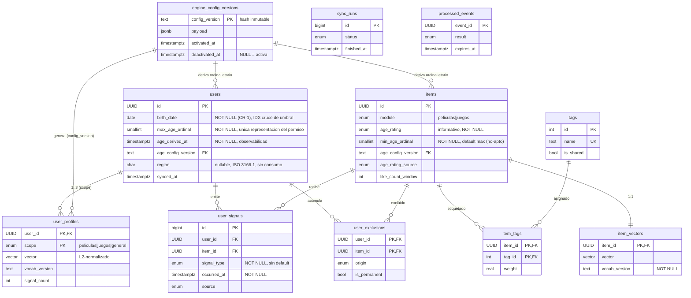

# Modelo de Datos: Servicio de Recomendaciones Híbridas Precomputadas

**Feature**: 001-recomendaciones-precomputadas · **Fecha**: 2026-09-10 · **Estado**: refinamiento de [plan.md](./plan.md) §2

**Alcance**: formaliza la capa de datos que `plan.md` asume. **No modifica el alcance funcional
aprobado.** Toda entidad se remonta a un FR de [spec.md](./spec.md) o a un principio de la
[constitution v1.0.0](../../.specify/memory/constitution.md).

**Regla de lectura**: este documento especifica **qué datos existen y por qué**, no con qué ORM se
acceden. Los tipos son lógicos; su mapeo concreto es decisión de T003.

---

## 1. Separación de responsabilidades de almacenamiento

El principio que ordena todo el modelo: **ningún dato tiene dos fuentes de verdad**.

| Dato | Reside en | Justificación |
|---|---|---|
| Identidad del usuario, catálogo, actividad | **api-general** | Dato ajeno. Principio I: no se accede a su DB; se consume vía REST |
| Proyección local de usuario, ítem y señales | **DB Recomendaciones** | Materialización necesaria para que edad y exclusión se apliquen **íntegramente con datos locales**, sin llamada externa en el request path (FR-003) |
| Perfiles de tags, vectores de ítem | **DB Recomendaciones** | Estado derivado propio. Nadie más lo produce ni lo consume |
| Configuración del motor y su versión | **DB Recomendaciones** + repo | El archivo versionado vive en el repo (Q4); la tabla registra qué versiones existieron, para que un top-N viejo siga siendo interpretable |
| Exclusiones resueltas | **DB Recomendaciones** | Invariante de seguridad. No puede depender de un sistema que se puede caer (FR-050) |
| Idempotencia de eventos | **DB Recomendaciones** + Redis | Redis da velocidad; Postgres da durabilidad. Perder Redis no debe permitir reprocesar (INV-2) |
| Top-N precomputado, filtros calientes, respaldo | **Redis** | **Caché derivada y descartable.** Todo es recomputable desde Postgres |

> ⚠️ **Redis nunca es fuente de verdad.** Su pérdida total es un evento de rendimiento, no de
> integridad: `docs/runbook.md` + T022 describen la reconstrucción. Si algún dato dejara de ser
> recomputable desde Postgres, eso es un defecto de diseño, no una optimización.

**Frontera con `api-general`**: la proyección local es *solo lectura* y *desechable*. Se reconstruye
sincronizando. No se le agregan campos propios ni se edita: eso la convertiría en una segunda fuente
de verdad de un dato ajeno, violando el Principio I.

---

## 2. Entidades persistentes en DB Recomendaciones

### 2.1 `users` — usuario materializado

**Propósito**: permitir el filtro de edad sin llamar a `api-general` en el request path (FR-003, FR-030).

> 🔄 **Revisado 2026-09-10 (RD-1)**: `birth_date` pasa a **obligatoria y confiable por contrato**.
> Desaparece el escenario de edad indeterminable y con él `age_resolution`. Ver §11.

| Atributo | Tipo | Nulo | Notas |
|---|---|---|---|
| `id` | UUID | No | **PK**. Identificador externo de `api-general`; no se genera acá |
| `birth_date` | date | **No** | **Único insumo admitido** para la restricción etaria. Garantizada por contrato (CR-1) |
| `max_age_ordinal` | smallint | **No** | **Única representación del permiso etario.** Derivado de `birth_date` vía config activa. Es el valor que se compara y se indexa |
| `age_derived_at` | timestamptz | **No** | Cuándo se derivó `max_age_ordinal`. **Observabilidad**, no insumo de consulta (§7.5) |
| `age_config_version` | text | **No** | FK → `engine_config_versions`. Mapeo usado en la derivación |
| `region` | char(2) | **Sí** | **ISO 3166-1 alfa-2**, mayúsculas. Proyección anticipada, **sin consumo en esta feature** (RD-4). `CHECK (region ~ '^[A-Z]{2}$')` |
| `synced_at` | timestamptz | No | Marca de última sincronización |

**Índices**:

| Índice | Consulta que sirve |
|---|---|
| PK (`id`) | Lectura por usuario en el request path |
| `idx_users_birth_date (birth_date)` | **Cruce de umbral** (§7.5): `WHERE birth_date IN (:fechas_umbral)` — igualdad exacta sobre el puñado de fechas que hoy hacen cumplir años a un usuario |
| `idx_users_age_config_version (age_config_version) WHERE age_config_version <> :activa` | **Derivados bajo config obsoleta** (§7.5): parcial, normalmente vacío; se puebla solo tras un cambio de catálogo |
| `idx_users_synced_at (synced_at)` | Detección de proyecciones rancias |

> **`region` no se indexa.** No existe consulta que lo justifique: ningún componente la lee. Un índice
> es costo de escritura permanente al servicio de una lectura hipotética. Se añadirá cuando exista un
> requisito de segmentación regional que defina la consulta concreta — no antes.


**Integridad**:
- `birth_date NOT NULL`: el esquema hace **irrepresentable** un usuario sin fecha de nacimiento.
  No hay default: un usuario sin ella no se inserta (§7.5, política de ingesta).
- `max_age_ordinal NOT NULL` **sin default**: no existe el estado «materializado pero sin derivar».
- `age_config_version` es FK real: un ordinal siempre es interpretable, aun si la config cambió.
- `region` **admite nulo y su ausencia no tiene consecuencia alguna**. Asimetría deliberada con
  `birth_date`: esta última es obligatoria porque de ella depende un invariante de seguridad; la
  región no sostiene ningún invariante. Un usuario sin región recibe exactamente las mismas
  recomendaciones que uno con región — porque **ningún componente la lee** (§4.3).

**Una sola representación del permiso.** No se almacena la clasificación etaria legible: sería el
mismo hecho codificado dos veces, derivado del mismo mapeo, y ningún componente la consultaría
—el filtro opera solo sobre el ordinal (§4.2)—. Su único efecto sería habilitar un estado
inconsistente que el esquema no puede impedir. Cuando se necesita la etiqueta legible para
diagnóstico o soporte, se resuelve el ordinal contra `age_config_version` del propio registro, que
es exactamente el mapeo con el que se derivó. La traducción es siempre correcta y nunca ocurre en
el request path.

**Por qué se materializa el ordinal**: el filtro debe ser una **comparación ordinal indexable**
(§4). Calcular la edad desde `birth_date` en cada evaluación implicaría aritmética de fechas sobre
cada candidato, lo que impide usar índice y reintroduce cómputo donde FR-003 lo prohíbe. El costo es
la caducidad por paso del tiempo, que se resuelve en §7.5.

**Ciclo de vida**: creado/actualizado por el Data Transformer (T029). El ordinal se recalcula al
sincronizar, al cruzar un umbral etario y al cambiar el catálogo (§7.5). Nunca se borra por lógica de
negocio; si desaparece del origen, se marca vía `synced_at` rancio. `region` se repuebla en cada
sincronización; nunca se edita ni se enriquece localmente.

#### Por qué se incorpora `region` y se sigue rechazando NC-1

Ambos son atributos sin requisito funcional. Incorporar uno y rechazar el otro exige un criterio
verificable, no una preferencia. El criterio es:

> **¿El atributo tiene un valor de verdad determinable sin decidir funcionalidad?**

| | «Módulo de interés» (NC-1) | `region` |
|---|---|---|
| ¿Existe en el origen? | **No.** Es un concepto de producto que habría que crear | **Sí.** Dato de registro que `api-general` ya posee |
| ¿Tiene semántica definida sin decidir su uso? | **No.** ¿Declarado o inferido? ¿Uno o varios? ¿Con qué vigencia? Cada respuesta es una decisión de producto | **Sí.** «País del usuario según ISO 3166-1». No hay grado de libertad |
| ¿Se puede poblar hoy correctamente? | **No.** Sin definir su semántica, cualquier valor es arbitrario | **Sí.** Se copia del origen y se valida contra un estándar externo |
| Sin consumo, ¿qué es? | **Nada.** Un módulo de interés que nadie lee no significa nada: su significado *es* alterar la selección | **Un hecho verdadero sobre el usuario**, verificable con independencia de que alguien lo use |

La distinción es esa última fila. NC-1 sin consumo es un campo sin significado, y definirlo obliga a
inventar producto —eso sí es alcance nuevo—. `region` sin consumo sigue siendo un dato correcto o
incorrecto, contrastable contra el origen. Proyectarlo no decide nada sobre el motor.

**Costo asumido, declarado sin atenuantes**: un atributo que nadie lee es un atributo que puede
pudrirse en silencio, porque ninguna funcionalidad falla si está mal. La única defensa es la métrica
de §7.6, y es una defensa débil. Ver RD-4 para la alternativa descartada.

> ⚠️ **needs-clarification (NC-1)** — El brief menciona «módulo de interés» del usuario. **La spec no
> define tal atributo** y ningún FR lo requiere: las recomendaciones se piden por módulo en el
> request (FR-006). No lo incluyo. Si existe un requisito de producto no capturado, debe entrar por
> `/speckit.clarify`, no asumirse acá.

> ✅ **NC-3 resuelto**: `api-general` expone `birth_date`. No hay campo `age` ni doble formato.

---

### 2.2 `items` — ítem del catálogo materializado

**Propósito**: candidatos a recomendar, con la clasificación etaria necesaria para filtrar localmente.

| Atributo | Tipo | Nulo | Notas |
|---|---|---|---|
| `id` | UUID | No | **PK**. Identificador externo |
| `module` | enum(`peliculas`,`juegos`) | No | Dimensión obligatoria del modelo |
| `age_rating` | enum | **No** | **Metadato informativo**. Default = valor más restrictivo (FR-051) |
| `min_age_ordinal` | smallint | **No** | **Edad mínima requerida, en escala ordinal**. Es el valor comparado e indexado. Default = máximo de la escala (más restrictivo) |
| `age_config_version` | text | **No** | FK → `engine_config_versions`. Mapeo usado para derivar `min_age_ordinal` |
| `age_rating_source` | enum | No | `declared` \| `unknown_defaulted` — auditoría de fail-closed |
| `like_count_window` | integer | No | Likes en la ventana configurada. Base del respaldo (FR-033a1) |
| `synced_at` | timestamptz | No | |

**Índices**: PK · `idx_items_module_popularity (module, like_count_window DESC)` para el batch de
respaldo (T038) · `idx_items_module_min_age (module, min_age_ordinal)` para el prefiltrado ordinal
(reemplaza a `idx_items_module_rating`; el filtro nunca consulta `age_rating`).

**Integridad**:
- `age_rating` **NOT NULL con default no-apto**. Un ítem sin clasificación es representable, pero
  **nunca como apto**. Esto corrige P2 del prototipo a nivel de esquema, no solo de código.
- `min_age_ordinal` **NOT NULL con default = máximo ordinal**: un ítem sin derivar es representable
  pero inalcanzable para todo usuario. El fail-closed queda en el default del esquema.
- `age_rating` y `min_age_ordinal` derivan del mismo mapeo versionado; su consistencia se verifica
  por test (DI-2), no por constraint.
- `age_rating` restringido al catálogo de la configuración activa (FR-053).

> **Asimetría deliberada con `users`**: un usuario sin `birth_date` **se rechaza** (el dato lo
> garantiza el contrato); un ítem sin clasificación **se acepta como no-apto**. La diferencia es que
> el catálogo es un origen de datos heterogéneo sobre el que no tenemos garantía contractual
> equivalente, y descartar ítems silenciosamente degradaría la cobertura sin señal.

**Disponibilidad regional: fuera de alcance (RD-4).** No se incorpora atributo equivalente a
`users.region`. La simetría sería aparente:

- La región del usuario es un **escalar** copiable; la disponibilidad regional de un ítem es un
  **conjunto** (`{AR, UY, ...}`), con vigencia temporal y a veces con ventanas por región. Proyectar
  eso son una tabla y un ciclo de vida, no una columna.
- Es un dato de **licenciamiento**, con consecuencias legales. Su autoridad reside en el catálogo,
  fuera de este repositorio. Materializar una copia sin consumirla crea una segunda representación
  de una obligación contractual que nadie valida — el peor caso de dato podrido.
- El argumento que justifica `users.region` (evitar una modificación futura del contrato compartido)
  **no aplica**: el contrato de disponibilidad regional no lo define este repositorio.

Si aparece un requisito de segmentación regional, la disponibilidad de ítems entra por
`/speckit.clarify` con su propia modelización. Registrado como **NC-6**.


---

### 2.3 `tags` y `item_tags` — vocabulario y asignación

**Propósito**: sostener el espacio vectorial **único** de FR-010d.

**`tags`**

| Atributo | Tipo | Nulo | Notas |
|---|---|---|---|
| `id` | serial | No | **PK** |
| `name` | text | No | **UNIQUE**. Normalizado |
| `is_shared` | boolean | No | Aparece en ítems de **ambos** módulos. Deriva la propagación cross-module (FR-010a) |

**`item_tags`**

| Atributo | Tipo | Nulo | Notas |
|---|---|---|---|
| `item_id` | UUID | No | **PK compuesta**, FK → `items.id` ON DELETE CASCADE |
| `tag_id` | integer | No | **PK compuesta**, FK → `tags.id` |
| `weight` | real | No | Peso del tag en el ítem |

**Índices**: PK compuesta · `idx_item_tags_tag (tag_id)` para la búsqueda inversa.

> **Decisión**: `is_shared` es atributo de `tags`, no tabla aparte. La tabla `shared_tags` de
> `plan.md` §2 se **consolida acá**: era la misma información con una indirección extra, y un
> booleano no justifica una tabla. Impacto en T003 (ver §9).

---

### 2.4 `item_vectors` — representación vectorial del ítem

**Propósito**: señal content-based (FR-009) sin recomputar TF-IDF en cada recálculo.

| Atributo | Tipo | Nulo | Notas |
|---|---|---|---|
| `item_id` | UUID | No | **PK**, FK → `items.id` ON DELETE CASCADE |
| `vector` | vector(N) | No | Espacio **compartido** entre módulos (FR-010d) |
| `vocab_version` | text | **No** | Versión del vocabulario que lo generó (FR-010f) |
| `computed_at` | timestamptz | No | |

**Índices**: PK · `idx_item_vectors_vocab (vocab_version)` para la transición de T030 · índice
vectorial (ivfflat/hnsw) diferido a Fase 3.

**Integridad**: `vocab_version` **NOT NULL**. Comparar vectores de versiones distintas es error, no
resultado silencioso (FR-010f). El esquema no puede impedirlo solo, pero sí garantiza que el dato
para detectarlo siempre está.

---

### 2.5 `user_profiles` — perfil de tags por módulo y general

**Propósito**: señal content-based por módulo y **señal cross-module** (FR-024).

| Atributo | Tipo | Nulo | Notas |
|---|---|---|---|
| `user_id` | UUID | No | **PK compuesta**, FK → `users.id` ON DELETE CASCADE |
| `scope` | enum(`peliculas`,`juegos`,`general`) | No | **PK compuesta** |
| `vector` | vector(N) | No | L2-normalizado (FR-022c) |
| `vocab_version` | text | No | |
| `signal_count` | integer | No | Señales que lo formaron. Umbral de personalización (D6) |
| `computed_at` | timestamptz | No | |

**Integridad**: hasta tres filas por usuario. El perfil `general` **no** es un cuarto vector
independiente: agrega pesos por tag sobre ambos módulos y es lo que hace posible el cold start
cruzado (SC-010).

> **Decisión**: una sola tabla con `scope` discriminador, no tres tablas. El prototipo usa
> `UserMovieProfile` / `UserGameProfile` / `UserGeneralTagProfile` como clases distintas; a nivel de
> datos son la misma estructura y separarlas triplicaría las consultas del recálculo.

---

### 2.6 `user_signals` — registro de interacción

**Propósito**: base de perfiles y exclusiones. Materializa DEP-1 y DEP-2.

| Atributo | Tipo | Nulo | Notas |
|---|---|---|---|
| `id` | bigserial | No | **PK** |
| `user_id` | UUID | No | FK → `users.id` ON DELETE CASCADE |
| `item_id` | UUID | No | FK → `items.id` |
| `signal_type` | enum(`like`,`dislike`,`consumo`) | **No** | **Sin default.** FR-064 prohíbe inferirlo |
| `occurred_at` | timestamptz | **No** | Resuelve señales contradictorias (FR-029d) |
| `source` | enum(`sync`,`feedback_api`) | No | Origen: Data Transformer o endpoint propio |

**Índices**: PK · `idx_signals_user_item_time (user_id, item_id, occurred_at DESC)` — soporta
directamente «gana la más reciente» · `idx_signals_user_type (user_id, signal_type)`.

**Integridad**: `signal_type` y `occurred_at` **NOT NULL sin default**. Un evento sin tipo de señal
no es representable: va a DLQ (T023). El esquema hace cumplir FR-064.

**Regla de negocio (FR-022b, decisión Q3)**: `like` y `dislike` alimentan el perfil **y** excluyen;
`consumo` **solo excluye**, no altera el vector. Corrige P1 del prototipo, que le daba peso 0.3.

> ⚠️ **needs-clarification (NC-2)** — **Retención**. La spec no define cuánto se conservan las
> señales. Afecta el tamaño de la tabla y, por FR-033a1, qué ventana de popularidad es computable.
> No lo asumo: es decisión de producto con implicancias de privacidad.

---

### 2.7 `user_exclusions` — conjunto de exclusión resuelto

**Propósito**: aplicar el filtro de exclusión en tiempo acotado, sin recorrer el histórico de señales.

| Atributo | Tipo | Nulo | Notas |
|---|---|---|---|
| `user_id` | UUID | No | **PK compuesta**, FK → `users.id` ON DELETE CASCADE |
| `item_id` | UUID | No | **PK compuesta**, FK → `items.id` |
| `origin` | enum(`like`,`dislike`,`consumo`) | No | Señal que la produjo |
| `is_permanent` | boolean | No | `consumo` ⟹ `true`; `dislike` es revertible por like posterior |
| `resolved_at` | timestamptz | No | Trazabilidad de la resolución |

**Índices**: PK compuesta — cubre la consulta de pertenencia, que es la única que el request path
necesita (FR-033d).

**Integridad**: vista materializada de `user_signals` bajo «gana la más reciente». Su regeneración
es determinista y auditable: dadas las mismas señales, produce el mismo conjunto.

**Por qué es tabla y no cálculo al vuelo**: FR-050 exige rechazar la solicitud si el conjunto no está
disponible. Un conjunto que se calcula recorriendo señales sería cómputo en el request path (FR-003);
uno que solo vive en Redis violaría INV-2 al expirar. Debe ser durable y barato de leer.

---

### 2.8 `engine_config_versions` — configuración versionada del motor

**Propósito**: que un top-N generado hace un mes siga siendo interpretable (Q4, FR-025).

| Atributo | Tipo | Nulo | Notas |
|---|---|---|---|
| `config_version` | text | No | **PK**. Hash del archivo. **Inmutable** |
| `payload` | jsonb | No | Copia íntegra de la configuración |
| `activated_at` | timestamptz | No | |
| `deactivated_at` | timestamptz | Sí | `NULL` = versión activa |

**Integridad**:
- Índice parcial único sobre `deactivated_at IS NULL`: **a lo sumo una versión activa**.
- Las filas son **append-only**. Editar una versión existente rompería la trazabilidad de todo
  resultado que la referencie.

**Relación con el repo**: la fuente de verdad del *contenido* es `engine_config/vN.yaml`, versionado
en git (Q4). Esta tabla registra qué versiones **estuvieron activas y cuándo** — información que el
archivo no tiene y que hace falta para interpretar un resultado viejo.

---

### 2.9 `sync_runs` — metadatos del Data Transformer

**Propósito**: freshness observable (FR-040, T031).

| Atributo | Tipo | Nulo | Notas |
|---|---|---|---|
| `id` | bigserial | No | **PK** |
| `started_at` / `finished_at` | timestamptz | No / Sí | `finished_at` nulo ⟹ en curso o interrumpida |
| `status` | enum(`running`,`success`,`failed`) | No | |
| `entity_counts` | jsonb | Sí | Volumen por entidad |
| `failure_reason` | text | Sí | |

**Índices**: `idx_sync_runs_success (finished_at DESC) WHERE status='success'` — la métrica de
freshness es el **último éxito**, no el último intento (T031).

---

### 2.10 `processed_events` — idempotencia

**Propósito**: FR-011. Un evento reentregado no debe recomputar dos veces.

| Atributo | Tipo | Nulo | Notas |
|---|---|---|---|
| `event_id` | UUID | No | **PK**. Provisto por `api-general` (DEP-3) |
| `processed_at` | timestamptz | No | |
| `result` | enum(`recomputed`,`skipped_no_shared_tag`,`dlq`) | No | Auditoría de FR-010c |
| `expires_at` | timestamptz | No | Retención configurable (FR-068) |

**Índices**: PK — la única consulta es pertenencia por `event_id` · `idx_processed_expires
(expires_at)` para la purga.

**Integridad**: PK sobre `event_id` hace la doble inserción **estructuralmente imposible**, no
dependiente de una comprobación previa que podría tener carrera.

**Relación con Redis**: `dedupe:event:{event_id}` es la copia caliente. Perder Redis degrada latencia,
no corrección: la PK sigue rechazando el duplicado (INV-2). Tras `expires_at`, un duplicado tardío
debe poder reprocesarse sin corromper estado (FR-069) — de ahí que el recálculo sea convergente.

---

## 3. Modelo de datos en Redis

> **Redis es caché derivada y descartable.** Todo lo de esta sección es reconstruible desde §2.

### 3.1 Esquema de claves

Convención: `{dominio}:{versión-config}:{identidad}:{dimensión}` — namespacing por prefijo, todas las
claves de recomendación llevan **usuario y módulo**.

| Clave | Estructura | TTL | Reconstrucción |
|---|---|---|---|
| `reco:v{cfg}:{user_id}:{module}` | JSON (§3.2) | `TTL_FRESH` (24 h) | Recálculo del worker |
| `reco:stale:v{cfg}:{user_id}:{module}` | JSON (§3.2) | `TTL_STALE` (7 d) | Copia del último vigente |
| `filters:{user_id}` | JSON: `max_age_ordinal` + `age_config_version` + set de exclusiones | `TTL_FILTERS` (1 h) | Desde `users` + `user_exclusions` |
| `fallback:{module}` | JSON (§3.2, sin `user_id`) | `TTL_FALLBACK` (6 h) | Batch T038 |
| `recompute:lock:{user_id}:{module}` | marca | `TTL_SUPPRESS` (5 min) | No requiere |
| `dedupe:event:{event_id}` | marca | `TTL_DEDUPE` (24 h) | Desde `processed_events` |

**`config_version` en la clave, no solo en el valor**: hace que resultados de versiones distintas
**coexistan sin colisionar**. Cambiar de configuración no requiere invalidación masiva — las claves
viejas expiran solas. Aplica a `reco:` **y** a `reco:stale:` (hallazgo F3).

**`TTL_FILTERS` es deliberadamente el más corto.** Corrige P4 del prototipo, donde `excl:` compartía
los 7 días de `reco:` (`cache_redis.py:33`): una exclusión vencida servía resultados sin filtrar.

### 3.2 Estructura del valor

```jsonc
{
  "schema_version": 1,
  "user_id": "...",           // ausente en fallback:
  "module": "peliculas",
  "config_version": "sha256:ab12...",   // obligatorio
  "vocab_version": "v3",
  "max_age_ordinal": 3,       // snapshot: ordinal del usuario al momento del cálculo
  "computed_at": "2026-09-10T12:00:00Z",
  "items": [
    { "item_id": "...", "rank": 1, "score": 0.87 }
  ]
}
```

**Atributos obligatorios por elemento**: `item_id`, `score`, `rank`. **Obligatorio por entrada**:
`config_version` — es lo que se propaga a la respuesta y hace trazable con qué pesos se generó (Q4).

**`max_age_ordinal` (snapshot etario)**: registra bajo qué permiso se filtró el resultado.
`fallback:` no lo lleva (no es por usuario); se filtra en el momento de servirse.

| Comparación al leer | Significado | Acción |
|---|---|---|
| `snapshot == usuario` | El resultado se calculó con el permiso vigente | Servir |
| `snapshot > usuario` | El permiso **se restringió** (corrección de datos). El resultado puede contener ítems ahora vedados | **Descartar como miss** + emitir recálculo. Nunca servir |
| `snapshot < usuario` | El usuario **creció** (§7.5). El resultado es seguro pero conservador | Servir + emitir recálculo asíncrono. No degrada seguridad |

La asimetría es intencional: el caso inseguro se descarta, el caso seguro-pero-subóptimo se sirve.
Esto hace que la caducidad por cumpleaños **no** produzca latencia ni indisponibilidad.

`schema_version` permite evolucionar el formato sin ambigüedad: una entrada con versión desconocida
se descarta como miss, no se interpreta a medias.

### 3.3 Reconstrucción total

Secuencia (T022), **nunca disparada por tráfico de lectura** (FR-066):

1. El servicio sigue respondiendo: `empty_pending` o `fallback` según precedencia (FR-056).
2. `fallback:{module}` se rehidrata desde la tabla de respaldo (D8) — sin recomputar.
3. El job de warm-up publica señales de recálculo **con límite de tasa**, priorizando usuarios activos.
4. `filters:` y `dedupe:` se repueblan por demanda desde Postgres.

Que la reconstrucción sea un proceso dedicado y no un efecto colateral del tráfico es lo que evita la
avalancha auto-infligida: N lecturas en miss no deben producir N recálculos.

---

## 4. Versionado de configuración del motor

**Contenido** (`engine_config/vN.yaml`): `alpha`, `beta`, `gamma` (pesos de señal, suma 1.0) ·
`k` (vecinos) · `lambda_mmr` (diversificación) · `top_n_default`, `top_n_max` · `peso_like`,
`peso_dislike` · `age_rating_catalog` (mapeo de clasificación etaria) · `tiebreak_criteria` ·
`popularity_window_days` · `diversity_max_cluster_share` · TTLs · umbrales de reintento.

### 4.1 `age_rating_catalog` — única fuente del mapeo ordinal

Es **la única** definición de la escala etaria en todo el sistema. Ningún componente puede tener
una tabla propia, un literal ni una traducción en tiempo de ejecución.

```yaml
age_rating_catalog:
  - { rating: ATP,  ordinal: 0, min_age: 0  }
  - { rating: "13", ordinal: 1, min_age: 13 }
  - { rating: "16", ordinal: 2, min_age: 16 }
  - { rating: "18", ordinal: 3, min_age: 18 }
```

- **Ordinal totalmente ordenado**: `ordinal` es único, contiguo y creciente con `min_age`.
  Verificable al cargar la config (falla el arranque si no).
- **Un solo mapeo, dos usos**: `min_age` deriva `users.max_age_ordinal` (el ordinal más alto cuyo
  `min_age` ≤ edad del usuario); `rating` deriva `items.min_age_ordinal`. Ambos lados hablan la
  misma escala **por construcción**, no por convención.
- **Asimetría de representación**: `users` guarda **solo** el ordinal (RD-2); `items` conserva
  además `age_rating`, porque allí es **dato recibido del origen**, no derivado — descartarlo
  perdería información que no podemos reconstruir.
- **Cambiar el catálogo es cambiar la versión de config**, y obliga a **recalcular todos los
  derivados** (`users.max_age_ordinal`, `items.min_age_ordinal`) antes de activar `vN+1`. Una
  activación con derivados a medio migrar mezclaría escalas: es la única falla capaz de romper el
  filtro sin que ningún componente tenga un bug.
- Los derivados guardan `age_config_version`: un valor cuya versión no es la activa **no se compara**
  (se trata como no derivado ⟹ no apto).

### 4.2 Regla de filtrado etario

> **El filtro de edad es, y solo es:** `item.min_age_ordinal <= user.max_age_ordinal`.

Ningún componente lee `birth_date`, calcula edades ni traduce `age_rating` en tiempo de ejecución.
La aritmética de fechas ocurre **una vez**, en la derivación (§7.5), nunca por candidato.

**Dónde se aplica** — reconciliación con FR-036/FR-049/T037:

| Momento | Qué corre | Fundamento |
|---|---|---|
| Recálculo asíncrono | Pipeline completo: scoring → **edad** → exclusión → MMR | FR-003: todo cómputo fuera del request path |
| Request path | **Solo** la comparación ordinal sobre la lista ya ordenada y acotada (≤ `top_n_max`) | FR-036 + FR-049: un resultado obsoleto o de respaldo **debe** reevaluarse contra los filtros vigentes antes de servirse |

Esto **no** contradice «el filtro se aplica en el recálculo»: el pipeline de selección es asíncrono.
Lo que permanece en el request path es una guarda de seguridad de costo O(n) sobre n ≤ 50, sin
similitud, sin recomputación, sin reordenamiento y sin diversificación (FR-033d). Eliminarla haría
servible un `reco:stale:` o un `fallback:` calculado bajo un permiso que ya no rige — exactamente el
fallo que FR-036 existe para impedir. La comparación ordinal es lo que vuelve esa guarda barata.

### 4.3 Frontera de responsabilidad de `region`

| Afirmación | Alcance |
|---|---|
| **Dato ajeno proyectado** | La fuente de verdad es `api-general`. Este repositorio guarda una copia de solo lectura (§1) |
| **No se edita ni se enriquece localmente** | Nada de inferencia por IP, por idioma ni por ningún otro medio. Inferirla la convertiría en dato propio y violaría el Principio I |
| **Sin consumo en esta feature** | Ni el motor, ni el post-procesamiento (scoring → edad → exclusión → MMR), ni el request path la leen |
| **Verificable** | Test: ninguna consulta de esos componentes referencia la columna. Es una aserción sobre el código, no una convención |

**Impacto sobre invariantes existentes: ninguno.** `region` es nulable, no participa de ninguna
derivación, no entra en ninguna clave y no tiene índice. Los invariantes etarios (DI-1, DI-2,
DI-2a'..DI-2e) y de exclusión (DI-3) dependen de `birth_date`, de los ordinales y de
`user_exclusions`; ninguno los toca. No se agrega invariante nuevo: **no hay nada que preservar**
sobre un atributo que nadie lee. Ese vacío es exactamente el costo declarado en §2.1.

**Ausencia de dimensión en la clave de caché.** El criterio que incorporó `module` y `config_version`
a la clave (§3.1) es: *una dimensión se agrega cuando resultados de valores distintos deben coexistir
sin colisionar*. Hoy la región no participa del cálculo, así que dos usuarios idénticos en todo salvo
la región obtienen **el mismo resultado**. Incorporarla multiplicaría las entradas por la cantidad de
regiones para almacenar copias idénticas — costo de memoria puro, sin ganancia.

Si mañana existiera segmentación regional, el cambio sería **aditivo y sin invalidación masiva**: la
segmentación llegaría acompañada de un cambio de configuración del motor, y `config_version` ya está
en la clave. Las entradas viejas quedarían en un espacio de nombres que nadie lee y expirarían solas
(§4, «no hay invalidación masiva»). Que la clave ya versione la configuración es lo que vuelve barato
este cambio futuro — no hace falta anticiparlo en la clave.

**Identificador**: hash criptográfico del archivo. Determinista e **inmutable**: mismo contenido ⟹
mismo identificador, en cualquier máquina.

**Trazabilidad (FR-025, Q4)**: toda recomendación persistida y servida referencia su
`config_version`. Está en el valor de Redis (§3.2), en la clave (§3.1) y en la respuesta de la API.
Sin esto, «¿por qué el sistema recomendó esto?» es incontestable.

**Cambio de versión activa**:

| Paso | Efecto |
|---|---|
| Se activa `vN+1` | `deactivated_at` de `vN` deja de ser nulo; nueva fila activa |
| Claves `reco:v{N}` | Siguen existiendo; **ya no se leen** (la clave incorpora la versión) |
| Lecturas nuevas | Miss bajo `vN+1` → precedencia FR-056: respaldo o pendiente |
| Expiración | Las claves de `vN` se purgan solas por TTL |

**No hay invalidación masiva**, y esa es la ventaja de tener la versión en la clave: el cambio de
configuración es un no-evento operativo.

---

## 5. Diagrama entidad-relación



**Fronteras**:

| Zona | Entidades | Naturaleza |
|---|---|---|
| **Ajena** (`api-general`) | identidad, catálogo, actividad | Consumida vía REST. Nunca duplicada como verdad |
| **Proyección local** | `users`, `items`, `tags`, `item_tags`, `user_signals` | Materialización desechable de datos ajenos |
| **Derivada durable** | `item_vectors`, `user_profiles`, `user_exclusions` | Propia. Recomputable, pero persistida por costo |
| **Operativa** | `engine_config_versions`, `sync_runs`, `processed_events` | Propia. `processed_events` **no** es recomputable — es memoria de hechos |
| **Caché** | Todo Redis | Descartable |

> `sync_runs` y `processed_events` no tienen FK: son bitácoras, no participan del grafo relacional.

---

## 6. Invariantes de datos

| ID | Invariante | Verificación | Origen |
|---|---|---|---|
| **DI-1** | Ningún ítem se persiste ni se sirve sin clasificación etaria resuelta | `items.age_rating NOT NULL` + default no-apto. Test: insertar sin rating → default restrictivo, nunca permisivo | FR-051 |
| **DI-2** | Todo usuario materializado tiene `birth_date` y ordinal etario completo y vigente | `birth_date`, `max_age_ordinal`, `age_derived_at`, `age_config_version` todos `NOT NULL` sin default. Test: insertar sin `birth_date` → rechazo de la base | RD-1, CR-1 |
| ~~DI-2a~~ | ~~Consistencia `max_age_rating` ↔ `max_age_ordinal`~~ | **ELIMINADO (RD-2)**: verificaba la coherencia entre dos representaciones del mismo hecho. Al quedar una sola, el estado inconsistente es irrepresentable y el invariante queda sin objeto | — |
| **DI-2a'** | El ordinal de todo usuario corresponde a su `birth_date` bajo `age_config_version` | Test de propiedad: para toda fila, `max_age_ordinal` es el que el mapeo registrado asigna a esa fecha. Sustituye a DI-2a con un objeto real: la derivación, no la duplicación | §4.1 |
| **DI-2b** | Ningún resultado almacenado ni servido contiene un ítem con `min_age_ordinal > max_age_ordinal` del usuario | Test de invariante: recorrer `reco:*` y `reco:stale:*` y cruzar contra `users`. Intersección de violaciones = ∅ | §4.2 |
| **DI-2c** | Todo cambio de `max_age_ordinal` invalida los resultados precomputados de ese usuario | Test: alterar el ordinal → la lectura siguiente no sirve el resultado previo (descarte o recálculo según §3.2) | §3.2, §7.5 |
| **DI-2d** | No existe forma de desactivar, saltear ni relajar el filtro por configuración | Revisión + test: no hay flag, no hay rama condicional, no hay valor de config que lo evite. `age_rating_catalog` no admite un ordinal «comodín» | Principio de seguridad |
| **DI-2e** | Ningún usuario con `age_config_version` distinta de la activa se evalúa | Test: ordinal derivado bajo otro mapeo no es comparable. Consulta de §7.5 causa B como chequeo permanente | §4.1, §7.5 |
| **DI-3** | Ningún elemento del conjunto de exclusión aparece en un top-N almacenado | Test de invariante (T017): para todo `reco:*`, intersección con `user_exclusions` = ∅ | FR-050 |
| **DI-4** | Todo top-N almacenado referencia una `config_version` existente | Test de integridad: cada `config_version` de Redis existe en `engine_config_versions` | Q4, FR-025 |
| **DI-5** | La clave de recomendación distingue siempre el módulo | Test unitario del constructor de claves: no existe forma de generar una sin `module` | §3.1 |
| **DI-6** | El mismo `event_id` no se procesa dos veces | PK sobre `processed_events.event_id`. Test: 10 inserciones → 1 fila, 1 recálculo | FR-011 |
| **DI-7** | A lo sumo una configuración activa | Índice parcial único sobre `deactivated_at IS NULL` | FR-025 |
| **DI-8** | Ningún vector se compara con otro de distinta `vocab_version` | `vocab_version NOT NULL` + error explícito al comparar | FR-010f |
| **DI-9** | Edad y exclusión se resuelven **solo con datos locales** | Test: el request path no emite ninguna llamada a `api-general` | FR-003, INV-1 |

**DI-1, DI-2 y DI-7 se cumplen en el esquema**, no en el código. Es la diferencia entre un invariante
que se puede violar por olvido y uno que la base rechaza.

DI-2 y DI-2a'..DI-2e son los invariantes etarios exigidos por RD-1, con la corrección de RD-2.
Nótese que **DI-2b es el único que no puede garantizarse en el esquema**: cruza Redis con Postgres.
Por eso es un test de invariante transversal (T017) y no una constraint — y por eso la guarda del
request path (§4.2) existe.

---

## 7. Ciclo de vida y consistencia

### 7.1 Escritura

```
api-general ──REST──> Data Transformer ──> users, items, tags, item_tags, user_signals
                                             │
                                             ├──> item_vectors    (TF-IDF, vocab compartido)
                                             ├──> user_profiles   (3 scopes)
                                             └──> user_exclusions (resolución de señales)

evento ──> Worker ──> processed_events (idempotencia)
                 └──> engine + post-proceso ──> reco:v{cfg}:{user}:{module}
                                                reco:stale:v{cfg}:...
```

### 7.2 Lectura y ausencia de resultado precomputado

Precedencia **estricta** de FR-056 — el orden importa y es lo que hace el comportamiento determinista:

| # | Condición | `result_type` |
|---|---|---|
| 1 | Recálculo en curso o sin datos suficientes | `empty_pending` |
| 2 | Candidatos agotados tras filtrar | `empty_no_candidates` |
| 3 | Sin top-N personalizado, hay respaldo | `fallback` |
| 4 | Vigente vencido, obsoleto disponible | `personalized_stale` |
| 5 | Top-N vigente | `personalized` |

**Nunca se devuelve vacío silencioso** — corrige la deuda del prototipo. Cada estado es distinguible
y accionable por el consumidor. **Redis caído ≠ miss**: es `503` con `Retry-After` (FR-065), nunca
un `200` engañoso.

### 7.3 Consistencia eventual

El sistema es **eventualmente consistente por diseño** (Principio III): el top-N refleja el estado
del perfil al momento del último recálculo.

| Ventana | Valor | Origen |
|---|---|---|
| Señal → top-N actualizado | segundos a minutos | Latencia del worker |
| Frescura aceptable | `TTL_FRESH` = 24 h | D5 |
| Obsolescencia máxima servible | `TTL_STALE` = 7 d | D5, Q1 |
| Antigüedad de la proyección | `sync_runs` + alerta | T031, T042 |

**Excepción sin ventana de tolerancia**: los invariantes de seguridad. Una exclusión registrada es
efectiva en la **siguiente lectura** —el filtro se aplica al servir, no solo al precomputar (FR-036)—
y por eso `TTL_FILTERS` es corto. Un top-N puede estar desactualizado; **nunca puede estar mal
filtrado**.

### 7.4 Migraciones

Regla: **expand → migrate → contract**. Nunca destructivo en un solo despliegue.

1. Agregar estructura nueva, nullable o con default seguro
2. Backfill idempotente y reanudable
3. Endurecer constraints
4. Eliminar lo viejo, en despliegue posterior

Toda migración tiene `downgrade` probado (T003). Un cambio de dimensionalidad del vector implica
`vocab_version` nueva: los vectores se recalculan **antes** de activarla (FR-010g), nunca conviven
mezclados.

### 7.5 Ingesta de usuarios y caducidad de los derivados etarios

**Política de ingesta (Data Transformer, T029)** — un usuario sin `birth_date` **no se inserta ni se
actualiza en modo degradado**:

| Paso | Acción |
|---|---|
| 1 | Se **rechaza** el registro. No hay inserción parcial ni fila con derivados por default |
| 2 | Se registra como **violación de contrato** (`WARN`), con `user_id` y `sync_run_id`, no como error de datos del usuario |
| 3 | El usuario queda **fuera del universo recomendable**: sin fila, no hay a quién recomendar. La ausencia es el fail-closed |
| 4 | Se incrementa `contract_violations_total{field="birth_date"}`, cuyo **valor esperado es 0**. Cualquier valor > 0 alerta: indica que `api-general` incumple CR-1 |
| 5 | `sync_runs.result` refleja el rechazo; la corrida no se marca exitosa en silencio |

Que la métrica tenga valor esperado cero es lo que la vuelve útil: no mide un fenómeno normal con
umbral arbitrario, mide un incumplimiento binario.

**Caducidad del ordinal.** Es el costo de materializarlo: `max_age_ordinal` es correcto *al momento
de derivarlo* y deja de serlo por **dos causas distintas**, que exigen consultas y respuestas
distintas.

#### Causa A — Cruce de umbral etario (paso del tiempo)

El usuario cumple la edad de un umbral del catálogo (13, 16, 18). Afecta a un conjunto **pequeño y
exactamente identificable** de usuarios por día.

**Criterio de selección** — no es un recorrido por antigüedad de derivación:

```sql
-- Para cada umbral U del catálogo activo, la fecha de nacimiento de quien
-- cumple exactamente U años hoy. Son tantas fechas como umbrales (3 o 4).
WHERE birth_date IN (:hoy - U1 años, :hoy - U2 años, ...)
```

Es **igualdad exacta** sobre un puñado de valores, resuelta por `idx_users_birth_date`. Buscar
«derivados antiguos» sería incorrecto además de caro: la antigüedad de la derivación no predice el
cruce de umbral —un usuario derivado hace un año puede seguir teniendo el ordinal correcto, y uno
derivado ayer puede cumplir años hoy—.

Acción: actualizar `max_age_ordinal` y `age_derived_at`; emitir evento de recálculo por usuario
(mismo camino que cualquier otra invalidación, con la idempotencia de `processed_events`).

| Parámetro | Valor | Fundamento |
|---|---|---|
| Frecuencia | **Diaria**, fuera de pico | Los umbrales son de granularidad diaria |
| Ventana máxima de caducidad aceptable | **24 h** | Cota superior del desfasaje |
| Dirección del desfasaje | **Siempre conservadora** | El ordinal viejo es *menor* que el correcto: el usuario ve **menos** contenido del que le corresponde. Nunca más |
| Métrica | `age_ordinal_staleness_seconds` (máx.) | Alerta si supera la ventana |

**La ventana de 24 h no es una ventana de riesgo de seguridad.** El paso del tiempo solo puede
volver a un usuario *más* permitido, jamás menos.

#### Causa B — Derivado bajo una versión de configuración distinta de la activa

Un cambio de `age_rating_catalog` reasigna la escala: los ordinales derivados con el mapeo anterior
**no son comparables** con los de ítems derivados con el nuevo. Es un caso categóricamente distinto
del anterior: afecta potencialmente a **toda** la tabla y no lo produce el paso del tiempo.

**Criterio de selección**: `WHERE age_config_version <> :version_activa`, resuelto por el índice
parcial `idx_users_age_config_version`. Normalmente el conjunto es **vacío**; se puebla solo tras
activar un catálogo nuevo.

Acción: recálculo masivo de `max_age_ordinal` (y de `items.min_age_ordinal`), **antes** de activar
`vN+1` (§4.1). Un usuario cuya `age_config_version` no es la activa tiene un ordinal no comparable:
no se lo evalúa contra ítems de la escala nueva.

> Esta consulta es también la **verificación** de que la migración de §4.1 terminó. Que sea barata y
> normalmente vacía la vuelve apta para ejecutarse como chequeo permanente, no solo durante el
> despliegue.

**`age_derived_at` no participa de ninguna de las dos consultas.** Es un atributo de observabilidad:
alimenta `age_ordinal_staleness_seconds` y permite auditar cuándo se tocó un registro. Indexarlo
para el refresco habría sido optimizar una consulta que el proceso no ejecuta.

**El caso inseguro no llega por ninguna de estas dos vías.** Que un permiso se **restrinja** —por
corrección de una fecha de nacimiento errónea— llega por sincronización (CR-4) y se propaga de
inmediato: la actualización de `users` invalida los resultados y, hasta que el recálculo ocurra, la
guarda del request path (§4.2) descarta el snapshot con ordinal mayor (§3.2).

### 7.6 Ingesta de `region`

Contrasta con la política de `birth_date` (§7.5) en todo salvo en la observabilidad:

| Situación | Comportamiento |
|---|---|
| Región presente y válida (ISO 3166-1 alfa-2) | Se persiste tal cual, en mayúsculas |
| **Región ausente** | Se persiste `NULL`. **El usuario se materializa normalmente** y es plenamente elegible para recibir recomendaciones |
| **Región fuera del dominio admitido** | Se persiste `NULL` (no el valor inválido: guardar basura validada es peor que no guardar). Se registra el valor rechazado en el log, no en la columna. El usuario se materializa normalmente |

**Ninguna de estas situaciones impide materializar al usuario ni afecta sus recomendaciones.** No
podría: nada las lee. Un `NULL` en `region` es indistinguible, para el motor, de cualquier valor.

**Observabilidad** — métrica deliberadamente **distinta** de la de campos obligatorios:

| Métrica | Valor esperado | Severidad | Significado |
|---|---|---|---|
| `contract_violations_total{field="birth_date"}` | **Exactamente 0** | Alerta | Incumplimiento de CR-1. Rompe el contrato y deja usuarios fuera del servicio |
| `projection_field_anomalies_total{field="region", reason="missing"\|"invalid"}` | **Bajo, no necesariamente 0** | Solo panel, sin alerta | Calidad de un dato sin consumo. No degrada nada hoy |

Confundirlas sería el error: alertar por región ausente entrenaría al equipo a ignorar alertas de una
familia que incluye violaciones reales de contrato. La métrica de región existe para que, **el día
que la región se consuma**, se sepa de antemano en qué estado está el dato — que es la única defensa
contra la degradación silenciosa que RD-4 declara como costo.

---

## 8. Correspondencia con el prototipo

| Prototipo | Entidad definitiva | Divergencia | Acción | Tarea |
|---|---|---|---|---|
| `Item` (`domain.py:18`) | `items` + `item_tags` | `tag_vector` embebido en el objeto | Separar a `item_vectors` con `vocab_version` | T003, T007 |
| `Movie` / `Game` | `items.module` | Subclases por módulo | Discriminador, no herencia: el módulo es dato | T003 |
| `User` (`domain.py:55`) | `users` | `.age` calculada al vuelo, por candidato | Materializar `max_age_ordinal`; la aritmética de fechas ocurre una vez (§7.5) | T003, T029 |
| `Feedback.WEIGHTS` (`domain.py:76`) | `user_signals` + config | **`consumo` pesa 0.3 sobre el perfil** | Solo excluye, no altera el vector (Q3) | T008 |
| `UserMovieProfile` / `UserGameProfile` / `UserGeneralTagProfile` | `user_profiles.scope` | Tres clases distintas | Una tabla, discriminador `scope` | T003 |
| `TfIdfVectorizer` (`vectorizer.py:44`) | `item_vectors` | **Vocabulario independiente por módulo** | Espacio único compartido (FR-010d) | T007, T030 |
| `AGE_RATING_MIN` (`orchestration.py:19`) | `age_rating_catalog` en config | **Constante en código; `.get(rating, 0)` fail-open** | Externalizar a config con ordinal; desconocido ⟹ ordinal máximo (no apto) | T004, T013 |
| `ExclusionSet` (`orchestration.py:102`) | `user_exclusions` | Estado interno accedido desde el batch | Tabla + interfaz pública de pertenencia | T014 |
| `RedisCache` (`cache_redis.py:67`) | §3 | **`DEFAULT_TTL` 7 d compartido; sin `config_version`** | TTLs diferenciados; versión en clave y valor | T018, T019 |
| `reco:{user}:{module}` (`cache_redis.py:103`) | `reco:v{cfg}:{user}:{module}` | **El módulo ya está**; falta `config_version` | Agregar versión al namespace | T018 |
| `excl:{user}:{module}` (`cache_redis.py:107`) | `filters:{user_id}` | Mismo TTL que `reco:` | `TTL_FILTERS` estrictamente menor | T018 |
| — | `sync_runs` | **Entidad ausente** | Crear: freshness observable | T003, T031 |
| — | `processed_events` | **Entidad ausente** | Crear: idempotencia durable | T003, T024 |
| — | `engine_config_versions` | **Entidad ausente** | Crear: trazabilidad de Q4 | T003, T004 |

> **Corrección al brief**: se pedía resolver «ausencia de la dimensión de módulo en la clave». El
> prototipo **sí** la incluye (`cache_redis.py:103`). La ausencia real es la de `config_version`.
> No se documenta una divergencia inexistente.

---

## 9. Impactos sobre `spec.md`, `plan.md`, `tasks.md` e issues

### 9.1 `spec.md`

| FR | Acción | Detalle |
|---|---|---|
| **FR-030** | ✏️ Reescribir | El filtro se resuelve por comparación ordinal local, no por «edad del usuario» genérica |
| **FR-052** | ⚠️ **Obsoleto en su forma actual** | «Si la edad no puede determinarse ⟹ restricción máxima» pierde referente: el caso es **irrepresentable** (DI-2). Reemplazar por: *un usuario sin `birth_date` MUST ser rechazado en ingesta y MUST NOT existir en el universo recomendable* |
| **FR-051** | ✅ Se mantiene | Aplica a **ítems**, donde el fail-closed por default sigue siendo necesario |
| **FR-036 / FR-049 / FR-033d** | ✅ Sin cambio | La guarda ordinal del request path los satisface (§4.2). **No se debilitan** |
| **FR-053** | ✏️ Precisar | El catálogo etario debe definir ordinal único, contiguo y monótono (§4.1) |
| **DEP-5** | ⚠️ Endurecer | De «edad o fecha de nacimiento» a **`birth_date` obligatoria, no nula y confiable**. Pasa de dependencia informativa a **requisito contractual duro** (CR-1) |
| **Nuevo FR** | ➕ Crear | Caducidad de derivados etarios: ventana máxima 24 h, proceso periódico, dirección conservadora (§7.5) |
| **`region`** | ⭕ **Sin impacto** | No corresponde FR alguno: no habilita comportamiento observable. Un FR describiría un requisito inexistente. Solo se refleja en DEP/contratos como CR-5/CR-6 |

### 9.2 `plan.md`

§2 ya delega en este documento. Agregar a la lista de componentes el job `age_threshold_refresh`
(Fase 1: sin él, DI-2c se degrada con el tiempo). Cerrar la referencia a resolución de edad en D-items.

### 9.3 `tasks.md`

| Tarea | Acción | Detalle |
|---|---|---|
| **T003** | ⚠️ Modificar | `users`: `birth_date NOT NULL`, `max_age_ordinal`, `age_derived_at`, `age_config_version`. **Sin `max_age_rating`** (RD-2) ni `age_resolution`. Índices `idx_users_birth_date` e `idx_users_age_config_version` (parcial) — **no** `idx_users_age_staleness` (RD-3). `items`: `min_age_ordinal`, `idx_items_module_min_age`; conserva `age_rating` |
| **T004** | ⚠️ Modificar | Validar `age_rating_catalog` al cargar: ordinal único, contiguo, monótono con `min_age`. Falla el arranque si no |
| **T013** | ⚠️ Modificar | El filtro es **solo** `min_age_ordinal <= max_age_ordinal`. TDD: el test rojo debe incluir el caso fail-open del prototipo |
| **T017** | ⚠️ Modificar | Cubrir DI-2, DI-2a', DI-2b, DI-2c, DI-2d, **DI-2e**. **No** implementar DI-2a (eliminado por RD-2) |
| **T029** | ⚠️ Modificar | Política de rechazo + `contract_violations_total` con valor esperado 0. Deriva solo el ordinal |
| **T031** | ✏️ Precisar | Exponer `age_ordinal_staleness_seconds` (desde `age_derived_at`) y el conteo de derivados bajo config no activa |
| **T037** | ✏️ Precisar | La guarda del request path es comparación ordinal. **No se elimina** |
| **T042** | ✏️ Precisar | Alertas: `contract_violations_total > 0`; `age_ordinal_staleness_seconds > 24 h`; derivados bajo config no activa > 0 |
| **T047** | ⚠️ Modificar | Documentar CR-1..CR-4 en `docs/contracts/required-fields.md` |
| **T051** | ➕ **Crear** | Job `age_threshold_refresh`, con **dos criterios de selección separados** (§7.5 causa A por igualdad sobre fechas de umbral; causa B por config no activa). Fase 1. Depende de T003, T004 |

**Impacto de `region` (RD-4) sobre el backlog: mínimo y sin funcionalidad.**

| Tarea | Acción | Detalle |
|---|---|---|
| **T003** | ✏️ Precisar | Columna `region char(2) NULL` con `CHECK (region ~ '^[A-Z]{2}$')`. **Sin índice** |
| **T029** | ✏️ Precisar | Mapear `region` desde el origen; `NULL` ante ausencia o valor fuera de dominio; `projection_field_anomalies_total` (§7.6) |
| **T031** | ✏️ Precisar | Exponer la métrica **en panel, sin alerta** — distinta de `contract_violations_total` |
| **T047** | ✏️ Precisar | Documentar CR-5 y CR-6 |

**Ninguna tarea nueva, ningún issue nuevo, ninguna estimación cambia.** `region` no habilita
funcionalidad: no hay lógica que implementar, ni test de comportamiento que escribir más allá de la
validación de dominio en T029 y la aserción de §4.3 (que ningún componente la lee). No genera épica
ni criterio de aceptación funcional. Es una columna, un mapeo y una métrica.

**Ninguna tarea se cierra por obsolescencia.** Todas se refinan.

### 9.4 Issues de GitHub

| Issue | Acción |
|---|---|
| #3, #4, #13, #17, #29, #47 | ⚠️ **Modificar** cuerpo (criterios de aceptación afectados) |
| #31, #37, #42 | ✏️ **Precisar** (agregar criterio) |
| **nuevo #51+** | ➕ **Crear** issue de T051, milestone Fase 1, épica de datos |
| — | ✅ **Ninguno se cierra** |

> Los issues afectados por `region` (#3, #29, #31, #47) ya figuran arriba por las correcciones
> etarias. **`region` no agrega ningún issue a la lista**: se absorbe en cambios ya necesarios.

> ⚠️ La numeración issue↔tarea (`TXXX`→`#XXX`) se rompe con T051, porque #51–#60 ya son épicas. El
> issue nuevo tomará #61. Conviene anotarlo en `tasks.md` para no reintroducir la suposición.

---

## 10. Contrato requerido a `api-general`

Este repositorio tiene **prioridad de definición** sobre el modelo de datos; `api-general` se acopla.

| ID | Requisito | Consecuencia del incumplimiento |
|---|---|---|
| **CR-1** | El usuario expone **`birth_date`** (`date`, ISO 8601), **obligatoria y no nula** | El usuario se rechaza en ingesta y no recibe recomendaciones |
| **CR-2** | `birth_date` es **confiable**: validada en origen, no derivada ni estimada | Un dato erróneo produce un permiso etario erróneo. Es la fuente única |
| **CR-3** | No se expone campo `age` ni escalar equivalente | Un segundo formato reintroduce la resolución ambigua que RD-1 elimina |
| **CR-4** | Toda corrección de `birth_date` genera evento de sincronización | Sin él, un permiso restringido tarda hasta el próximo sync completo |
| **CR-5** | El usuario expone **`region`** como código **ISO 3166-1 alfa-2** en mayúsculas. **Best-effort**: puede venir ausente o nula | **NO se rechaza al usuario.** Se persiste `NULL` y se materializa igual (§7.6). Solo se contabiliza en `projection_field_anomalies_total` |
| **CR-6** | Toda corrección de `region` se refleja en la siguiente sincronización | Ninguna. No requiere evento dedicado ni invalidación de caché: nada consume el valor (§4.3). Se corrige solo por el sync periódico |

**Sobre el nivel de garantía de CR-5**: es el único requisito de la serie que **no** es exigible. Se
pide el estándar de codificación, no la presencia del dato. Exigir presencia sería incoherente:
no podemos convertir en bloqueante un campo que no usamos. Si `api-general` no puede emitir ISO
3166-1, es preferible que **no emita nada** a que emita texto libre — un `NULL` es honesto, un
`"Buenos Aires"` en un campo declarado ISO es una mentira que alguien creerá más adelante.

A documentar en `docs/contracts/required-fields.md` (T047) y a reflejar en la constitution de
`api-general` como cambio de contrato que requiere aprobación.

---

## 11. Registro de decisión

### RD-1 — `birth_date` obligatoria; filtro etario por comparación ordinal

**Contexto**: el modelo original admitía `birth_date` nula, un campo `age` alternativo y un atributo
de auditoría `age_resolution` con fail-closed sobre `undetermined` (FR-052).

**Decisión**: `birth_date` obligatoria y no nula como único insumo. Derivar `max_age_ordinal` y
comparar ordinales. Eliminar `age_resolution`.

**Fundamento**:
1. `age_resolution` audita un estado que ya no puede ocurrir. Un atributo cuyo dominio útil es vacío
   es ruido, y peor: **sugiere que el caso es manejable**, invitando a código que lo maneje.
2. La comparación ordinal es indexable; la comparación por enum requiere traducir en tiempo de
   ejecución, que es exactamente donde vivía el bug fail-open del prototipo (`.get(rating, 0)`).
3. Con un solo insumo obligatorio, el fail-closed se mueve del código al esquema: no hay rama que
   olvidar.

### Alternativa descartada — `birth_date` opcional + `age_resolution` + fail-closed

**En qué consistía**: aceptar usuarios sin fecha de nacimiento, registrar la procedencia de la
resolución, y aplicar la restricción máxima cuando fuera indeterminable.

**Por qué se descarta**: dado que `api-general` se acopla a este modelo, aceptar el dato ausente
sería tolerar voluntariamente una degradación evitable. Introduce un estado (`undetermined`) que
debe manejarse en cada punto de decisión, y un usuario permanentemente limitado al contenido más
restrictivo sin señal accionable — un fallo silencioso disfrazado de comportamiento seguro.

**Ventaja real que se resigna**: robustez ante un origen de datos incompleto. La alternativa degrada;
esta decisión rechaza. Rechazar es más visible, pero deja usuarios sin servicio.

**Condición bajo la cual debe reconsiderarse** — cualquiera de estas la reactiva:

1. `api-general` deja de poder garantizar CR-1 (p. ej. registro social sin fecha de nacimiento, o
   requisito legal de que el campo sea opcional).
2. Aparece un **segundo consumidor** del contrato con garantías distintas, de modo que este
   repositorio pierde la prioridad de definición.
3. `contract_violations_total{field="birth_date"}` deja de ser cero de forma sostenida y el origen
   no puede corregirse: la realidad contradice al contrato, y el modelo debe seguir a la realidad.

En cualquiera de los tres casos, la reversión es aditiva: relajar `NOT NULL`, reintroducir el
atributo de procedencia y hacer que `max_age_ordinal` tome el máximo del catálogo ante ausencia.
La escala ordinal **no** cambia — solo el modo de poblarla.

---

### RD-2 — Ordinal como única representación del permiso etario del usuario

**Contexto**: RD-1 introdujo `max_age_ordinal` **junto a** `max_age_rating`. Ambos codificaban el
mismo hecho, derivaban del mismo mapeo y ninguna consulta leía el enumerado: §4.2 establece que el
filtro opera solo sobre el ordinal y que ningún componente traduce clasificaciones en runtime.

**Decisión**: eliminar `max_age_rating` de `users`. Conservar solo `max_age_ordinal`.

**Fundamento**: el propio documento admitía que la consistencia entre ambos «se verifica por test,
no por constraint — la base no conoce el mapeo». Esa admisión es el argumento: la duplicación
**crea** un estado inconsistente posible que sin ella no existiría, y traslada al test la carga de
detectarlo. Un invariante que solo hace falta porque duplicamos un dato es un costo autoinfligido.

**Qué se pierde**: legibilidad directa en inspección de la tabla. Se recupera resolviendo el ordinal
contra `age_config_version` del propio registro — traducción siempre correcta, porque usa el mapeo
con el que se derivó, y nunca en el request path.

**No aplica a `items`**: ahí `age_rating` es dato recibido del origen, no derivado. Eliminarlo
perdería información irreconstruible y borraría la trazabilidad de `age_rating_source`.

**Invariante eliminado**: DI-2a queda sin objeto. Se sustituye por DI-2a', que verifica lo que sí
importa —que el ordinal corresponda a la fecha de nacimiento bajo el mapeo registrado—.

**Reconsiderar si**: apareciera un consumidor que requiera la etiqueta legible en caliente y con
volumen tal que la resolución contra la config resulte costosa. Sería entonces una **caché** de
presentación explícita, no un atributo del modelo.

---

### RD-3 — Índice orientado a la consulta de cruce de umbral

**Contexto**: RD-1 definió `idx_users_age_staleness (age_derived_at, birth_date)` para detectar
derivados caducados.

**Decisión**: reemplazarlo por `idx_users_birth_date (birth_date)` y un índice parcial sobre
`age_config_version`. Reclasificar `age_derived_at` como atributo de observabilidad.

**Fundamento**: el índice servía a una consulta que el proceso no ejecuta. El refresco no busca
*derivados antiguos* sino *usuarios que cruzan un umbral hoy*, lo cual es igualdad exacta sobre
tantas fechas como umbrales tenga el catálogo. La antigüedad de la derivación **no predice** el
cruce: un usuario derivado hace un año puede tener el ordinal correcto y uno derivado ayer puede
cumplir años hoy. Liderar el índice por `age_derived_at` habría forzado un recorrido por rango
seguido de descarte, sobre toda la tabla.

**Corolario**: al separar las consultas se hizo visible que hay **dos causas** de caducidad con
respuestas distintas —cruce de umbral (incremental, diario, seguro) y cambio de catálogo (masivo,
bloqueante de la activación)—. La formulación anterior las confundía en un solo barrido. La segunda
queda cubierta por `idx_users_age_config_version`, índice parcial normalmente vacío que sirve además
como verificación permanente de que la migración de §4.1 terminó (DI-2e).

---

### RD-4 — `region` como anticipación de contrato, sin consumo funcional

**Contexto**: ningún FR de `spec.md` exige recomendaciones regionales. El atributo no habilita
funcionalidad en esta feature.

**Decisión**: incorporar `users.region` (`char(2)`, ISO 3166-1 alfa-2, nulable, sin índice, sin
dimensión de clave). **No** incorporar disponibilidad regional en `items`.

**Fundamento**:
1. **La asimetría de costo de cambio.** Agregar una columna a una tabla propia es una migración
   local. Agregar un campo al contrato compartido requiere coordinación con `api-general`, cambio
   de versión de contrato y aprobación según su constitution. Definirlo ahora, mientras este
   repositorio tiene prioridad de definición y el contrato aún no está congelado, cuesta casi nada;
   hacerlo después cuesta una negociación entre repositorios.
2. **No es alcance nuevo** según el criterio verificable de §2.1: `region` tiene valor de verdad
   determinable sin decidir funcionalidad, a diferencia de NC-1.
3. **No compromete nada.** Nulable, sin índice, sin clave, sin invariante, sin lectura.

**Costo asumido, sin atenuar**: se persiste un dato que nadie valida por uso. Ninguna funcionalidad
falla si está mal, así que su degradación es silenciosa por construcción. Añade una columna al
esquema, al mapeo del Data Transformer y a la superficie de privacidad (NC-5) a cambio de un
beneficio íntegramente futuro y condicional. Si la segmentación regional nunca llega, esto fue
trabajo neto perdido y un campo que confundirá a quien lea la tabla en dos años.

**Alternativa descartada — diferir hasta que exista requisito funcional**

*En qué consistía*: no tocar el modelo ni el contrato; incorporar región cuando un FR la exija,
junto con su índice, su semántica de uso y su dimensión de clave.

*Qué la hace atractiva*: es el criterio que este documento aplicó a NC-1 y a la disponibilidad
regional de ítems. Evita el dato podrido y mantiene la regla «nada entra al modelo sin consumo».

*Qué se resigna al no diferirla*: la coherencia perfecta de ese criterio. Se admite acá una
excepción fundada en el costo de cambio del contrato, no en necesidad técnica. **Es la parte más
débil de esta decisión** y conviene que quede escrita así.

*Qué se resignaría al diferirla*: una modificación posterior del contrato compartido, con
coordinación entre dos repositorios y sus ciclos de aprobación — precisamente lo que la prioridad
de definición actual permite evitar.

**Condición de revisión** — cualquiera reabre la decisión:
1. Pasan **dos ciclos de planificación** sin que aparezca un requisito de segmentación regional:
   el beneficio esperado no se materializó y la columna debería eliminarse.
2. `projection_field_anomalies_total{field="region"}` es alto y sostenido: el origen no puede
   proveer el dato con calidad, y anticipar el contrato no compró nada.
3. Se determina que la región es dato personal con obligaciones de minimización (NC-5): entonces
   persistir sin consumo pasa de costo menor a **incumplimiento**, y la columna se elimina.
4. Aparece el requisito funcional: la decisión se cierra y `region` deja de ser anticipación —
   entran índice, dimensión de clave si corresponde (§4.3) y NC-6 para ítems.

---

## 12. Pendientes de clarificación

| ID | Ambigüedad | Por qué no lo asumo | Bloquea |
|---|---|---|---|
| **NC-1** | «Módulo de interés» del usuario | Ningún FR lo requiere; las recomendaciones se piden por módulo en el request (FR-006). Agregarlo sería alcance nuevo | No. `users` está completa sin él |
| **NC-2** | Retención de `user_signals` | Decisión de producto con implicancias de privacidad. Afecta el tamaño de la tabla y la ventana de FR-033a1 | No a Fase 1. Sí antes de producción |
| **NC-3** | ~~Formato de la edad~~ | ✅ **Cerrado por RD-1**: `birth_date` obligatoria, único formato admitido (CR-1, CR-3) | — |
| **NC-4** | Umbrales del `age_rating_catalog` (¿ATP/13/16/18?) | El esquema es agnóstico, pero los valores concretos son decisión de producto/legal | No a T003. Sí a T004 |
| **NC-5** | ¿`region` es dato personal sujeto a minimización? | Misma familia que NC-2. Un dato de ubicación **persistido sin consumo** es el caso más difícil de justificar ante un principio de minimización: no hay finalidad que invocar. No decido esto solo | No a T003. **Sí antes de producción**, y condiciona RD-4 |
| **NC-6** | Disponibilidad regional de ítems | Fuera de alcance por RD-4 (§2.2): es dato de licenciamiento, conjunto no escalar, con autoridad fuera de este repositorio | No. Entra por `/speckit.clarify` si aparece segmentación regional |

Ninguno bloquea T003. NC-2, NC-4 y **NC-5** deberían cerrarse antes de Fase 2.

> **NC-5 tiene prioridad sobre los demás** porque puede revertir RD-4. Es el único pendiente capaz
> de convertir una decisión aplicada en un cambio a deshacer.


---

<sub>Refinamiento de `plan.md` §2 · Trazable a spec.md FR-001→FR-071 y constitution v1.0.0 · Prototipo consultado como referencia (no normativo)</sub>
