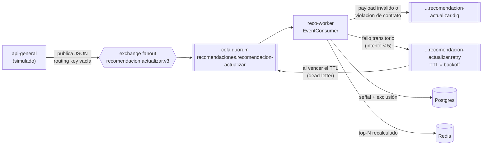
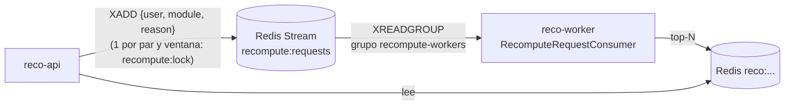
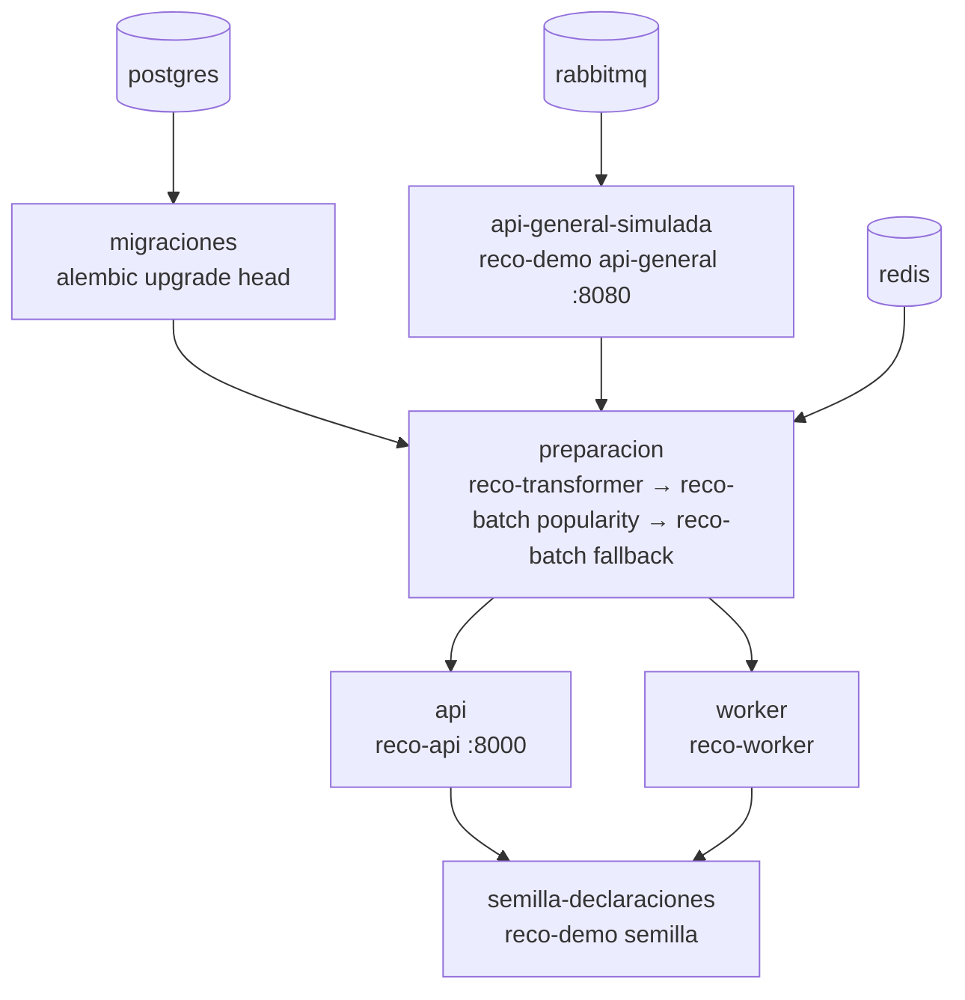

# Modo demo: cómo funciona por dentro

Este paquete reemplaza a `api-general` mientras su integración no está disponible. Acá se explica:

1. por dónde pasa RabbitMQ (y por dónde **no**),
2. qué hace cada contenedor y en qué orden arranca,
3. qué código se ejecuta en cada paso del guion,
4. cómo se prueba todo esto.

El guion para presentar está en [`docs/demo.md`](../../../docs/demo.md).

---

## 1. RabbitMQ: quién se conecta y para qué

**La API de recomendaciones (`reco-api`) no se conecta con RabbitMQ.** Solo lee Redis y, para validar
precondiciones y escribir la declaración de gustos, Postgres. Es una decisión de diseño: la lectura nunca
calcula nada ni depende del broker (INV-1, FR-003).

Con RabbitMQ hablan dos procesos:

| Proceso | Rol | Archivo | Conexiones |
|---|---|---|---|
| `api-general` (en la demo, el simulado) | **Publica** `recomendacion.actualizar` cuando un usuario interactúa con un ítem | [`api_general_simulada.py`](api_general_simulada.py), endpoint `POST /demo/usuarios/{usuario}/interacciones` | 1 |
| `reco-worker` | **Consume** `recomendacion.actualizar` y `usuario.eliminado` | [`worker/consumer.py`](../worker/consumer.py), cableado en [`worker/runtime.py`](../worker/runtime.py) | 2 (una por consumidor) |

Se puede comprobar con el stack levantado:

```powershell
docker compose exec rabbitmq rabbitmqctl list_connections user peer_host
```

Aparecen tres conexiones: una desde la IP del contenedor `api-general-simulada` y dos desde `worker`.
Ninguna sale del contenedor `api`.

### 1.1 El recorrido de un evento



1. **Publicación.** El simulado arma el evento con los siete campos obligatorios del schema más
   `correlation_id`, y lo publica en el exchange `recomendacion.actualizar.v3`. Le pone `message_id = event_id`,
   persistencia y los headers `event_type`/`event_version` que exige el contrato v3, igual que el runtime de `api-general`. Antes guarda
   **el mismo hecho** en su actividad de sync, con el mismo `origin_interaction_id` y `occurred_at`, como
   exige el contrato (CR-17, FR-061).
2. **Ruteo.** El exchange es *fanout*: copia cada mensaje a todas las colas ligadas e ignora la routing key.
   La única cola ligada es la nuestra.
3. **Consumo** (`EventConsumer._on_message`):
   - Verifica los headers `event_type` y `event_version`, y valida contra
     [`worker/contracts/recomendacion-actualizar-v3.schema.json`](../worker/contracts/recomendacion-actualizar-v3.schema.json)
     **antes** de tocar el dominio. Si es inválido va a la DLQ con `x-dlq-reason: invalid_payload` y **sin
     reintento**.
   - Si es válido, ejecuta `ActualizarHandler` ([`worker/handler.py`](../worker/handler.py)) en un hilo:
     1. **Idempotencia por `event_id`** ([`worker/idempotency.py`](../worker/idempotency.py)): marca en Redis
        (`dedupe:event:{id}`) respaldada por la tabla `processed_events`. Un evento repetido no recalcula.
     2. **Persistencia de la señal** ([`worker/signals.py`](../worker/signals.py)) en `user_signals`,
        deduplicada por `origin_interaction_id`. Toda interacción (`like`, `dislike` o `consumo`) además
        **excluye** el ítem para ese usuario, porque no se recomienda algo con lo que ya interactuó
        ([`storage/db/exclusions.py`](../storage/db/exclusions.py)). Invalida `filters:{user}` en Redis: el ítem
        desaparece en la lectura siguiente, sin esperar el recálculo. El tipo de señal sí importa para el
        perfil: un like suma afinidad a sus tags y un dislike la resta.
     3. **Disparador** ([`worker/trigger.py`](../worker/trigger.py)): cuenta las señales nuevas del usuario en
        ese módulo desde el último perfil. Si llega a `RECO_INTERACTION_RECALC_THRESHOLD` (10 en producción,
        **1 en la demo**), recalcula.
     4. **Recálculo** (`Recomputer`): reconstruye el perfil, corre el motor (`engine/`: contenido +
        colaborativo + cruce entre módulos, filtro de edad, exclusiones y MMR) y escribe el top-N en
        `reco:v{config}:{user}:{module}`.
   - Ante un fallo transitorio (Postgres o Redis caído), republica en la cola `.retry` con un TTL por mensaje
     de `1 s × 2^(intento-1)`. Al vencer, RabbitMQ lo devuelve a la cola principal. Después de 5 intentos va a
     la DLQ como `retries_exhausted`.
   - Siempre confirma (`ack`): los reintentos son explícitos, no por reentrega del broker.

### 1.2 La topología la declara el worker

Al arrancar, el worker declara todo lo que necesita ([`worker/topology.py`](../worker/topology.py)). Las
declaraciones son idempotentes:

| Recurso | Tipo | Argumentos |
|---|---|---|
| `recomendacion.actualizar.v3` | exchange fanout, durable | — |
| `recomendaciones.recomendacion-actualizar` | cola quorum | `x-message-ttl` = 24 h, `x-delivery-limit` = 5, dead-letter a `.dlq` |
| `recomendaciones.recomendacion-actualizar.retry` | cola quorum | dead-letter a la cola principal (vuelve al vencer) |
| `recomendaciones.recomendacion-actualizar.dlq` | cola quorum | sin TTL: se conserva para reproceso (runbook) |
| `usuario.eliminado` y sus tres colas | ídem | ídem, para la baja de cuenta |

Los valores salen de `RECO_EVENT_REDELIVERY_WINDOW_HOURS` y `RECO_RETRY_MAX_ATTEMPTS`. El simulado también
declara el exchange al arrancar, con los mismos parámetros, por si se levanta antes que el worker. Sin una cola
ligada, un mensaje publicado en un fanout se pierde.

Para verlo en vivo: http://localhost:15672 (usuario `reco`, clave `reco`), pestañas *Exchanges* y *Queues*.

### 1.3 Lo que NO pasa por RabbitMQ: la cola interna de recálculo

La API necesita pedirle trabajo al worker (después de una declaración de gustos, o ante un miss de caché), pero
no publica en RabbitMQ. Usa un **Redis Stream** interno, `recompute:requests`:



- Lo emite [`storage/cache/recompute.py`](../storage/cache/recompute.py) (`RecomputeStream.request`), con
  motivos como `declaration` o `miss`. Un lock con TTL evita pedir lo mismo dos veces.
- Lo consume [`worker/requests_stream.py`](../worker/requests_stream.py), que confirma (`XACK`) **después** de
  escribir el resultado.

RabbitMQ es para eventos **entre repositorios**, cuyo contrato custodia `api-general`. El stream es un detalle
interno de este servicio.

### 1.4 Con el `api-general` real

Lo que hace hoy el simulado lo tiene que hacer `api-general` con su outbox (`RECOMMENDATIONS_OUTBOX_*`). Del
lado de este servicio, el worker ya declara y consume lo mismo. La única excepción posible es el exchange: hay
una propuesta abierta para mover v3 a un exchange propio, y en ese caso cambia una constante de
`worker/topology.py` (ver [`docs/contracts/migracion-v3.md`](../../../docs/contracts/migracion-v3.md)).

Pero el simulado sigue el contrato **propuesto**, no el runtime actual de `api-general`. Hasta que este cierre
las diferencias de ruta, header, IDs y catálogo, no alcanza con cambiar la configuración: ver «Cuando esté el
`api-general` real» en [`docs/demo.md`](../../../docs/demo.md).

---

## 2. Arranque: qué hace cada contenedor

Todos los contenedores propios usan la misma imagen ([`Dockerfile`](../../../Dockerfile)). El
[`docker-compose.yml`](../../../docker-compose.yml) elige el comando y el orden:



| Contenedor | Comando | Qué hace | Termina |
|---|---|---|---|
| `migraciones` | `alembic upgrade head` | Crea el esquema de DB Recomendaciones ([`migrations/`](../../../migrations/)), incluida la extensión `vector` | Sí |
| `api-general-simulada` | `reco-demo api-general` | Sirve el contrato de sync y la puerta de entrada `/demo` ([`main.py`](main.py) → [`api_general_simulada.py`](api_general_simulada.py)) | No |
| `preparacion` | `reco-transformer`, luego `reco-batch popularity` y `fallback` | El **Data Transformer real** pide por REST usuarios, catálogo y actividad al simulado y los proyecta en Postgres; reconcilia vocabulario y vectores. Después se calcula la popularidad (Wilson) y el respaldo no personalizado en Redis | Sí |
| `api` | `reco-api` | API de lectura y de declaración de gustos | No |
| `worker` | `reco-worker` | Declara la topología, consume RabbitMQ y el stream `recompute:requests` | No |
| `semilla-declaraciones` | `reco-demo semilla` | Declara los gustos de los 24 usuarios de fondo contra la API real ([`semilla.py`](semilla.py)). El worker les calcula perfil: son los vecinos del término colaborativo | Sí |

Los healthchecks importan. Por ejemplo, el de RabbitMQ usa `check_port_connectivity` y no `ping`: `ping` da OK
antes de que el puerto 5672 acepte conexiones, y el simulado fallaba al arrancar. Por las dudas, el simulado
también reintenta la conexión durante 30 s.

### Los datos ([`datos.py`](datos.py))

- **Catálogo:** 40 películas y 36 juegos con tags y clasificación (`ATP`, `+13`, `+18`). Los tags `terror`,
  `accion`, `aventura`, `fantasia`, `ciencia-ficcion` y `familiar` existen en los dos módulos: con ellos se ve
  la herencia entre módulos.
- **Personas:** Ana (adulta) y Tomás (15 años), sin actividad ni declaración. Se declaran en vivo.
- **Usuarios de fondo:** 24, seis por cada uno de cuatro perfiles de gustos, con 480 interacciones (likes,
  dislikes y consumos de los últimos 30 días). Alimentan la popularidad y el colaborativo.
- Los IDs son UUID deterministas (`uuid5`): sobreviven a los reinicios del simulado.

---

## 3. El guion, paso por paso, con el código que corre

| Paso del guion | Recorrido |
|---|---|
| **1.** `GET /demo/usuarios/ana/recomendaciones` → 412 | Simulado → `GET /internal/v1/recommendations/{id}` → [`api/services/precondiciones.py`](../api/services/precondiciones.py) no encuentra declaración en el módulo y responde 412 `declaration_required` |
| **2.** `POST .../declaracion` → 201 | Simulado → `POST /internal/v1/declarations/{id}` → [`api/services/declaracion.py`](../api/services/declaracion.py): valida al menos 5 tags del vocabulario vigente, escribe `user_declared_tags`, invalida `filters:{user}` y pide recálculo por el **stream de Redis** (motivo `declaration`) |
| **3a.** `GET` → `fallback` | [`api/services/read_service.py`](../api/services/read_service.py) no encuentra `reco:` (miss), pide recálculo (motivo `miss`; el lock deduplica) y sirve el respaldo por popularidad, ya filtrado por edad y exclusiones |
| **3b.** `GET` → `personalized` | El worker tomó la solicitud del stream, corrió el motor y escribió `reco:`. La lectura lo encuentra y lo sirve |
| **4.** Declarar juegos | Igual que el paso 2. La respuesta trae `inherited_tags`: los tags declarados en películas que también existen en juegos |
| **5.** `POST .../interacciones` (dislike) | Simulado → **RabbitMQ** → worker: señal, exclusión y, con umbral 1, recálculo. Todo el recorrido de la sección 1.1 |
| **6.** Tomás | El filtro de edad del post-proceso ([`engine/postprocess.py`](../engine/postprocess.py)) y de la lectura descarta todo `+18` para alguien de 15 años |
| **7.** API sin key → 401 | [`api/deps.py`](../api/deps.py) compara `X-Internal-API-Key` en tiempo constante; sin ella o con otra, 401 |

---

## 4. Cómo se prueba

### 4.1 Tests unitarios de la demo, en CI y sin Docker: [`tests/unit/test_demo.py`](../../../tests/unit/test_demo.py)

Usan `TestClient` de FastAPI **sin** el bloque `with`, así no corre el `lifespan` y no hace falta RabbitMQ. Para
el Transformer, se le pasa al `ApiGeneralClient` real el transporte HTTP del `TestClient`: el cliente de
producción le habla al simulado en memoria.

| Test | Qué garantiza |
|---|---|
| `test_datos_son_deterministas_y_unicos` | Mismos IDs en cada arranque; sin `origin_interaction_id` repetidos |
| `test_cada_perfil_es_declarable_en_su_modulo` | La semilla nunca recibe 422: cada perfil tiene al menos 5 tags del vocabulario (se valida con `validate_declaration` de la API) |
| `test_el_transformer_real_recibe_pasadas_completas` | El `ApiGeneralClient` real ve las tres pasadas completas (CR-9) y el filtro `since` funciona |
| `test_la_paginacion_recorre_todo_con_un_mismo_snapshot` | Páginas de 37: todas con el mismo `snapshot_id` y la cantidad igual a `total` |
| `test_una_api_key_ajena_se_rechaza` | El simulado exige la API key, como el real |
| `test_los_datos_pasan_la_ingesta_sin_violaciones` | Corre las validaciones reales de `SyncPipeline`: ningún usuario rechazado y todos los ítems con clasificación declarada. Si fallaran, `preparacion` saldría con error |
| `test_una_interaccion_publica_un_evento_que_el_worker_acepta` | Reemplaza el exchange por uno falso, captura el mensaje y lo pasa por `parse_actualizar`, **el parser real del worker**. Comprueba que el mismo hecho quedó en la actividad de sync |
| `test_usuario_o_item_desconocido_es_404` | Errores claros en la demo |
| `test_el_modo_demo_no_se_importa_desde_los_procesos_reales` | Ningún módulo fuera de `demo/` importa este paquete: la demo nunca entra al camino de producción |

```powershell
pytest tests/unit/test_demo.py -q
```

### 4.2 Lo que ya cubría el repo, con contenedores reales (testcontainers)

La demo se apoya en comportamiento que ya está probado contra Postgres, Redis y RabbitMQ reales:

| Test | Qué cubre |
|---|---|
| [`test_phase1_end_to_end.py`](../../../tests/integration/test_phase1_end_to_end.py) | El mismo recorrido que la demo: sync → popularidad → respaldo → 412 → declaración → `fallback` → worker → `personalized` → dislike por evento → el ítem desaparece |
| [`test_topology.py`](../../../tests/integration/test_topology.py) | Colas quorum, TTL y `x-delivery-limit` alineados con el broker de `notificaciones` |
| [`test_consumer.py`](../../../tests/integration/test_consumer.py) | Validación del schema; un válido se procesa y un inválido va a la DLQ |
| [`test_invalid_payload.py`](../../../tests/integration/test_invalid_payload.py) | Mensajes inválidos intercalados nunca bloquean a los válidos |
| [`test_retry_dlq.py`](../../../tests/integration/test_retry_dlq.py) | Backoff exponencial por la cola `.retry` y DLQ al agotar intentos |
| [`test_idempotency.py`](../../../tests/integration/test_idempotency.py) | Un `event_id` repetido no recalcula dos veces |
| [`test_event_signals.py`](../../../tests/integration/test_event_signals.py) | La señal del evento se persiste y su exclusión es efectiva en la lectura siguiente |
| [`test_recompute_requests.py`](../../../tests/integration/test_recompute_requests.py) | El stream `recompute:requests` y su grupo de consumidores |

```powershell
pytest tests/integration -q        # requiere Docker
```

### 4.3 Prueba manual del stack

Con `docker compose up -d`, el guion completo se verificó contra los contenedores:

- 412 sin declaración y 201 al declarar;
- `fallback` y enseguida `personalized`;
- herencia de `terror` a juegos;
- un dislike que saca el ítem en menos de un segundo;
- ningún `+18` para Tomás;
- 401 sin API key.

Después de probar, hacer `docker compose down -v` para empezar limpio: una declaración es definitiva.

---

## 5. Archivos de este paquete

| Archivo | Qué contiene |
|---|---|
| [`main.py`](main.py) | Entrypoint `reco-demo api-general \| semilla`; lee la configuración `RECO_*` como el resto de los procesos |
| [`api_general_simulada.py`](api_general_simulada.py) | FastAPI con `create_app()`: sync, puerta de entrada `/demo` y publicación en RabbitMQ |
| [`datos.py`](datos.py) | Catálogo, personas, perfiles y actividad inicial |
| [`semilla.py`](semilla.py) | Declaraciones de los usuarios de fondo |

Variables propias de la demo, además de las `RECO_*` de siempre:

| Variable | Por defecto | Para qué |
|---|---|---|
| `RECO_DEMO_API_URL` | `http://localhost:8000` | Dónde está la API de recomendaciones (en el compose, `http://api:8000`) |
| `RECO_DEMO_PORT` | `8080` | Puerto del simulado |

Para sacar la demo del servicio: borrar esta carpeta, la línea `reco-demo` de `pyproject.toml`,
`tests/unit/test_demo.py` y los servicios `api-general-simulada` y `semilla-declaraciones` del compose.
